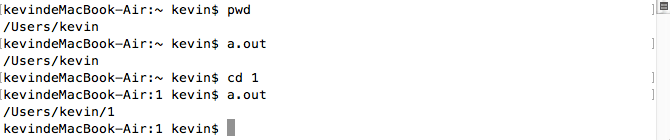

# apue pwd命令实现

> 了解了文件目录相关的系统调用后，就可以尝试模拟实现各种shell命令了。这里给出了ls -l的完成代码，加上pwd及mkdir -p的实现。里面用到了递归，也涉及到一些细节问题，如根目录的上一级目录还是根目录，chdir需要用户有目录的执行权限。



## pwd命令的实现，显示当前路径
思路: 先获取当前目录的名字，然后chdir到上一级目录，重复..直到根目录  
```c
/*  
 *  pwd的实现  
 *  Thu Oct 20 17:48:52 2016
 *  Create by Kevin Zuo
 */

#include <stdio.h>
#include <stdlib.h>
#include <sys/stat.h>
#include <unistd.h>
#include <dirent.h>
#include <errno.h>
#include <string.h>

void pwd()
{
    struct stat buf;
    struct stat buf2;
    DIR* dirp = opendir("..");

    lstat(".", &buf);
    lstat("..", &buf2);
    if ( buf.st_ino == buf2.st_ino) // 如果当前目录和上一级目录的i节点相同
        return;
    
    chdir(".."); // 先递归再打印
    pwd();

    struct dirent* p;
    while(1) {
        int err = errno;
        p = readdir(dirp);
        if (p == NULL && errno != err) { // 错误提示
            perror("readdir()");
            return;
        }
        if (p == NULL) break; // 读完退出
        if (p->d_fileno == buf.st_ino) { // 找到文件名后结束
            printf("/%s", p->d_name);
            break;
        }
    }


int main(int argc, char* argv[])
{
    // 如果是在根目录，省略处理...; 某些出错判断，省略...
    pwd();
    printf("\n");

    exit(0);
}

// 运行效果:
// kevindeMacBook-Air:~ kevin$ ./a.out
// /Users/kevin
// kevindeMacBook-Air:~ kevin$ pwd
// /Users/kevin
// kevindeMacBook-Air:~ kevin$
```

## ls -l 的完整实现
思路: 遍历当前目录的文件，过滤掉以.开头的文件，以一定格式打印
```c
/*  
 *  ls -l的实现  
 *  Thu Oct 20 19:09:48 2016
 *  Create by Kevin Zuo
 */

#include <stdio.h>
#include <stdlib.h>
#include <time.h>
#include <sys/stat.h>
#include <dirent.h>
#include <pwd.h>
#include <grp.h>
#include <errno.h>

void print_mode(mode_t mode)
{
    //printf("%o ", mode);
    switch (mode & S_IFMT) { // 打印文件类型
        case S_IFIFO: putchar('p'); break;
        case S_IFCHR: putchar('c'); break;
        case S_IFDIR: putchar('d'); break;
        case S_IFBLK: putchar('b'); break;
        case S_IFREG: putchar('-'); break;
        case S_IFLNK: putchar('l'); break;
        case S_IFSOCK: putchar('s'); break;
    }
    if (mode & S_IRUSR) putchar('r'); else putchar('-');
    if (mode & S_IWUSR) putchar('w'); else putchar('-');
    if (mode & S_IXUSR) putchar('x'); else putchar('-');

    if (mode & S_IRGRP) putchar('r'); else putchar('-');
    if (mode & S_IWGRP) putchar('w'); else putchar('-');
    if (mode & S_IXGRP) putchar('x'); else putchar('-');

    if (mode & S_IROTH) putchar('r'); else putchar('-');
    if (mode & S_IWOTH) putchar('w'); else putchar('-');
    if (mode & S_IXOTH) putchar('x'); else putchar('-');

    putchar(' ');
}

int main(int argc, char* argv[])
{
    DIR* dirp = opendir(".");
    struct dirent* p;

    while (1) {
        int err = errno;
        p = readdir(dirp);
        if (err != errno && p == NULL) {
            perror("readdir()");
            return 1;
        }
        if (p == NULL) break;
        if (p->d_name[0] == '.') continue; // 如果是隐藏文件，退出

        struct stat buf;
        struct passwd* t1;
        struct group* t2;
        struct tm* t;

        lstat(p->d_name, &buf); // 获取当前目录(~)下文件1.c的信息存入变量buf
        t1 = getpwuid(buf.st_uid);
        t2 = getgrgid(buf.st_gid);
        t = localtime(&buf.st_mtime);

        print_mode(buf.st_mode); // 打印前面的信息
        printf("%2d ", buf.st_nlink); // 文件硬链接数
        printf("%s %s ", t1->pw_name, t2->gr_name); // 文件的拥有者及所在用户组
        printf("%6lld ", buf.st_size); //文件大小
        printf("%2d %2d %02d:%02d ", t->tm_mon+1, t->tm_mday, t->tm_hour, t->tm_min);
        printf("%s\n", p->d_name);
    }

    exit(0);
}

// 运行效果：
// kevindeMacBook-Air:~ kevin$ ./a.out
// drwxr-xr-x 30 kevin staff   1020 10 20 19:19 1
// -rw-r--r--  1 kevin staff    143 10 17 17:31 1.txt
// -rw-r--r--  1 kevin staff 144313 10 15 16:27 1015.sql
// -rw-r--r--  1 kevin staff 143533 10 15 19:07 1015_2.sql
// -rw-r--r--  1 kevin staff    143 10 17 17:37 5.txt
// -rwxr-xr-x  1 kevin staff   9008 10 20 19:49 a.out
// drwx------ 17 kevin staff    578 10 20 18:56 Desktop
// drwx------  7 kevin staff    238 10 13 14:46 Documents
// drwx------ 15 kevin staff    510 10 18 15:04 Downloads
// drwx------ 53 kevin staff   1802  8  2 12:21 Library
// -rw-r--r--  1 kevin staff   2046 10 20 19:49 ls.c
// drwx------  3 kevin staff    102  6  1 12:08 Movies
// drwx------  5 kevin staff    170  6 25 15:49 Music
// drwx------  4 kevin staff    136 10 17 16:00 Pictures
// drwxr-xr-x  5 kevin staff    170  6  1 12:08 Public
// -rw-r--r--  1 kevin staff    918 10 20 19:28 pwd.c
// kevindeMacBook-Air:~ kevin$ ls -l
// total 632
// drwxr-xr-x  30 kevin  staff    1020 10 20 19:19 1
// -rw-r--r--   1 kevin  staff     143 10 17 17:31 1.txt
// -rw-r--r--   1 kevin  staff  144313 10 15 16:27 1015.sql
// -rw-r--r--   1 kevin  staff  143533 10 15 19:07 1015_2.sql
// -rw-r--r--   1 kevin  staff     143 10 17 17:37 5.txt
// drwx------+ 17 kevin  staff     578 10 20 18:56 Desktop
// drwx------+  7 kevin  staff     238 10 13 14:46 Documents
// drwx------+ 15 kevin  staff     510 10 18 15:04 Downloads
// drwx------@ 53 kevin  staff    1802  8  2 12:21 Library
// drwx------+  3 kevin  staff     102  6  1 12:08 Movies
// drwx------+  5 kevin  staff     170  6 25 15:49 Music
// drwx------+  4 kevin  staff     136 10 17 16:00 Pictures
// drwxr-xr-x+  5 kevin  staff     170  6  1 12:08 Public
// -rwxr-xr-x   1 kevin  staff    9008 10 20 19:49 a.out
// -rw-r--r--   1 kevin  staff    2046 10 20 19:49 ls.c
// -rw-r--r--   1 kevin  staff     918 10 20 19:28 pwd.c
// kevindeMacBook-Air:~ kevin$
```
这里没有处理l符号链接，有时间可以扩展

## mkdir -p 功能模拟
```c
int mkdir(const char *path, mode_t mode); -- make a directory file
int chdir(const char *path); -- change current working directory
In order for a directory to become the current directory, a process must have execute (search) access to the directory.
```
这里可能是为什么文件权限为0644, 而目录的权限是0755的原因(都多了执行权限)
```c
/*  
 *  mkdir -p 模拟  
 *  Thu Oct 20 20:23:01 2016
 *  Create by Kevin Zuo
 */

#include <stdio.h>
#include <stdlib.h>
#include <unistd.h>
#include <string.h>
#include <sys/stat.h>

int main(int argc, char* argv[])
{
    if (argc != 2) { // 通过命令行传参 ./a.out 4/2/3, 乱传参数错误处理部分会忽略
        printf("argc error!");
        exit(1);
    }

    if (!access(argv[1], F_OK)) { // 如果该文件已存在
        printf("文件已存在!");
        exit(2);
    }
    if (argv[1][0] == '/') // 如果是根目录下
        chdir("/");
    char* p = strtok(argv[1], "/");
    if (mkdir(p, 0755)) { // 根目录下可能会出现权限限制 ./a.out /5
        perror("mkdir()");
        exit(3);
    }
    chdir(p);

    while (1) { // 循环切分
        char* q = strtok(NULL, "/");

        if (q == NULL)
            break;
        if (!access(q, F_OK)) continue;
        mkdir(q, 0755);
        chdir(q);
    }

    exit(0);
}
```