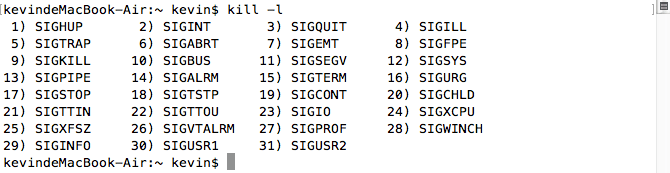

# apue 信号signal

> 这里所说的信号也叫软中断信号，当进程接收到一个来自内核的信号，如ctrl+c时，进程就会中断。系统定义了一些宏来表示这些中断。一般以SIG开头，对于这些信号，系统会有默认的处理方式，也可以通过signal函数，自定义处理方式(系统默认处理/ignore/执行某个函数)。



man signal
```c
No    Name         Default Action       Description
1     SIGHUP       terminate process    terminal line hangup
2     SIGINT       terminate process    interrupt program // ctrl+c
3     SIGQUIT      create core image    quit program  // ctrl+
4     SIGILL       create core image    illegal instruction
5     SIGTRAP      create core image    trace trap
6     SIGABRT      create core image    abort program (formerly SIGIOT) // abort()
7     SIGEMT       create core image    emulate instruction executed
8     SIGFPE       create core image    floating-point exception
9     SIGKILL      terminate process    kill program  // kill()
10    SIGBUS       create core image    bus error
11    SIGSEGV      create core image    segmentation violation
12    SIGSYS       create core image    non-existent system call invoked
13    SIGPIPE      terminate process    write on a pipe with no reader
14    SIGALRM      terminate process    real-time timer expired // alarm signal
15    SIGTERM      terminate process    software termination signal
16    SIGURG       discard signal       urgent condition present on socket
17    SIGSTOP      stop process         stop (cannot be caught or ignored)
18    SIGTSTP      stop process         stop signal generated from keyboard
19    SIGCONT      discard signal       continue after stop
20    SIGCHLD      discard signal       child status has changed // child process terminate
21    SIGTTIN      stop process         background read attempted from control terminal
22    SIGTTOU      stop process         background write attempted to control terminal
23    SIGIO        discard signal       I/O is possible on a descriptor (see fcntl(2))
24    SIGXCPU      terminate process    cpu time limit exceeded (see setrlimit(2))
25    SIGXFSZ      terminate process    file size limit exceeded (see setrlimit(2))
26    SIGVTALRM    terminate process    virtual time alarm (see setitimer(2))
27    SIGPROF      terminate process    profiling timer alarm (see setitimer(2))
28    SIGWINCH     discard signal       Window size change
29    SIGINFO      discard signal       status request from keyboard
30    SIGUSR1      terminate process    User defined signal 1
31    SIGUSR2      terminate process    User defined signal 2
```

## 信号的产生
- 通过ctr+c(SIGINT)或ctrl+(SIGQUIT)等组合键，请求内核产生信号
- 当进程执行出错或某些事件(段错误[SIGSEGV]，除0[SIGFPE])发生时。
- 通过kill调用

## 信号处理的3种方式
- 执行默认处理方式，一般是终止程序，signal(SIGINT, SIG_DFL); // default 默认
- 忽略信号 signal(SIGINT, SIG_IGN); // ignore 忽略
- 调用一个函数(signal) // 写一个函数，收到某个信号就去执行这个函数 void k(int num); signal(SIGINT, k);

## signal函数
```c
sig_t signal(int sig, sig_t func); 
typedef void (*sig_t) (int); // 指向函数的指针 void k(int sum)
// 参数1: 信号标识(宏) // SIGALRM, SIGINT
// 参数2: 处理方式 SIG_IGN(忽略)，SIG_DFL(默认)，函数k
```
一般情况下while(1)执行的程序遇到ctrl+c和ctrl+"\"系统会默认终止程序，下面的程序改写对应的处理方式  
```c
/*  
 *  signal的基本处理  
 *  Fri Oct 21 00:17:19 2016
 *  Create by Kevin Zuo
 */

#include <stdio.h>
#include <stdlib.h>
#include <unistd.h>

void k(int num)
{
    printf("产生了%d号中断信号!", num);
}

int main(int argc, char* argv[])
{
    // ctrl+c的效果
    //signal(SIGINT, SIG_IGN); // ...^C... 忽略信号,进程不会结束
    //signal(SIGINT, SIG_DFL); // ....^C  默认 结束进程
    signal(SIGINT, k); // ...^C产生了2号中断信号!.... 执行k函数,进程不结束

    // ctrl+的效果类似.. SIGQUIT

    while (1) { // 每隔1秒打印一个.
        putchar('.');
        fflush(stdout);
        sleep(1);
    }

    exit(0);
}
```

## alarm信号(SIGALRM)的处理 
闹钟信号
```c
// unsigned alarm(unsigned seconds); -- set signal timer alarm
// DESCRIPTION
//   This interface is made obsolete by setitimer(2). // 类似 creat ==> open()
```
小例子:
```c
/*  
 *  alarm 信号  
 *  Fri Oct 21 00:44:26 2016
 *  Create by Kevin Zuo
 */

#include <stdio.h>
#include <stdlib.h>
#include <unistd.h>

int main(int argc, char* argv[])
{
    signal(SIGALRM, SIG_DFL); // ...Alarm clock: 14 默认处理方式中断   
    // signal(SIGALRM, SIG_IGN); // 忽略什么都不做
    alarm(3);

    while (1) {
        putchar('.');
        fflush(stdout);
        sleep(1);
    }

    exit(0);
}
```

## 通过alarm+pause() 模拟sleep的功能
```c
// int pause(void); -- stop until signal 进程挂起，直到捕捉到一个信号
```
将上面的程序改写
```c
/*  
 *  alarm 信号  改写sleep 
 *  Fri Oct 21 00:44:26 2016
 *  Create by Kevin Zuo
 */

#include <stdio.h>
#include <stdlib.h>
#include <unistd.h>

void my_sleep(int t)
{
    alarm(t);
    pause();
}

void k(int num)
{
}

int main(int argc, char* argv[])
{
    signal(SIGALRM, k); // 执行函数，什么都不做，保证不退出进程，并可激活pause()
    while (1) {
        putchar('.');
        fflush(stdout);
        my_sleep(1); // 与系统的sleep基本一致
    }

    exit(0);
}
```
## alarm的升级版，setitimer()
可产生连续的SIGALRM信号， 而alarm()只能产生一次
```c
int setitimer(int which, const struct itimerval * value, struct itimerval * ovalue);
//  -- set value of interval timer
//  参数1: which 计时的方式,分3种
//        #define ITIMER_REAL      0   真实时间
//        #define ITIMER_VIRTUAL   1   用户空间执行时间  
//        #define ITIMER_PROF      2   系统调用，cpu调度时间 
//  参数2: 
//        struct itimerval {
//            struct  timeval it_interval;    /* timer interval */ 以后每次产生时间间隔
//            struct  timeval it_value;       /* current value */ 第一次产生时间
//        }; 
//        struct timeval {
//            time_t       tv_sec;     /* seconds */
//            suseconds_t   tv_usec; /* microseconds */
//        };
//  参数3: 设置是否保存老值, 一般填NULL
//  struct itimerval t; setitimer(0, &t, NULL);
```
改写上面的sleep  
```c
/*  
 *  setitimer 产生连续的alarm信号  改写sleep 
 *  Fri Oct 21 00:44:26 2016
 *  Create by Kevin Zuo
 */

#include <stdio.h>
#include <stdlib.h>
#include <unistd.h>
#include <sys/time.h>

void k(int num) { }

int main(int argc, char* argv[])
{
    signal(SIGALRM, k); // 执行函数，什么都不做，保证不退出进程，并可激活pause()
    struct itimerval t;

    t.it_interval.tv_sec = 1;
    t.it_interval.tv_usec = 0;
    t.it_value.tv_sec = 1;
    t.it_value.tv_usec = 0;
    setitimer(0, &t, NULL); // 每个1秒产生一个SIGALRM信号

    while (1) {
        putchar('.');
        fflush(stdout);
        pause();
    }

    exit(0);
}
```

## 信号掩码 相当于信号黑名单
在信号处理的过程中，如果该信号再次被触发，会阻塞，例子:
```c
/*  
 *  signal 信号阻塞  
 *  Fri Oct 21 01:39:54 2016
 *  Create by Kevin Zuo
 */

#include <stdio.h>
#include <stdlib.h>
#include <unistd.h>

void k(int num) {
    printf("start\n");
    sleep(5);
    printf("end\n");
}

int main(int argc, char* argv[])
{
    signal(SIGINT, k);

    while (1) {
        putchar('.');
        fflush(stdout);
        sleep(1);
    }

    exit(0);
}

// 执行结果如下： 
// 当第一次ctrl+c，执行函数k，SIGINT自动加到黑名单，即信号掩码，除第一次之后的多次调用只会执行一次   
// kevindeMacBook-Air:~ kevin$ ./a.out
// ...^Cstart     
// ^C^C^Cend
// start
// end
// ............
```

## 信号掩码的处理, signal的升级版 sigaction()
```c
struct  sigaction {
    union __sigaction_u __sigaction_u;  /* signal handler */
    sigset_t sa_mask;               /* signal mask to apply */
    int     sa_flags;               /* see signal options below */
};
union __sigaction_u {
    void    (*__sa_handler)(int);
    void    (*__sa_sigaction)(int, siginfo_t *, void *);
};
#define sa_handler      __sigaction_u.__sa_handler
#define sa_sigaction    __sigaction_u.__sa_sigaction
int sigaction(int sig, const struct sigaction * act, struct sigaction * oact);
// 允许嵌套，允许添加信号掩码集，安全性高
```
示例
```c
/*  
 *  signal 升级版 sigaction
 *  Fri Oct 21 02:02:29 2016
 *  Create by Kevin Zuo
 */

#include <stdio.h>
#include <stdlib.h>
#include <unistd.h>
#include <signal.h>

void k(int num)
{
    printf("stat\n");
    sleep(5);
    printf("end\n");
}

int main(int argc, char* argv[])
{
    struct sigaction acts;
    acts.sa_handler = k;
    sigemptyset(&acts.sa_mask); // 将信号掩码集清空,默认为空，可不写
    sigaddset(&acts.sa_mask, SIGQUIT); // 加入SIGQUIT信号
    acts.sa_flags = SA_NODEFER; // 允许嵌套
    sigaction(SIGINT, &acts, NULL);
    while (1) {
        putchar('.');
        fflush(stdout);
        sleep(1);
    }

    exit(0);
}

// 执行结果:
// kevindeMacBook-Air:~ kevin$ ./a.out
// ..^Cstat
// ^Cstat
// ^Cstat
// ^end
// end
// end
// Quit: 3
// kevindeMacBook-Air:~ kevin$
```