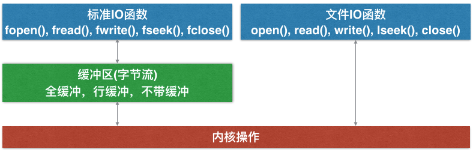
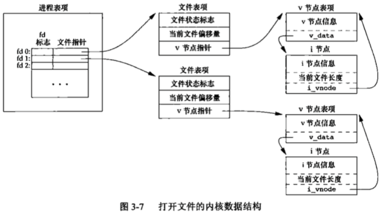
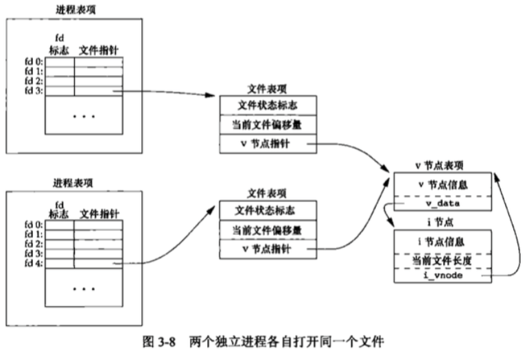
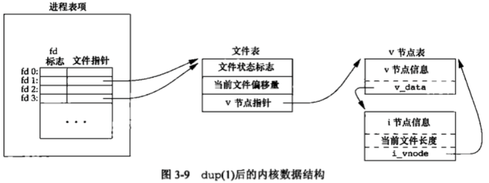

---
{
  "title": "apue 文件IO",
  "staticFileName": "apue_file_io.html",
  "author": "guoqzuo",
  "createDate": "2016/10/18",
  "description": " UNIX系统中，文件I/O常用的5个函数: open,read,write,lseek,close。与标准I/O相比文件I/O通常称为不带缓冲的I/O(unbuffered)。一般所有I/O都要经过内核的块缓冲。read，write的数据也要被内核缓冲，这里不带缓冲的I/O指的是在用户进程用不会自动缓冲，每次都是系统调用。",
  "keywords": "文件IO,标准IO,C语言文件处理,APUE文件IO,apue 文件io",
  "category": "C与APUE"
}
---

# apue 文件IO

> UNIX系统中，文件I/O常用的5个函数: open,read,write,lseek,close。与标准I/O相比文件I/O通常称为不带缓冲的I/O(unbuffered)。一般所有I/O都要经过内核的块缓冲。read，write的数据也要被内核缓冲，这里不带缓冲的I/O指的是在用户进程用不会自动缓冲，每次都是系统调用。



## 文件描述符 (file descriptor)
对内核而言，所有打开的文件都是通过fd来引用。

文件描述符0，1，2分别与进程的标准输入，输出，错误缓冲区相关联，分别对应宏STDIN_FILENO, STDOUT_FILENO, STDERR_FILENO。这些宏都在unistd.h里定义，一般每个进程最多能打开64个文件

## I/O函数概述
这里主要介绍open、create、read、write、lseek、close、fcntl等函数

### open函数
类似printf，可变长参数，可以是2参或3参。打开文件，返回该文件的fd，错误返回-1，且修改errno值
```c
int open(const char *path, int oflag, ...); // open or create a file for reading or writing
```
函数参数：
- path: 文件路径
- oflag: 文件打开的方式，只读O_RDONLY、只写O_WRONLY、读写O_RDWR、追加写入O_APPED等
  - 只读，只写，读写 三个中必选一个，其它的是可以追加的，一般标志位的定义都是以8进制来对应
  - 只读为0，只写为1，追加写入为8，可以"|"的方式进行组合。
  - O_EXCL | O_CREAT，文件存在返回-1，否则正常执行，防止同名文件被修改
  - O_TRUNC | O_CREAT, 文件存在就清空，不存在就创建
  - open时如果文件不存在会返回错误，除非打开时加上标记位:O_CREAT, 文件不存在就创建
- 创建文件时权限，O_CREAT 打开文件时，如果文件不存在，就需要使用参数3了，用来指定穿件文件时的默认权限，0644。
  - 以前只有两参后来加了一个参数，用来淘汰creat()函数，使打开文件和创建文件成为原子性操作
  

示例: open("1.c", O_RDONLY | O_CREAT, 0644) 打开文件，如果存在就打开，不存在创建，权限为0644，如果只用2参，写法如下    
```c
if ((fd = open("1.c", O_RDONLY)) < 0) {
    if (error == ENOENT) { // 如果文件打开失败，且错误为文件不存在
        creat("1.c", 0644);
    } else {
        perror("open()");
        return 1;
    }
}
```
**系统调用函数一般是原子性(atomic operation)的，在执行的时候不会因为进程调度中断其执行而产生bug**

### create函数
```c
// DESCRIPTION   This interface is made obsolete by: open(2).
// The creat() function is the same as: open(path, O_CREAT | O_TRUNC | O_WRONLY, mode);
int creat(const char *path, mode_t mode);
```

### read函数
```c
// 读取文件内容存入buf，返回读取的字节数，return 0 表示文件已读完
ssize_t read(int fildes, void *buf, size_t nbyte); // read input 
```

### write函数
```c
// 向文件写入内容
ssize_t write(int fildes, void *buf, size_t nbyte); // wirte output
```

### lseek函数
```c
// 移动文件偏移位置，之前写一个取反加密时用过.  
// whence有3种情况0,1,2分别对应SEEK_SET、SEEK_CUR、SEEK_END, 宏和数字怎么方便就怎么用
off_t lseek(int fildes, off_t offset, int whence); // reposition read/write file offset
```

### close函数
```c
// 关闭文件，官方解释为删除fd
int close(int fildes);  // delete a descriptor
```

### fcntl函数
```c
int fcntl(int fildes, int cmd, ...); // file control
// 可以修改已打开文件的fd标志，文件状态标志，复制fd，参数2决定它的功能
// cmd = F_GETFD/F_SETFD 获取或设置fd标志
// cmd = F_GETFL/F_SETFL 获取或设置文件状态标志，可追加O_APPED
// cmd = F_DUPFD，复制fd
```

## 内核I/O数据结构
当打开一个文件，内核以什么形式来保持/操作相关数据？(以下UNIX系统适用，具体实现可能有差异）

当一个进程执行时：
- 有一张进程表，里面包含一张打开文件表。每个打开的fd占一行，有两个属性:fd标志、文件指针
- 文件表里记录了文件状态标志(只读/写/追加等,用于指向该表所有fd)、当前偏移量、指向v结点表的指针
- v结点表简化来讲包含了i节点表，里面记录了文件的基本信息，当前文件的长度等，如下图:    



0、1、2为进程默认代开的文件

**每次write后，文件表里的文件偏移量会加入所写入的字节数，如国偏移量超过文件长度，i结点表的当前文件长度会修改为当前偏移量，文件增大。lseek没有进行任何I/O操作，只是修改了文件表中的当前文件偏移量**

## 两个进程操作同一个文件   


- 两个进程打开同一个文件，对应的文件表独立，但v结点是同一个

- 当两个进程同时open了一个文件，他们的文件偏移位置是独立的，进程1向文件写入数据，文件偏移，但此时进程2的文件偏移还是0，此时进程2写入数据，进程1写入的数据将被覆盖, O_APPEND可解决这个问题

- **O_APPEND原理是当要写入数据到文件时，如果文件状态标志有O_APPEND，会先将文件的偏移量改为v结点里当前文件的长度，再write，就相当于每次write都要先lseek(fd, 0, SEEK_END); 但是这里是原子性的.**

## 文件描述符的copy(dup, dup2)  
dup, dup2 -- duplicate an existing file descriptor

open()函数返回fd遵循最小分配原则，默认打开了0、1、2，最小分配为3，如果0、1、2有关闭的，下次open就会占用系统的这些值, 例如close(1)后open一个文件，那么这个文件就成了输出缓冲区
```c
int dup(int oldfd); // 将oldfd再分配一个fd，最小分配原则
int dup2(int oldfd, int newfd); // 复制fd，可指定新fd的值，如果新的已打开，先关闭。
```



```c
dup(fd); // ==> fcntl(fd, F_DUPFD, 0);

dup(fd, fd2); // ==> close(fd2); 
fcntl(fd, F_DUPFD, fd2);  // dup2是一个原子性的操作
```