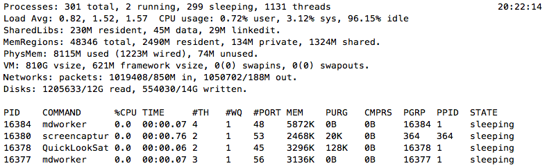
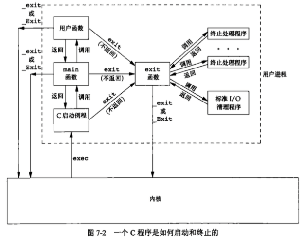
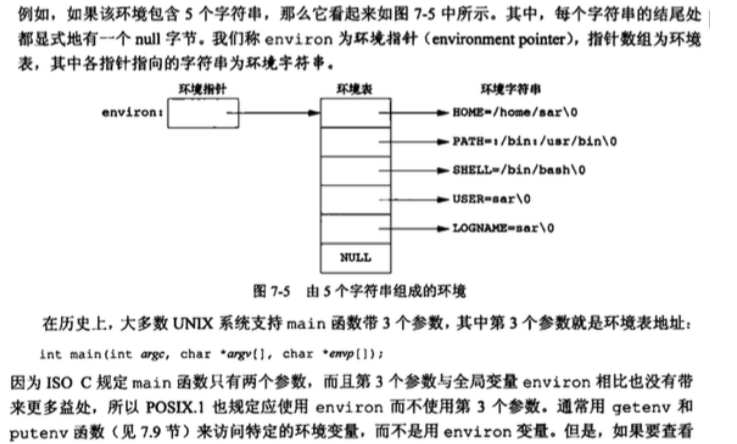
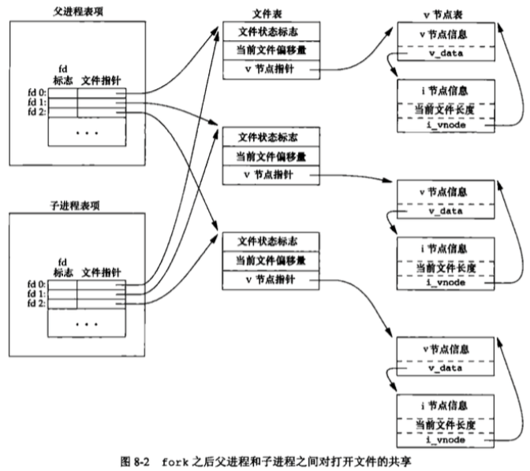

# apue 进程(Process)

> 进程就是正在运行的程序。不管是进程还是线程，主要作用就是可以在同一时间内同时处理多个事情，提升用户体验。像shell终端，如果是单个进程，那每次执行完命令，都需要重新打开终端，非常不利于操作。拿扫雷来说，如果一边开个while(1)来处理输入输出，那如果你需要实时显示时间呢? 学了进程相关的操作后就可以fork一个子程序专门用来显示实时时钟。



## 进程 - 正在运行的程序 
c语言中main函数就是主进程，一个shell程序的执行过程
1. 用户输入./a.out
2. shell建立一个新的进程来运行这个程序  // fork
3. shell将程序从磁盘载入 // exec 以代码覆盖的方式执行程序
4. 程序在它的进程中运行知道结束 // wait

```c
int execl(const char *path, const char *arg0, ... /*, (char *)0 */);
int execlp(const char *file, const char *arg0, ... /*, (char *)0 */);
execl("/bin/ls", "ls","-l","-a",NULL);  execlp("ls","ls","-l","-a",NULL);
// 后面加p的作用直接从环境变量里找ls可执行程序，如果不加就要指定绝对路径
// l ==> v 只是将参数2...到参数n字符串封装成了数组, 不用NULL((char*)0)结束

/* execl execv execlp  execvp 在程序运行过程中，运行另一个程序
 * 有无p表示是否需要指定路径 l/ｖ表示是否用数组封装
 */
```
示例
```c
#include <stdio.h>
#include <unistd.h>

int main()
{
  //execl("/bin/pwd","pwd",NULL); // 以代码覆盖的方式让一个程序替换另一个程序运行
  //execl("/bin/ls","ls","-l",NULL); 
  //char *arr[]={"ls","-l",NULL}; // NULL 可以让数组知道在哪结束
  //execv("/bin/ls",arr);
  execlp("ls","ls","-l",NULL); // 自动到环境变量里面去找
  perror("execl()"); // 错误检查，如果上一行失败，不会执行到这里
  printf("b\n");

  return 0;
}
```

## 进程终止
5种正常终止方式
- 从main函数返回
- 调用exit() // 执行清理处理(fclose() 所有打开流，fflush输出缓冲区) man 3 exit
- 调用_exit或_Exit // 立即进入内核 _exit由POSIX.1是系统调用，_Exit和exit为C库函数(ISO C)
- 最后一个线程return
- 最后一个线程调用 pthread_exit()

3种异常终止方式:
- 调用abort
- 接到一个信号
- 最后一个线程对取消请求作出响应

进程的终止状态exit, _exit, _Exit 可以指定具体值， return 0, exit(0);

查看程序的退出状态 echo $?



**内核使程序执行的唯一方式是调用一个exec()函数，进程自愿终止的唯一方法是显示或隐式调用_exit或_Exit,也可以非自愿的由一个终端信号使其终止**

## 进程环境表  
shell cmd "printenv", 每个程序都会有一张环境表，它是一个字符串指针数组和argv[]类似，全局变量environ可访问该环境表
```c
extern char** environ;
```



两种方法都可以打印环境表，到达printenv的效果, 代码如下:      
```c
/*  
 *  环境表  
 *  Sat Oct 22 17:43:20 2016
 *  Create by Kevin Zuo
 */

#include <stdio.h>
#include <stdlib.h>

extern char** environ; // 调用全局变量方法

int main(int argc, char* argv[], char* envp[])
{
    int n = 0;

    while (1) { // 遍历打印环境表   
        if (*(environ+n) == NULL) break;
        printf("%s\n", *(environ+n));
        /*  调用 main函数第3参数 envp
            if (envp[n] == NULL)
                break;
            printf("%s\n", envp[n]);
        */
        n++;
    }

    exit(0);
}
```

## fork() 创建一个子进程
通过fork系统调用可以以复制的方式创建一个新的进程，新进程拥有和原进程一样的代码，数据，运行位置。
```c
pid_t fork(void);  // -- create a new process
```
- fork()创建的新进程被称为子进程，函数执行一次，但返回两次,子进程返回0，父进程返回子进程id
- 子进程是父进程的副本，各自空间独立，也就是说子进程里面变量值的改变对父进程没有任何影响，fork之后
- 子进程会复制父进程的文件描述符，fork之后父子进程谁先执行时不确定的.
```c
pid_t wait(int *stat_loc);  -- wait for process termination  // 父进程阻塞等待所有子进程结束
stat_loc是结果参数，可获子进程的退出状态，不去获取其退出状态可填NULL, wait(NULL);
pid_t waitpid(pid_t pid, int *stat_loc, int options); // 可等待某个子进程结束
```
pid如果是-1，表示所有子进程, stat_loc同wait, options 0无特殊要求 WNOHANG,有结束就等，没有就不等了

子进程退出时，父进程会收到一个SIGCHLD信号    
```c
/*  
 *  fork()
 *  Sat Oct 22 18:24:37 2016
 *  Create by Kevin Zuo
 */

#include <stdio.h>
#include <stdlib.h>
#include <unistd.h>

int main(int argc, char* argv[])
{
    fork();
    fork();
    printf("pid = %d, ppid = %d\n", getpid(), getppid());
    // 会打印4次,子进程结束后如果不return，顺序执行

    exit(0);
}

// 执行结果对比:    
// kevindeMacBook-Air:~ kevin$ ./a.out
// TERM_PROGRAM=Apple_Terminal
// SHELL=/bin/bash
// TERM=xterm-256color
// TMPDIR=/var/folders/mw/hbp6ytc9753gcm3zhqbmfkp40000gn/T/
// Apple_PubSub_Socket_Render=/private/tmp/com.apple.launchd.iGH1KaBlJJ/Render
// TERM_PROGRAM_VERSION=361.1
// TERM_SESSION_ID=800C54D0-5E25-4B6D-9C3C-B7348F78B6BD
// USER=kevin
// SSH_AUTH_SOCK=/private/tmp/com.apple.launchd.ZLi0oN8Xp8/Listeners
// __CF_USER_TEXT_ENCODING=0x1F5:0x19:0x34
// PATH=/usr/local/bin:/usr/bin:/bin:/usr/sbin:/sbin:/usr/local/mysql/bin
// PWD=/Users/kevin
// LANG=zh_CN.UTF-8
// XPC_FLAGS=0x0
// XPC_SERVICE_NAME=0
// SHLVL=1
// HOME=/Users/kevin
// LOGNAME=kevin
// _=./a.out
// kevindeMacBook-Air:~ kevin$ printenv
// TERM_PROGRAM=Apple_Terminal
// SHELL=/bin/bash
// TERM=xterm-256color
// TMPDIR=/var/folders/mw/hbp6ytc9753gcm3zhqbmfkp40000gn/T/
// Apple_PubSub_Socket_Render=/private/tmp/com.apple.launchd.iGH1KaBlJJ/Render
// TERM_PROGRAM_VERSION=361.1
// TERM_SESSION_ID=800C54D0-5E25-4B6D-9C3C-B7348F78B6BD
// USER=kevin
// SSH_AUTH_SOCK=/private/tmp/com.apple.launchd.ZLi0oN8Xp8/Listeners
// __CF_USER_TEXT_ENCODING=0x1F5:0x19:0x34
// PATH=/usr/local/bin:/usr/bin:/bin:/usr/sbin:/sbin:/usr/local/mysql/bin
// PWD=/Users/kevin
// LANG=zh_CN.UTF-8
// XPC_FLAGS=0x0
// XPC_SERVICE_NAME=0
// SHLVL=1
// HOME=/Users/kevin
// LOGNAME=kevin
// _=/usr/bin/printenv
// kevindeMacBook-Air:~ kevin$
```

## fork 分支
```c
/*  
 *  fork() 分支  
 *  Sat Oct 22 18:24:37 2016
 *  Create by Kevin Zuo
 */

#include <stdio.h>
#include <stdlib.h>
#include <unistd.h>

int main(int argc, char* argv[])
{
    int pid = fork();
    // 这时有两个进程在顺序向下执行
    if (pid == 0) { // 如果是子进程
        return 0; //或 exit(0); 可以结束子进程,子进程就不会打印下面的值了
    }
    printf("pid = %d, ppid = %d\n", getpid(), getppid());

    exit(0);
}
```
## wait() 示例
```c
/*  
 *  fork(), wait() 
 *  Sat Oct 22 18:24:37 2016
 *  Create by Kevin Zuo
 */

#include <stdio.h>
#include <stdlib.h>
#include <unistd.h>

int main(int argc, char* argv[])
{
    int pid = fork();

    if (pid == 0) { // 如果是子进程
        printf("child process!\n");
        return 0;
    }
    //sleep(1); // sleep后子进程会先打印
    //wait(NULL); // 等待子进程结束，只有这样子进程退出后其占用的资源才会被释放干净
    printf("123\n");
    
    exit(0);
}
```
## fork的理解
```c
/*  
 *  fork() 的理解
 *  Sat Oct 22 18:24:37 2016
 *  Create by Kevin Zuo
 */

#include <stdio.h>
#include <stdlib.h>
#include <unistd.h>

int main(int argc, char* argv[])
{
    int  n = 1;
    for (int i = 0; i < 3; i++) {
        fork();
    }
    n++;
    printf("%d\n", n); // n的值永远是2，进程各自独立，不会改变其值，打印次数为2的3次方

    exit(0);
}
```
## SIGCHLD信号
```c
/*  
 *  SIGCHLD 
 *  Sat Oct 22 18:24:37 2016
 *  Create by Kevin Zuo
 */

#include <stdio.h>
#include <stdlib.h>
#include <unistd.h>

void k(int n)
{
    printf("子进程结束!");
}

int main(int argc, char* argv[])
{
    signal(SIGCHLD, k);

    int pid = fork();
    if (pid == 0) {
        sleep(5); // 子进程空间与父进程空间独立, sleep 5s对父进程无影响
        return 0; // 子进程结束父进程会收到SIGCHLD信号
    }

    while (1) {
        putchar('.');
        fflush(stdout);
        sleep(1);
    }

    exit(0);
}

// 执行结果:
// kevindeMacBook-Air:~ kevin$ ./a.out
// .....子进程结束!....
// kevindeMacBook-Air:~ kevin$
```

## 子进程对文件描述符的影响
```c
/*  
 *  fork对文件描述符的影响  
 *  Sat Oct 22 18:24:37 2016
 *  Create by Kevin Zuo
 */

#include <stdio.h>
#include <stdlib.h>
#include <unistd.h>
#include <fcntl.h>

int main(int argc, char* argv[])
{
    int fd = open("data.txt", O_RDWR|O_CREAT, 0644);
   
    int pid = fork(); // 父子进程会共享文件表，偏移量
    
    //如果fd在此处open，数据会覆盖

    if (pid == 0) {
        write(fd,"hellodd", 8);
        return 0;
    }

    wait(NULL);
    write(fd, "world", 5);

    exit(0);
}
```

