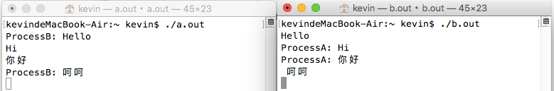

---
{
  "title": "apue 进程间通信IPC",
  "staticFileName": "apue_ipc.html",
  "author": "guoqzuo",
  "createDate": "2016/10/23",
  "description": "由于进程所处的空间都是独立的，如果多个子进程需要交互数据，那就需要了解进程间通信(InterProcess Communication, IPC)了。这里先介绍前三种通信方式：1. 管道(无名) 只能用于父子进程通信，半双工，单向；2. 命名管道，同一台主机的任意两个进程；3. 共享内存。",
  "keywords": "IPC,ipc,进程间通信,apue,C语言实现聊天小程序,管道,共享内存,pipe,fifo",
  "category": "C与APUE"
}
---

# apue 进程间通信IPC

> 由于进程所处的空间都是独立的，如果多个子进程需要交互数据，那就需要了解进程间通信(InterProcess Communication, IPC)了。这里先介绍前三种通信方式：1. 管道(无名) 只能用于父子进程通信，半双工，单向；2. 命名管道，同一台主机的任意两个进程；3. 共享内存。


## 无名管道pipe
int pipe(int fildes[2]); -- create descriptor pair for interprocess communication

1. pipe打开了一个"文件", 他有两个文件描述符，一个专门用来读，一个专门用来写。
2. fildes参数是一个结果参数，两个文件描述符(fd)

```c
int arr[2] = {0}; 
pipe(arr); 
// arr[0]只能为读端，arr[1]只能为写端，fd最小分配原则!  
// arr[0] = 3; arr[1] = 4;
```
管道中的数据会被读走，如果没有数据，read也不会返回0，而是阻塞等待有人向写端写数据，对端关闭，才能返回0，pipe之后，fork，子进程会复制父进程的文件描述符表,父子进程看到的是同一个管道，都有读写端,父读子写，子读父写，不能同时又读又写，一般父子进程需要一个关闭读端，一个关闭写端，当读端是循环的，它的写端如果不关闭，read会一直阻塞，写端要都关闭read才能正常退出，包括自己的写端
```c
/*  
 *  pipe() IPC  
 *  Sat Oct 22 21:08:25 2016
 *  Create by Kevin Zuo
 */

#include <stdio.h>
#include <stdlib.h>
#include <unistd.h>
#include <string.h>

int main(int argc, char* argv[])
{
    int pid = 0;
    int pipefd[2] = {0};
    char buf[100] = {0};

    pipe(pipefd);
    pid = fork();
    if (pid == 0) { // 子进程
        close(pipefd[0]); // 关闭读
        // sleep(5);  // 如果read 读不到数据会阻塞等待
        write(pipefd[1], "hello", 5);
        write(pipefd[1], "world", 5);
        return 0; // 子进程结束会自己关闭对应的读写端
    }

    // 父进程
    close(pipefd[1]); // 关闭写,如果自己的写端不关闭，作为读端会一直阻塞
    while (1) {
        memset(buf, 0, 100);
        int n = read(pipefd[0], buf, 100);
        if (n == 0) break;
        printf("%s\n", buf);
    }

    exit(0);
}
```
输出重定向
```c
/*  
 *  pipe() IPC  
 *  Sat Oct 22 21:08:25 2016
 *  Create by Kevin Zuo
 */

#include <stdio.h>
#include <stdlib.h>
#include <unistd.h>
#include <string.h>

int main(int argc, char* argv[])
{
    int pid = 0;
    int pipefd[2] = {0};
    char buf[100] = {0};

    pipe(pipefd);
    pid = fork();
    if (pid == 0) { // 子进程
        close(pipefd[0]); // 关闭读
        dup2(pipefd[1], 1); // 将文件重定向都输出缓冲区
        printf("hello world!");
        return 0; // 子进程结束会自己关闭对应的读写端
    }

    // 父进程
    close(pipefd[1]); // 关闭写,如果自己的写端不关闭，作为读端会一直阻塞
    while (1) {
        memset(buf, 0, 100);
        int n = read(pipefd[0], buf, 100);
        if (n == 0) break;
        printf("%s\n", buf);
    }

    exit(0);
}

// 执行结果:
// kevindeMacBook-Air:~ kevin$ ./a.out
// hello world!
// kevindeMacBook-Air:~ kevin$
```
## 命名管道 fifo
有名管道FIFO, 文件类型p，突破无名管道只能在父子进程通信的问题
```bash
mkfifo data # 建立一个叫data的管道文件

# kevindeMacBook-Air:~ kevin$ ls -l data
# prw-r--r--  1 kevin  staff  0 10 22 21:30 data
```
int mkfifo(const char *path, mode_t mode); -- make a fifo file

文件大小永远是0, 只有i节点号，写入改文件的数据不会存在硬盘里，而是写入缓存,任意的两个进程同通过打开这个文件，操作这个文件进行通信，open打开有名管道时，需遵循一个读，一个写的原则
- a.out 以只读的方式打开data，没有写会阻塞。如果以读写的方式打开，读还是会阻塞 
- b.out 以只写的方式打开data，没有读会阻塞。如果以读写的范式打开，写不会阻塞

进程间通信为什么不用普通文件呢?
- 很难去控制，文件打开后，如果一端写入了内容，另一端有缓存，读不出文件的变化，需要关了再打开,但怎么判断写入了多少内容，需要控制检索。
- 验证: 先open一个文件1.txt(内容为123), 用一个scanf阻塞程序，待修改1.txt内容后，让程序继续运行

```c
/*  
 *  open的缓存问题  
 *  Sat Oct 22 22:19:14 2016
 *  Create by Kevin Zuo
 */

#include <stdio.h>
#include <stdlib.h>
#include <fcntl.h>
#include <unistd.h>

int main(int argc, char* argv[])
{
    int d = 0;
    int fd = open("1.data", O_RDONLY);
    char buf[100] = {0};

    scanf("%d", &d); // 阻塞，待文件修改后，再输入
    read(fd, buf, 100); // 读出的内容不是最新的
    printf("%s\n", buf);

    exit(0);
}
```

fifo在普通文件的基础上，加了一些特性，让两个进程可以依靠读写来通信

半双工的管道，只能一边读另一边写，如果模拟一个聊天程序，需要两个管道文件才行

管道文件a: a.out写，b.out读  a.out给b.out发送消息、管道文件b: a.out读，b.out写  b.out给a.out发送消息

a.c

```c
/*  
 *  程序a   
 *  Sat Oct 22 23:10:14 2016
 *  Create by Kevin Zuo
 */

#include <stdio.h>
#include <stdlib.h>
#include <unistd.h>
#include <sys/stat.h>
#include <fcntl.h>
#include <string.h>

int main(int argc, char* argv[])
{
    int n = 0;
    char buf[100] = {0};

    if(access("data_a", F_OK)) // 文件存在返回0，不存在返回-1
        mkfifo("data_a", 0644);
    if (access("data_b", F_OK))
        mkfifo("data_b", 0644);

    int fd_a = open("data_a", O_RDONLY);
    int fd_b = open("data_b", O_WRONLY);

    int pid = fork();
    if (pid == 0) {
        while(1) { // 子进程用来接收来自程序b的消息
            read(fd_a, buf, 100);
            printf("%s", buf);
            fflush(stdout);
        }
        return 0;
    }
    while (1) { // 父进程用来写入信息到程序b
        memset(buf, 0, 100);
        fgets(buf, 100, stdin);
        buf[strlen(buf)-1] = '\0';
        char buf_t[100] = {0};
        sprintf(buf_t, "ProcessA: %s", buf);
        write(fd_b, buf_t, strlen(buf_t));
    }

    exit(0);
}
```
b.c
```c
/*  
 *  程序b   
 *  Sat Oct 22 23:10:14 2016
 *  Create by Kevin Zuo
 */

#include <stdio.h>
#include <stdlib.h>
#include <unistd.h>
#include <sys/stat.h>
#include <fcntl.h>
#include <string.h>

int main(int argc, char* argv[])
{
    int n = 0;
    char buf[100] = {0};

    if(access("data_a", F_OK)) // 文件存在返回0，不存在返回-1
        mkfifo("data_a", 0644);
    if (access("data_b", F_OK))
        mkfifo("data_b", 0644);

    int fd_a = open("data_a", O_WRONLY);
    int fd_b = open("data_b", O_RDONLY);

    int pid = fork();
    if (pid == 0) {
        while(1) { // 子进程用来接收来自程序a的消息
            read(fd_b, buf, 100);
            printf("%s", buf);
            fflush(stdout);
        }
        return 0;
    }
    while (1) { // 父进程用来写入信息到程序a
        memset(buf, 0, 100);
        fgets(buf, 100, stdin);
        buf[strlen(buf)-1] = '\0';
        char buf_t[100] = {0};
        sprintf(buf_t, "ProcessB: %s
", buf);
        write(fd_a, buf_t, strlen(buf_t));
    }

    exit(0);
}
```
运行结果: 



## 共享内存 ipcs 
查看已有的共享内存
- shmget创建或打开    
- shmat建立链接    
- shmdt解除链接    
- shmctl管理共享内存


### shmget 创建或打开一个共享内存
```c
int shmget(key_t key, size_t size, int shmflg); -- get shared memory area identifier
// 得到一个共享内存标识符或创建一个共享内存对象并返回共享内存标识
参数1: 相当于一个暗号, 0x1234两个进程key一样，就是同一块共享内存(大小size也要一样)
参数2: 创建或打开的共享内存的大小
参数3: 标识位  IPC_CREAT没有就创建, 一定要 | 0644, 创建权限
shmget(0x1234, 512, IPC_CREAT | 0644); 返回一个id
```

### shmat 获取共享内存的起始地址
可向本地空间一样访问，连接共享内存标识符为shmid的共享内存，将共享内存区对象映射到调用进程的地址空间
```c
void * shmat(int shmid, const void *shmaddr, int shmflg); 
// -- map shared memory
// 参数1：shmget的返回值，共享内存的标识
// 参数2：指定共享内存出现在进程内存地址的什么位置，NULL表示让内核自己决定位置
// 参数3：0  无特殊要求   SHM_RDONLY,只读模式， 其他为读写
char* p = shmat(shmid, NULL, 0);
```

### shmdt 断开共享内存连接
关闭共享内存与进程的连接
```c
int shmdt(const void *shmaddr);  // -- unmap shared memory
// 参数为shamt的返回值，连接的共享内存的起始地址, shmdt(p); 
```
### shmctl 共享内存管理
对共享内存的控制，可用来删除共享内存空间
```c
int shmctl(int shmid, int cmd, struct shmid_ds *buf); -- shared memory control operations
// 参数1：共享内存标识符
// 参数2：操作标识，参数不同，操作不同
//       IPC_STAT：将共享内存的状态复制到buf结构体里
//       IPC_SET：改变共享内存的状态，将buf里的参数，复制到进程的shmid_ds结构类
//       IPC_RMID：删除这片共享内存
// 参数3：共享内存管理结构体， IPC_RMID删除时一般填NULL；
```
实例:

1a.c
```c
/*  
 *  1a.c 共享内存  
 *  Sun Oct 23 02:15:22 2016
 *  Create by Kevin Zuo
 */

#include <stdio.h>
#include <stdlib.h>
#include <sys/shm.h>
#include <string.h>

int main(int argc, char* argv[])
{
    int shmid = shmget(0x1234, 512, IPC_CREAT | 0644);
    char* p = shmat(shmid, NULL, 0);

    memcpy(p,"hello word!",strlen("hello word!"));
    shmdt(p);

    exit(0);
}
```
1b.c
```c
/*  
 *  1b.c 共享内存  
 *  Sun Oct 23 02:15:22 2016
 *  Create by Kevin Zuo
 */

#include <stdio.h>
#include <stdlib.h>
#include <sys/shm.h>
#include <string.h>

int main(int argc, char* argv[])
{
    int shmid = shmget(0x1234, 512, IPC_CREAT | 0644);
    char* p = shmat(shmid, NULL, 0);

    char buf[32] = {0};
    memcpy(buf, p, 31);
    printf("%s\n", buf);
    shmdt(p);
    shmctl(shmid, IPC_RMID, NULL); // 删除这片共享内存

    exit(0);
}

// 运行效果：
// kevindeMacBook-Air:~ kevin$ ./a.out
// kevindeMacBook-Air:~ kevin$ ipcs
// IPC status from <running system> as of Sun Oct 23 02:35:29 CST 2016
// T     ID     KEY        MODE       OWNER    GROUP
// Message Queues:
// T     ID     KEY        MODE       OWNER    GROUP
// Shared Memory:
// m 196608 0x53414e44 --rw-rw-rw-    kevin    staff
// m 786433 0x00001234 --rw-r--r--    kevin    staff
// T     ID     KEY        MODE       OWNER    GROUP
// Semaphores:
// kevindeMacBook-Air:~ kevin$
// kevindeMacBook-Air:~ kevin$ ./b.out
// hello word!
// kevindeMacBook-Air:~ kevin$ ipcs
// IPC status from <running system> as of Sun Oct 23 02:35:44 CST 2016
// T     ID     KEY        MODE       OWNER    GROUP
// Message Queues:
// T     ID     KEY        MODE       OWNER    GROUP
// Shared Memory:
// m 196608 0x53414e44 --rw-rw-rw-    kevin    staff
// T     ID     KEY        MODE       OWNER    GROUP
// Semaphores:
// kevindeMacBook-Air:~ kevin$ ./b.out
```