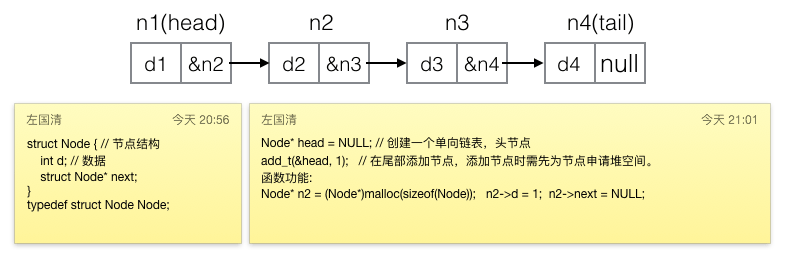
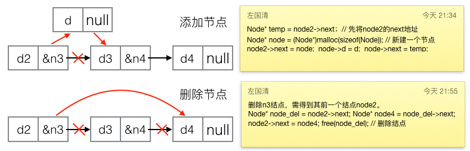

---
{
  "title": "c语言单向链表的实现",
  "staticFileName": "c_linked_list.html",
  "author": "guoqzuo",
  "createDate": "2016/10/16",
  "description": "c语言指针和结构体一学完就是链表了。也是一个分水岭，很多小白都卡在了这里，当初我自学时就是在这个位置时放弃了。我发现很多地方讲链表都讲得比较复杂，其实链表很简单，就是将多个数据(结构体类型)连在一起。只要有该链表头结点的地址，就可以操作这一连串数据。",
  "keywords": "c语言单向链表,单向链表,单向链表理解,c 链表,c 单向链表",
  "category": "C与APUE"
}
---
# c语言单向链表的实现

> c语言指针和结构体一学完就是链表了。也是一个分水岭，很多小白都卡在了这里，当初我自学时就是在这个位置时放弃了。我发现很多地方讲链表都讲得比较复杂，其实链表很简单，就是将多个数据(结构体类型)连在一起。只要有该链表头结点的地址，就可以操作这一连串数据。



最开始自学C时，指针的概念都不怎么懂，在熟悉链表的过程中，指针就慢慢的熟悉了。链表由结点组成。结点用结构体来表示，单向链表的结构体有两个变量，一个存数据，一个存下一个结点的地址。就是把一连串的地址有序的连接起来，用头结点地址表示链表。每个结点的空间用malloc来分配。双向链表就是多了个pre的指针,环形链表只是head的pre指向尾结点，尾部的next指向头结点，一般单向链表理解了，其他的就好理解了。单向链表可以模拟一般数据库的功能，增删查改都行，以前用文件和链表写过纯C的学生成绩管理系统。如果想提升可以去研究内核的链表结构。链表一般情况也不怎么用，在高级语言中都有现成的类，方法都写好了，直接用就行了。



具体代码如下:
```c
/*  
 *  C单向链表的实现与运用   
 *  Sun Oct 16 17:32:42 2016
 *  Create by Kevin Zuo
 */ 

#include <stdio.h>
#include <stdlib.h>

struct Node { // 组成单向链表的节点,类似于对象
    int d; // 这里只是示范,也可以将d替换为另一个struct对象，如学生信息结构体
    struct Node* next;  // 纯C的学生成绩管理系统可不依赖数据库，直接用链表+文件
};
typedef struct Node Node;

int size(Node* head) // 计算链表长度
{
    if (head == NULL) return 0;
    int count = 0;
    while (head != NULL) {
        count++;
        head = head->next;
    }
    return count;
}

void print(Node* head) { // 打印链表
    if (head == NULL) printf("链表为空!\n");
    else {
        while (head != NULL) {
            printf("%d ", head->d);
            head = head->next;
        }
        printf("\n");
    }
}

// 结点的增加
void add_h(Node** head, int t) // 头部添加结点, 可能需要修改头结点，传地址
{
    // 在堆空间申请一个片空间，用来存放结点
    Node* p = (Node*)malloc(sizeof(Node)); // 代码长度关系，就不进行出差判断了
    p->d = t;
    p->next = NULL;

    if (*head == NULL) *head = p; // 如果链表为空，将p赋值给
    else {
        p->next = *head;
        *head = p;
    }
}

void add_t(Node** head, int t) // 尾部添加结点
{
    Node* p = (Node*)malloc(sizeof(Node)); // new 一个结点
    p->d = t;
    p->next = NULL;

    if (*head == NULL) *head = p; // 如果链表为空，将p赋值给
    else {
        // 为了防止改动头结点, 用另一个指针来遍历
        Node* temp = *head;
        while (temp->next != NULL) { // 找到尾部结点
            temp = temp->next;
        }
        temp->next = p;
    }
}

void add_pos(Node** head, int t, int pos) // 指定位置(pos)添加结点
{
    if (pos < 1 || pos > size(*head)) { // 位置超出范围
        printf("位置错误!"); return;
    }
    Node* p = (Node*)malloc(sizeof(Node)); // new 一个结点
    p->d = t;
    p->next = NULL;
    Node* temp = *head;
    for (int i = 0; i < pos-1; i++) { // 第一个位置添加，指针后移0，第二个，后移1,第pos个后移pos-1次
        temp = temp->next;
    }
    p->next = temp->next;
    temp->next = p;
}

// 结点的删除
void del_h(Node** head) // 删除头部结点
{
    if (*head == NULL) return;
    Node* temp = *head;
    *head = (*head)->next;
    free(temp);
}

void del_t(Node** head) // 删除尾部结点
{
    if (*head == NULL) return;
    Node* temp = *head;
    if (temp->next == NULL) {  // 只有一个结点
        *head = NULL;
        free(temp);
        return;
    }
    // 至少有两个结点
    while ((temp->next)->next != NULL) { // 找到要删除的前一个结点
        temp = temp->next;
    }
    free(temp->next);
    temp->next = NULL;
}

void del_pos(Node** head, int pos) // 删除指定位置(pos)结点
{
    if (pos < 1 || pos > size(*head)) {
        printf("位置错误!"); return;
    }
    if (pos == 1) del_h(head);
    else if (pos == size(*head)) del_t(head);
    else { // 不是头尾, 且长度至少为3
        Node* temp = *head;
        for (int i = 0; i < pos-2; i++) // 删除第二个，移动0,第3个,移动1，第pos个，移动pos-2
            temp = temp->next;
        Node* temp2 = temp->next;
        temp->next = temp2->next;
        free(temp2);
    }
}

// 结点的逆序 单向链表特有
void inv(Node** head)
{
    if (size(*head) < 2) return;
    Node* t1 = *head; // 结点1
    Node* t2 = t1->next; // 结点2
    Node* t3; // 当结点2改为指向结点1时，临时存结点2的next  
    while (t2 != NULL) { // 这种模型很常见，如菲波那切数列, 1/2+2/3+3/5,都可以用这种思路
        t3 = t2->next;
        t2->next = t1;
        Node* t = t2;
        t2 = t3;
        t1 = t;
    }
    (*head)->next = NULL;
    *head = t1;
}

// 结点的排序
Node* find_zx(Node** head) // 寻找最小值结点地址
{
    // 肯定不为空，至少有1个结点
    Node* temp = *head;
    if (temp->next == NULL) { // 只有一个结点 
        *head = NULL;
        return temp;
    } else { // 至少两个结点
        Node* min = temp;
        Node* pre_min;
        while (temp->next != NULL) {
            if (min->d > (temp->next)->d) {
                min = temp->next;
                pre_min = temp;
            }
            temp = temp->next;
        }
        pre_min->next = min->next;
        return min;
    }
}

void add_node(Node** head, Node* p) // 尾部添加完整结点
{
    p->next = NULL;
    if (*head == NULL)
        *head = p;
    else {
        Node* temp = *head;
        while (temp->next != NULL) {
            temp = temp->next;
        }
        temp->next = p;
    }
}

void sort(Node** head) // 排序
{
    if (size(*head) < 2) return;
    //思路 新建一个链表头结点，每次找出最小值结点(返回地址,解除与原链表的关系)，依次添加到新链表
    Node* list = NULL;
    while(1) {
        if (size(*head) == 0) break;
        Node* t = find_zx(head);
        // printf("[[%d ",t->d);  测试用
        add_node(&list, t);
    }
    *head = list;
}

int main(int argc, char* argv[])
{
    Node* head = NULL; // 创建一个单向链表，头节点
    add_h(&head, 1);
    add_h(&head, 2);
    add_h(&head, 3);
    add_t(&head, 4);
    add_t(&head, 5);
    add_t(&head, 6);
    add_pos(&head, 10, 1);
    add_pos(&head, 100, 3);
    add_pos(&head, 1000, 8);
    /*del_h(&head);
    del_h(&head);
    del_t(&head);
    del_t(&head);
    del_pos(&head,1);
    del_pos(&head,4);
    del_pos(&head,2);
    */
    printf("size=%d\n", size(head));
    print(head);
    inv(&head);
    print(head);
    sort(&head);
    print(head);
    exit(0);
}
```