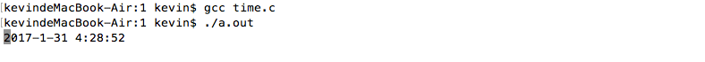

---
{
  "title": "c语言实现控制台下走动的时间",
  "staticFileName": "c_console_time.html",
  "author": "guoqzuo",
  "createDate": "2016/10/16",
  "description": "UI下时间插件很容易展现一个走动的时间，但C语言下控制台程序想要实现一个走动的时间，就需要用while(1)每隔1秒来打印了。其间我们可以开个fork用子程序来跑这个死循环。顺便延升到输出缓冲区与printf函数的问题。",
  "keywords": "c 控制台走动的时间,c语言时间程序,c 走动时间, c 控制台时间",
  "category": "C与APUE"
}
---
# c语言实现控制台下走动的时间

> UI下时间插件很容易展现一个走动的时间，但C语言下控制台程序想要实现一个走动的时间，就需要用while(1)每隔1秒来打印了。其间我们可以开个fork用子程序来跑这个死循环。顺便延升到输出缓冲区与printf函数的问题。



## 初步实现
这里没有其他的操作就直接在主进程里面实现了。思路是在while(1)里每隔1s不断的打印当前时间。首先要获取当前时间,用man 3 localtime来获取时间，格式0000-00-00 00:00:00，之后就是让打印的时间总是显示在该行。也就是不换行，可以用' '来将光标移动至行首实现。代码如下:
```c
/*  
 *  C语言 显示走动的时间  
 *  Sun Oct 16 14:26:55 2016
 *  Create by Kevin Zuo
 */

#include <stdio.h>
#include <stdlib.h>
#include <time.h>
#include <unistd.h>
int main(int argc, char* argv[])
{
    while (1) {
        struct tm *p;
        time_t t = time(NULL);
        p = localtime(&t);
        printf("%d-%d-%d %d:%d:%d\n",p->tm_year+1900, p->tm_mon+1, p->tm_mday,
                p->tm_hour, p->tm_min, p->tm_sec);
        sleep(1);
        fflush(stdout);
    }
    exit(0);
}
```

## 问题延升
上面的程序为什么加了sleep(1)和fflush(stdout)呢? 首先如果不加sleep(1)，打印的光标会一直刷，一秒钟while(1)可以执行多次。所以需要加休眠1秒，但加了sleep(1)之后，由于标准IO(printf)都是行缓冲或满缓冲，当短时间内打印的内容无法全部输出时，就会出现缓冲，暂时不打印，遇到换行或者等缓冲区满了才会打印。如果想要实时打印就要用fflush(stdout)强制刷新输出缓冲区。printf函数是c语言库函数，其本质就是向输出缓冲区文件写入内容。可以用write来代替printf。向write这样的系统调用在用户空间无缓冲机制，写入都是实时的，所以不用fflush(stdout))。代码如下:
```c
#include <stdio.h>
#include <stdlib.h>
#include <time.h>
#include <unistd.h>
#include <string.h>

int main(int argc, char* argv[])
{
    while (1) {
        struct tm *p;
        time_t t = time(NULL);
        p = localtime(&t);
        char buf[100] = {0};
        sprintf(buf,"%04d-%02d-%02d %02d:%02d:%02d\n",p->tm_year+1900, p->tm_mon+1, p->tm_mday,
                p->tm_hour, p->tm_min, p->tm_sec);
        write(1, buf, strlen(buf));
        sleep(1);
    }
    exit(0);
}
```

## 最后
以上的代码执行效果和上面一致，只是用了系统调用函数。如果只学了基本的C语言，看上面的内容可能会不懂，关于系统调用，可参考UNIX高级编程笔记，也就是APUE。C语言方面想要提高的，可以好好研下。