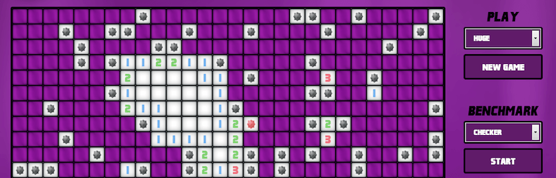
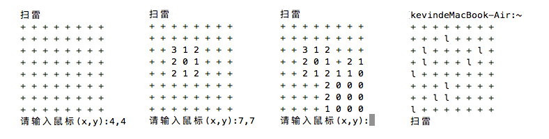
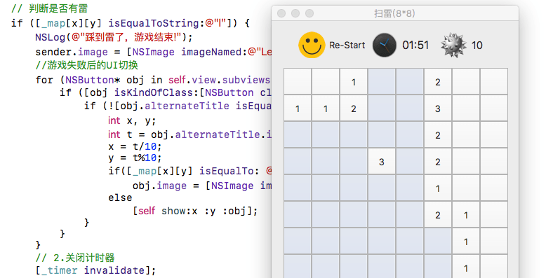

# c语言扫雷(控制台版)

>  扫雷游戏的逻辑其实很简单，只要学了C的循环语句、数组、递归就可以基本实现了。思路有了，就可以应用到UI上，这里例子是纯C代码，控制台下模拟，提供相关思路及示例。



## 游戏规则
点击方格后，如果是雷，游戏结束。如果不是就显示其周围雷的个数，如果个数为0(一般UI显示为空白)，会遍历打开其周围的方格。如果是雷则不打开，否则显示其周围雷的个数，如果还为0，继续像前面一样遍历，直到遇到边界。以此类推，当除了雷之外所有的方格都点开后，游戏就胜利了。  

## 实现思路
这里用c语言在控制台下模拟，不依赖任何第三方插件。右键插旗子是做不了的，鼠标点击改为输入坐标，旨在模拟扫雷实现的基本逻辑。首先要有两张地图，分别对应两个8*8的二维数组(字符)。一个用来显示界面，一个用来做内部地图，用memset()全部设置为'+'。内部地图里面设置10个雷，刚开始可以将雷的坐标写死，用'l'来标记。最好用随机数来决定雷的坐标，要注意防止随机数的重复。用while(1)来不断接收用户输入，并进行相关操作，注意坐标越界的处理。如果输入坐标为4，4。就到内部地图数组arr[3][3]查其值(数组为0开始，坐标为1开始，所以要减1)，如果为'l'就是踩到雷了。游戏结束。否则遍历其周围的8个方向雷的个数，得到雷的个数后设置到对应的UI数组arr_ui[3][3]。这里要注意字符'0'为数字48。上面的实现之后算是一个分水岭了，难点是如果雷的个数为0，要一扫一大片的效果。就要用到递归了，遍历的时候将坐标周围8个方向的坐标设置为了一个二维数组，当前坐标加上这些个方向坐标，正好代表了其周围的坐标。递归时如果越界了就continue。如果之前递归过该坐标(对应UI数组已经写过值或为雷)，也continue。如果雷数不为0，写值，为0递归。具体实现参见下面示例源码，下图为该示例的运行效果。



## 示例源码
```c
/*
 *  C语言扫雷，控制台
 *  2016/10/15 12:19
 *  Create by Kevin Zuo
 */

#include <stdio.h>
#include <stdlib.h>
#include <string.h>
#include <time.h>
#define NUM 8 // 地图长宽
#define LEI 10 // 雷的个数

int mark[8][2] = {{0,1},{1,1},{1,0},{1,-1},{0,-1},{-1,-1},{-1,0},{-1,1}}; // 8个方向坐标
char map[NUM][NUM] = {0}; // 内部地图
char ui[NUM][NUM] = {0};  // UI

void print(char map[][NUM], int n) // 打印UI或地图
{
    for(int i = 0; i < n; i++) {
        for (int j = 0; j < n; j++) {
            printf("%c ",map[i][j]);
        }
        printf("\n");
    }
}

int lei_count(int x, int y, int n) { // 根据坐标，计算周围有几个雷
    int count = 0;
    int x1 = 0, y1 = 0;
    for (int i = 0; i < 8; i++) {
        x1 = x + mark[i][0];
        y1 = y + mark[i][1];
        if (x1 < 1 || x1 > n || y1 < 1 || y1 > n) continue; // 如果超出了边界
        if (map[x1-1][y1-1] == 'l')
            count++;
    }
    return count;
}

void zero_digui(int x, int y) // 递归显示
{
    ui[x-1][y-1] = 0 + 48;
    int x1 = 0, y1 = 0;
    for (int i = 0; i < 8; i++) { // 遍历周围的8个方向
        x1 = x + mark[i][0];
        y1 = y + mark[i][1];
        if (x1 < 1 || x1 > NUM || y1 < 1 || y1 > NUM) continue; // 如果超出了边界
        int count = lei_count(x1,y1,NUM);
        if (count != 0) ui[x1-1][y1-1] = count + 48; // 不为0直接写值 
        else if (ui[x1-1][y1-1] == '0') continue; // 为0, 但值已是0，以前遍历过
        else zero_digui(x1,y1); // 为0，没遍历过, 遍历
    }
}

int win_check() // 赢了返回1,else 返回0
{
    // 计算ui里面+的个数,为LEI，则胜利
    int count = 0;
    for (int i = 0; i < NUM; i++) {
        for (int j = 0; j < NUM; j++) {
            if (ui[i][j] == '+')
                count++;
        }
    }
    if (count == LEI)
        return 1;
    else
        return 0;
}

int main(int argc, char* argv[])
{
    memset(map, '+', NUM*NUM); // 填充+
    memset(ui, '+', NUM*NUM);

    srand(time(NULL)); // 设置随机数种子
    for (int i = 0; i < LEI; i++) { // 随机给出LEI个雷,用'l'标记
        int x = 0, y = 0;
        do {
            x = rand()%NUM;
            y = rand()%NUM;
        } while(map[x][y] == 'l'); // 防止随机数重复
        map[x][y] = 'l';
    }
    print(map, NUM); // 测试用

    while (1) {
        int x = 0, y = 0;
        printf("扫雷\n");
        print(ui, NUM); // 打印UI
        do { // 提示输入，且保证输入坐标正常!
            printf("请输入鼠标(x,y):");
            scanf("%d,%d", &x, &y);
        } while (x < 1 || x > NUM || y < 1 || y > NUM);
        // 判断是否有雷
        if (map[x-1][y-1] == 'l') { // 如果是雷，游戏结束
            print(map, NUM);
            printf("踩到雷了，游戏结束!\n");
            break;
        } else { // 如果不是雷
            int count = lei_count(x, y, NUM);
            if (count != 0) // 周围有几个雷就显示几个雷
                ui[x-1][y-1] = count + 48; // int型 => 字符 +48
            else { // 没有雷就递归寻找，显示
                zero_digui(x, y);
            }
        }
        // 判断是否赢了
        if(win_check()) { // 恭喜，胜利
            print(ui,NUM);
            printf("恭喜,胜利!\n");
            break;
        }
    }
     return 0;
}
```

## 扩展
在图形化界面里面可以将对应的方格对应到二维数组。思路是一样的，之前写过一个mac版的，但只做了基本的一扫一大片。后续还有一些要完善的，等完成了会更新具体实现，希望对大家有帮助。



