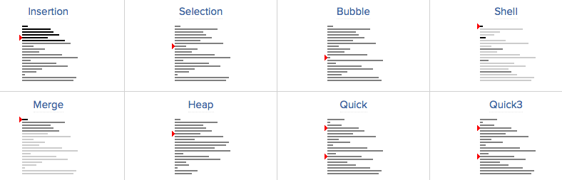

# c语言排序算法

> 排序的方法有不少，不过到现在还没怎么具体应用过，可能还比较low吧。这里介绍4中常见的排序算法：冒泡排序、选择排序、插入排序、快速排序，用C语言实现。



直接上代码:
```c
/*  
 *  排序  
 *  Sun Oct 16 15:54:56 2016
 *  Create by Kevin Zuo
 */

#include <stdio.h>
#include <stdlib.h>

void swap(int* a, int* b) // 交换值
{
    int t = *a;
    *a = *b;
    *b = t;
}

void sort_mp(int *a, int n) // 冒泡排序
{
    for (int i = 0; i < n; i++) {
        for (int j = i+1; j < n; j++) { // 拿第一个值逐个比较，大于就交换
            if (a[i] > a[j])
                swap(&a[i], &a[j]);
        }
    }
}

void sort_xz(int *a, int n) // 选择排序
{
    int min = 0;
    for (int i = 0; i < n; i++) {
        min = i;
        for (int j = i+1; j < n; j++) { // 拿第一个值逐个比较，将小的值存入min
            if (a[min] > a[j])
                min = j;
        }
        if (min != i) // 找出最小值，再交换
            swap(&a[min], &a[i]);
    }
}

void sort_cr(int *a, int n) // 插入排序
{
    // 将数组分为两个队列，逐渐把第二个队列的第一个元素，按到校顺序插到第一个队列
    // 6      2,4,5,3,1,4,9,7,8
    // 2,6    4,5,3,1,4,9,7,8
    // 2,4,6  5,3,1,4,9,7,8
    for (int i = 1; i < n; i++) {
        int t = a[i];
        int j = 0;
        for (j = i -1; j>=0 && a[j]>t;j--) { // 找到合适的位置,之前的数据对应前移
            a[j+1] = a[j];
        }
        a[j+1] = t;
    }
}

void sort_ks(int *a, int n) // 快速排序
{
    // 将无序数列最左边的数作为参照，比它大的放右边，小的放左边，这样就得到了两个无序
    // 数列，再递归
    if (n < 2) return; // 长度<2 的不用排序，防止递归段错误
    int l = 0, r = n - 1, t = a[l];
    while (l < r) {
        while (a[r] >= t && l < r)
            r--;
        swap(&a[l], &a[r]);
        while (a[l] <= t && l < r)
            l++;
        swap(&a[l], &a[r]);
    }
    sort_ks(a, l);
    sort_ks(a+l+1, n-l-1);
}

int main(int argc, char* argv[])
{
    int a[10] = {6,7,4,5,3,1,4,9,2,8};

    //sort_mp(a, 10);
    //sort_xz(a, 10);
    //sort_cr(a, 10);
    sort_ks(a, 10);
    for (int i = 0; i < 10; i++)
        printf("%d ", a[i]);
    printf("\n");

    exit(0);
}
```

更多详情参见: https://www.toptal.com/developers/sorting-algorithms/