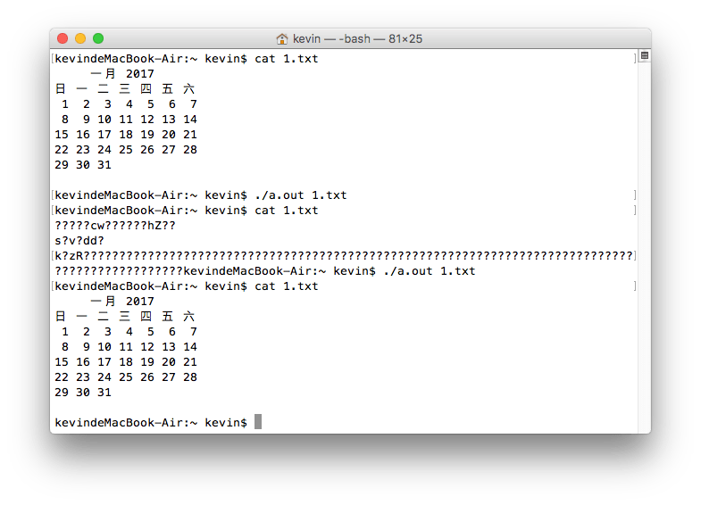

# c语言文件操作 - 简单的文件加密解密

> 文件加密对小白来说是一个很高大上的技术，但也不是那么遥不可及。只要学了C语言的文件操作，就可以用简单的文件操作方法，对文件进行简单的加密。


## 文件取反加密
思路是先打开文件，再读取文件的每一字节，取反之后再写入文件。运行一次后，文件的每一个字节都取反了，内容肯定是乱了。就相当于加密了，再运行一次就会还原，相当于解密。代码如下:
```c
/*  
 *  C语言 运行一次加密，再运行一次解密
 *  Sun Oct 16 15:23:23 2016
 *  Create by Kevin Zuo
 */

#include <stdio.h>
#include <stdlib.h>

int main(int argc, char* argv[])
{
    // 用第二个参数来接收要加密的文件
    if (argc < 2) {
        printf("参数错误，找不到文件!\n");
        return 1;
    }
    FILE* fp = fopen(argv[1],"r+");
    if (fp == NULL) { // 如果打开文件失败
        perror("open()");
        return 2;
    }
    while (1) { // 遍历改文件的每一个字节，取反
        char buf;
        int n = fread(&buf, 1, 1, fp); // 读取一个字节的内容,存入buf
        if (n == 0) break; // 读到文件结尾就退出
        buf = ~buf; //对自己取反
        fseek(fp, -1, SEEK_CUR);  // 读一位之后，文件指针会后移,修改时需将文件指针向前移动一位
        fwrite(&buf, 1, 1, fp); // 将取反的结果再写入文件
    }

    fclose(fp); // 关闭文件
    exit(0);
}
```

测试程序效果：



这个程序有个缺点就是不能对文件夹也就是目录加密，有了这个思路以后，就可以以此内推打造自己的加密算法了。