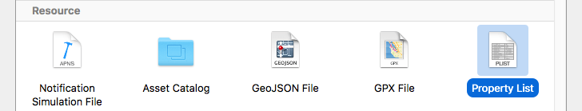
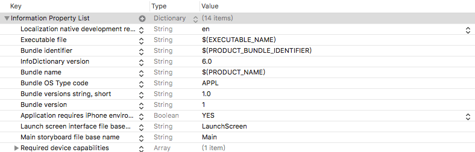
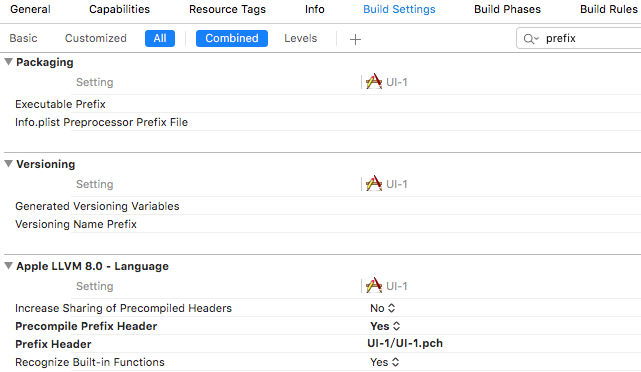
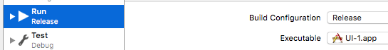

# iOS Info.plist与pch文件

> plist的全称为property list，是apple的一种属性列表文件，一般用来存储数组或字典类型数据。是iOS中数据持久化的一种方式。info.plist是app的配置文件，里面包含了app名称、版本、启动入口等基本信息。



## Info.plist配置文件
这个文件就是一个字典Dictionary，这里简单介绍下，更多详情移步: [iOS中Info.plist文件简介](https://my.oschina.net/hmj/blog/104196)



- Bundle name: app图标下显示名称，默认为项目名: $(PRODUCT_NAME)
- Bundle version string, short: 版本信息
- Launch screen interface file base name: 启动界面，如果不指定，界面不能全屏
- Main stroyboard file base name: 主界面    
- Supported interface orientations: 横屏/竖屏

## 解析plist文件
根据Info.plist文件获取当前的版本号信息等，获取Info.plist文件字典的方法有两种
1. 根据Info.plist文件的路径获取字典, 先得获取plist的路径
```objectivec
NSString* filePath = [[NSBundle mainBundle] pathForResource:@"Info.plist" ofType:nil];
NSDictionary* dict = [NSDictionary dictionaryWithContentsOfFile:filePath];
NSLog(@"%@", dict);
```
2. NSBundle类自带该字典的属性
```objectivec
NSDictionary* dict2 = [NSBundle mainBundle].infoDictionary;
NSLog(@"%@", dict2);
// 根据key值获取属性
NSString* version = dict[@"CFBundleShortVersionString"]; // 获取版本号
```

## pch文件    
pch原理: 项目下的所有文件都共用该文件；命名规范: 与工程名一致

注意事项: 
1. pch文件需提前编译(prefix) 
2. 需要做一些判断，有c文件，就不导入OC语法

使用前操作: 设置该文件为提前编译 Precompile prefix Header => YES; prefix Header 改为pch文件路径，相对于工程



由于每个OC文件都定义了宏__objectivec__， 如果是C文件，改宏不会被定义，所有内容写在下面的语句之间
```objectivec
#ifdef __objectivec__    

#endif  // __objectivec
```
作用: 
1. 存放一些公用宏    #denfie Wid 100
2. 存放一些公用的头文件 
3. 自定义输出日志(NSLog), 调试阶段需要打印来调试，而上架时就没必要了，节省资源



```objectivec
 #ifdef DEBUG // 调试 DEBUG系统自带宏, 上架可修改,edit scheme,run debug修改为release
 #define KEVINLog(...) NSLog(__VA_ARGS__);
 #else // 发布
 #define KEVINLog(...)
 #endif
// 工程里面的打印都使用KEVINLog()就可以了，__VA_ARGS__宏为可变长参数的标识
```

## xcode5 ==> xcode6 
- xcode6没有Frameworks文件夹，会自动导入常见的开发框架(Foundation.framework, UIKit.framework等)
- xcode5自带pch文件，为减少编译时间xcode6去掉了自带的pch文件
- xcode6多了launchSreen.xib界面，启动界面
- Supporting Files目录下少了InfoPlist.strings文件