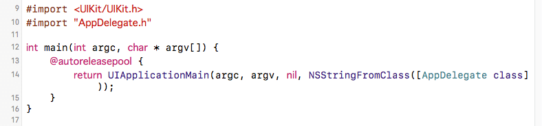
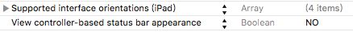
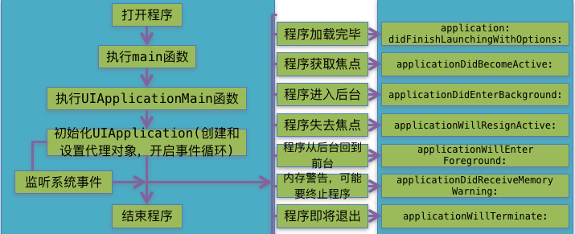
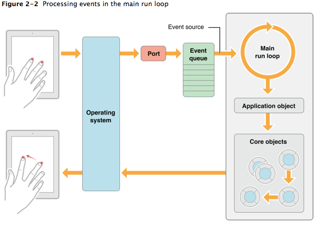

---
{
  "title": "iOS程序启动过程，从main函数开始UIApplication与AppDelegate",
  "staticFileName": "ios_startup.html",
  "author": "guoqzuo",
  "createDate": "2016/10/25",
  "description": "想弄清楚一段程序，就需要了解程序的执行过程。一般程序都是从main函数开始执行，iOS app也不例外。iOS程序main函数里执行了UIApplicationMain()函数，这个函数会创建UIApplication对象及代理AppDelegate，并开启事件循环，显示UI.",
  "keywords": "iOS程序启动过程,UIApplication,AppDelegate,iOS main函数执行过程",
  "category": "iOS"
}
---
# iOS程序启动过程，从main函数开始UIApplication与AppDelegate

> 想弄清楚一段程序，就需要了解程序的执行过程。一般程序都是从main函数开始执行，iOS app也不例外。iOS程序main函数里执行了UIApplicationMain()函数，这个函数会创建UIApplication对象及代理AppDelegate，并开启事件循环，显示UI.



## UIApplication
UIApplication对象是app的象征，每一个app都有自己的UIApplication对象，而且是唯一的(单例)。

单例: 整个app只能new一次该对象，再次new会出错, iOS程序启动时，创建的第一个对象就是UIApplication.
```objectivec
UIApplication* app = [[UIApplication alloc] init]; // 系统已自动创建了该对象，再次new会抛出异常
// Terminating app due to uncaught exception 'NSInternalInconsistencyException', reason:  
// 'There can only be one UIApplication instance.'
```
获取该单例对象
```objectivec    
UIApplication* app= [UIApplication sharedApplication]; //获取UIApplication对象
```
创建一个类模拟系统单例的实现
- 不能外界调用alloc，一调用就抛出异常
- 提供一个方法给外界获取单例   shareXxx
- 内部创建一次单例
  

创建一个Person对象

Person.h
```objectivec
#import <Foundation/Foundation.h>

@interface Person : NSObject

// 获取单例
+ (instancetype)sharePerson;

@end
```
Person.m  
```objectivec
#import "Person.h"

@implementation Person

// 程序启动时候创建对象

// 静态变量
static Person *_instance = nil;

// 作用: 加载类
// 什么时候调用: 每次程序一启动，就会把所有的类加载进内存
+ (void)load  // 启动时间早于main函数
{
    NSLog(@"%s", __func__);
    _instance = [[self alloc] init]; // 创建对象
}

+ (instancetype)sharePerson  // 获取单列对象
{
    return _instance;
}

+ (instancetype) alloc
{
    // super -> NSObject 才知道怎么分配内存，调用系统默认的做法,当重写一个方法的时候，如不想覆盖原来的实现
    // 就调用super
    if (_instance) { // 如果有值，说明已分配了内存，非第一次调用
        // 抛出异常
        // Terminating app due to uncaught exception 'NSInternalInconsistencyException', 
        // reason: 'There can only be one UIApplication instance.'
        // name 异常名称 、  reson 原因  、  userInfo 异常信息
        NSException* excp = [NSException exceptionWithName:@"NSInternalInconsistencyException" 
                            reason:@"There can only be one Person  instance." userInfo:nil];
        [excp raise];
    }
    return [super alloc];
}

@end
```
## UIApplication作用
先获取该对象
```objectivec
UIApplication* app = [UIApplication sharedApplication];
```    
### 设置app图标的提醒数字
```objectivec
app.applicationIconBadgeNumber = 5; // iOS8之后需注册用户通知
/* set to 0 to hide. default is 0. In iOS 8.0 and later, your application must register 
    for user notifications using -[UIApplication registerUserNotificationSettings:] before
    being able to set the icon badge. */
UIUserNotificationSettings* setting = [UIUserNotificationSettings
        settingsForTypes:UIUserNotificationTypeBadge categories:nil]; //创建通知对象
    [app registerUserNotificationSettings:setting]; // 注册用户通知
```
### 设置状态栏联网提示
```objectivec
[app setNetworkActivityIndicatorVisible:YES];
// 或者 
app.networkActivityIndicatorVisible = YES;
```

### 设置状态栏, 隐藏
```objectivec
//状态栏默认是交给UIViewController控制器管理，但控制器可能多个，可交给UIApplication管理
//设置Info.plist文件  add key: View controller-based status bar appearance ==> No
app.statusBarHidden = YES;

// 如果没有设置，只能使用View controller的方法
- (BOOL)prefersStatusBarHidden  // 隐藏状态栏
{
  return YES;
}
```


    
### 打电话，发短信，发邮件，打开网页
```objectivec
// URL 路径  URL: 协议头://资源路径, 根据协议头判断用什么软件打开  tel电话  mailto右键, sms 短信
NSURL* url = [NSURL URLWithString:@"http://zuo11.com"];
NSURL* url2 = [NSURL URLWithString:@"tel://13566612138"];  // 需要真机调试
NSURL* url3 = [NSURL URLWithString:@"sms://18826012138"]; // 需要真机调试
NSURL* url4 = [NSURL URLWithString:@"mailto:916707888@qq.com"]; // 需要真机调试
[app openURL:url4];
```

## UIApplication与delegate
在app受到干扰时，会产生一些系统事件，这时UIApplication会通知它的delegate，让delegate代理处理这些系统事件。delegate可处理的事件包括：
- 应用程序的生命周期事件(如程序的启动和关闭)
- 系统事件 (如来电)
- 内存警告
...

```objectivec
// 当程序运行后，依次执行
didFinishLaunchingWithOptions // app启动完成时
applicationDidBecomeActive // app完全获取焦点,当app完全获取到焦点，才能与用户交互
// 按下Home键，执行   // 需保存一些资源
applicationWillResignActive // 当app即将失去焦点时
applicationDidEnterBackground // 当app完全进入后台的时候
// 再次进入app时
applicationWillEnterForeground // 当app即将进入前台的方法
applicationDidBecomeActive // app完全获取焦点
// app即将完全退出时执行
applicationWillTerminate
```

## iOS程序启动过程 
```objectivec
int main(int argc, char * argv[]) {
    @autoreleasepool {
        // 第3个参数 The name of the UIApplication class or subclass. If you specify nil, 
            UIApplication is assumed.   // nil == @"UIApplication"
        //  NSStringFromClass([UIApplication class])
        // 第4个参数 UIApplication的代理名称 @"AppDelegate";
        
        //NSStringFromClass: 把类名转化为字符串, 1.有提示功能 2.避免出错
        // NSStringFromClass([AppDelegate class]);
        return UIApplicationMain(argc, argv, nil, NSStringFromClass([AppDelegate class]));
    }
}
// main之前会将所有的类加载到内存，会先执行类的 +(void)load;
// UIApplicationMain底层实现
// 1.根据principalClassName 传递的类名创建一个UIApplication对象
// 2.创建UIApplication代理对象, 给UIApplication对象设置代理
// 3.开启主运行事件循环，开始处理事件, 保持代码一直执行
// 4.加载Info.plist，判断是否指定main,如指定了，就去加载
```

UIApplicationMain

This function is called in the  entry point to create the application object and the application delegate and set up the event cycle.

This function instantiates the application object from the principal class and instantiates the delegate (if any) from the given class and sets the delegate for the application. It also sets up the main event loop, including the application’s run loop, and begins processing events. If the application’s  file specifies a main nib file to be loaded, by including the  key and a valid nib file name for the value, this function loads that nib file.



## The Main Run loop
  


