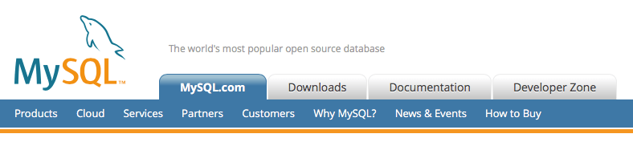
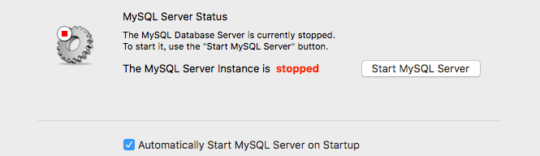
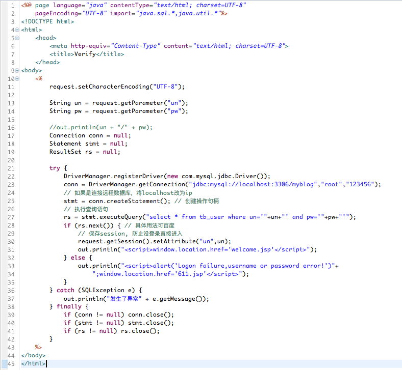

---
{
  "title": "mysql连接操作命令",
  "staticFileName": "db_mysql_basecmd.html",
  "author": "guoqzuo",
  "createDate": "2016/10/23",
  "description": "最开始接触数据库是在学校，有一门课就是讲数据库的，但只是拿着ppt讲了将书上的东西，没有实际操作。回想起来觉得很失败，一点动手操作的意识都没。现在学东西，我更喜欢从实际的问题出发，多查资料，多实践。这里总结了mac下mysql的安装与一些基本的应用。",
  "keywords": "mysql连接操作命令,mysql基础命令,mac下mysql安装,mysql mac,jsp连接mysql,jsp操作mysql",
  "category": "后端数据库等"
}
---
# mysql连接操作命令

> 最开始接触数据库是在学校，有一门课就是讲数据库的，但只是拿着ppt讲了将书上的东西，没有实际操作。回想起来觉得很失败，一点动手操作的意识都没。现在学东西，我更喜欢从实际的问题出发，多查资料，多实践。这里总结了mac下mysql的安装与一些基本的应用。



SQL包括:
- DDL(data definition language) 数据定义语言(创建、删除数据库、创建、删除表)
- DML(data manufacture language) 数据操作语言(数据的增删查改)

mysql 注释 -- 或 /**/

## Mac下数据库的安装
到官网下载一个dmg安装包，顺序安装后，弹出的最后一个对话框会生成一个随机密码，保存起来。

下载地址: MySQL :: Download MySQL Community Server

安装完成后打开系统偏好设置，最下面会多出一个mysql图标


点击进去，设置自动启动mysql



将mysql的bin目录添加到环境变量 
```bash
vi ~/.bash_profile # 打开环境变量配置文件
#输入 export PATH=${PATH}:/usr/local/mysql/bin
source .bash_profile
```

修改数据库登录密码，先用给的随机密码登录成功后 set password=password('123456');

修改编码为utf-8，防止中文乱码，mysql登录后输入status命令，显示的结果不能有latin编码
```bash
sudo cp /usr/local/mysql/support-files/my-medium.cnf /etc/my.cnf
sudo vi /etc/my.cnf
# [client]部分加入: default-character-set=utf8, 
# [mysqld]部分加入character-set-server=utf8
```

## MySQL服务的启动与关闭
```bash
net start mysql # 启动
net stop mysql # 关闭
```

## mysql登录
```bash
mysql -h -uroot -p 
# -h 可远程登录其他主机上的数据库，如 mysql -h10.141.164.59 -uroot -p 
# -u 指定用户名  -p 密码

# 登录到指定的数据库myblog
mysql -uroot -p myblog
```

## 设置允许远程访问数据库 -h  
```bash
mysql> use mysql;

mysql> grant all privileges on *.* to 'root'@'%' with grant option;

mysql> update user set password=password('密码') where user='root';

mysql> flush privileges;

mysql> exit
```

## DDL SQL语句
数据库:  
```bash
mysql> show databases; # 列出所有的数据库

mysql> use myblog  # 切换数据库为myblog

mysql> select database(); # 显示当前使用的数据库名

mysql> create database 数据库名; # 创建一个数据库

mysql> drop database 数据库名; # 删除数据库

mysql> alter database 数据库名 character set utf8; # 修改数据库的编码
```
数据表: 
```c
mysql> show tables; // 显示所有的数据表

mysql> desc tb_bj; // 查看表的结构 tb_bj;

mysql> create table tb_user (id int auto_increment primary key,user varchar(100) comment "用户名",passwd varchar(100) comment "密码") comment "用户表"; // 创建数据表，要指定id，primary key 

// comment用于注释, 常用类型int, varchar, date, timestamp,text,longtext
```
修改/删除表: 
```c
mysql> alter table 表名 drop 要删除的列名; // 删除列

mysql> alter table 表名 add 列名; // 添加列

mysql> alter table 表名 change 列名 新列名; // 修改列

mysql> drop table 表名; // 删除表
```
## DML SQL语句
查询数据:
```c
mysql> select * from tb_user; // 查询表

mysql> select user,passwd from tb_user; //查询表里面的具体数据，如果只需要1两个不需要整个表查

mysql> select * from tb_user order by id DESC; // order by 排序，DESC逆序

mysql> select count(*) from tb_note; // 查询数据的数量

mysql> select * from tb_user group by department; // 查询数据时按部门统计

mysql> select a.id,b.id form tb_a1 a, tb_b1 b where a.id=b.kid; // 跨表查询

// 不等于<>， not in， like '%123%', and, or, varchar要加单引号''

// .....

mysql> insert into tb_user (列1,列2) values (值1,值2); // 新增数据

mysql> delete from tb_user where ...; // 删除表中数据 

mysql> update tb_user set id=1 where ...; // 修改表的数据
```
字段的批量修改:
```bash
mysql> update tb_user set 要修改的列名=replace(要修改的列名,'本来内容','要修改的内容') where id = ..;
```

## 批量执行mysql语句
可以将一条条的mysql语句放在.sql文件中: init.sql，可自动执行 

## 数据库的备份与导入
备份数据库, 终端下任意位置 mysqldump -uroot -p 数据库名 > 1.sql  //  即可备份数据库

导入数据库，需要先选择数据库 use 数据库名， source 1.sql

## jsp连接操作mysql数据库
在Eclipse或其它IDE，连接数据库，先得配置数据库相关。配置好后导入jar包，就可以在jsp页面操作了。下面是一个用jsp写的登陆密码验证及跳转。 mysql jar包:  mysql-connector-java-5.1.7-bin.jar.zip

