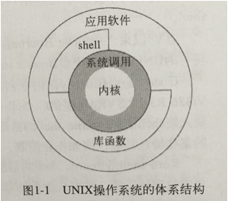
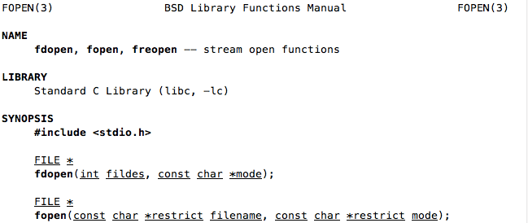

---
{
  "title": "unix环境高级编程(APUE)",
  "staticFileName": "apue_first.html",
  "author": "guoqzuo",
  "createDate": "2016/10/17",
  "description": "APUE是一本非常经典的书，被认为是在UINX环境下进行程序设计有关人员必读，且需要经常查阅的首选参考书，对于深入了解UNIX及内核源码非常有利。这本书没有花哨的界面，各种高大上的程序都是用C语言编写且在终端下运行，在这个浮躁的社会，能潜心去钻研这本书真的非常不容易。但只要用心去研究，一定会有意想不到的收获。",
  "keywords": "APUE,apue 笔记, APUE笔记,UNIX基础知识,UNIX环境高级编程,apue",
  "category": "C与APUE"
}
---

# unix环境高级编程(APUE)

> APUE是一本非常经典的书，被认为是在UINX环境下进行程序设计有关人员必读，且需要经常查阅的首选参考书，对于深入了解UNIX及内核源码非常有利。这本书没有花哨的界面，各种高大上的程序都是用C语言编写且在终端下运行，在这个浮躁的社会，能潜心去钻研这本书真的非常不容易。但只要用心去研究，一定会有意想不到的收获。


## UNIX操作系统(OS)与内核(Kernel)
从严格意义上讲OS就是Kernel，可以理解为一种软件。它能够控制计算机软硬件资源，提供程序运行环境。从广义的角度来看OS不仅包含了Kernel，还加上一些其他软件，这些软件包括app，shell，公用库函等。



## 系统调用、公用库函数、shell
### 系统调用(system call)
内核提供的接口函数，对应man手册第2章。它是内核的唯一接口。只要和内核交互，一定通过系统调用来实现。一些C语言库函数就是对系统调用的封装，如fopen和fwrite就是封装了open和wirte两个系统调用，在用户空间增加了缓冲机制。C库函数不一定都是封装了系统调用，如一些不需要操作内核的函数:strcpy，atoi等。


### 公用库函数
C语言库函数，对应man手册第3章。  




### shell
一个抽象的概念，特殊应用程序，为其他应用程序提供接口。shell的用户输入通常来自终端(交互式shell)，也可以来自于文件(如shell脚本)。可以理解为命令解释器，接收用户命令(如ls等)，然后调用相应的程序。macOS下默认的shell是bash，终端下的可执行命令，也叫shell命令(man手册第1章)。    有些shell命令如pwd、ls、cp、mv、cd、cp、mv等都可以通过调用系统调用来实现，后面会具体的讲。


## APUE内容对应内核功能
- 进程调度 -- 进程控制、线程控制、进程间通信(IPC)
- 内存分配
- 文件系统 -- 文件和目录、文件I/O、标准I/O、系统数据文件和信息、高级I/O

## 文件系统
文件系统非常重要，UNIX下所有的一切皆文件(everything is file)。
- 根(root)目录用 "/"表示。
- 主文件夹为: "~" 打开Terminal，当前所在的目录就是主文件夹(~), 任何目录输入cd命令都会进入该目录。
- 相对路径: 不是以根目录开头的路径，绝对路径: 以根目录开头的路径。
- 目录(directory): 文件夹，也是文件的一种创建新目录时，会自动创建两个文件.和..文件，分别代表当前路径和上一级路径,可用ls -a查看。

## 输入和输出 I/O
C语言中，输入输出函数都定义在stdio.h里，一般叫标准I/O，一个程序在运行时会打开3个缓冲区: 输入缓冲区，输出缓冲区，错误缓冲区。scanf的原理是从输入缓冲区读取相应格式的数据(%d),存储到变量里(&n)。printf的原理是将数据(n)以相应的格式(%d)写入输出缓冲区。输入缓冲区的文件一般由键盘写入或文件重定向(./a.out < 1.txt), 输入缓冲区的内容会打印或重定向到文件。这三个缓冲区实际上对应的是三个文件，当程序执行时，会默认打开着三个文件，标准I/O表现形式对应fopen的返回值FILE*类型 stdin、stdout、stderr; 文件I/O表现形式对应open的返回值int类型 0、1、2（有对应的宏，但感觉0，1，2更好记）。在C语言笔记里有用wirte(1,"str","lengt")来代替printf的例子，printf就是向输出缓冲区文件写入内容这里的0、1、2也叫fd(文件描述符 file descriptor)。相关实例：将输入缓冲区内容写入输出缓冲区，gcc编译链接后 ./a.out < 1.c 相当于cat 1.c, 复制文件可以用 ./a.out < 1.c > 1.txt, 相当于cp 1.c 1.txt
```c
/*  
  *  将输入缓冲区的内容写入输出缓冲区  
  *  Mon Oct 17 17:26:29 2016
  *  Create by Kevin Zuo
  */

#include <stdio.h>
#include <stdlib.h>
#include <unistd.h>

int main(int argc, char* argv[])
{
    int n = 0;
    char buf[1024] = {0};

    /*
    while (fgets(buf, 1024, stdin) != NULL) { // 标准I/O
        fputs(buf, stdout);
    }
    */

    while((n = read(0, buf, 1024)) != 0) { // 文件I/O
        write(1, buf, n); // 忽略出错判断与网络掉包情况
    }

    exit(0);
}
```

## 程序和进程
程序(program)是存储在磁盘上某个目录的可执行文件，使用exec函数将程序读入内存并执行。程序的运行实例称为进程(process)，UNIX确保每个进程都有一个唯一的数字标识符(进程ID)，控制进程主要有三个函数 fork, exec, waitpid。例子: shell终端程序模拟   
```c
/*  
  *  shell终端程序模拟  
  *  Mon Oct 17 17:45:24 2016
  *  Create by Kevin Zuo
  */

#include <stdio.h>
#include <stdlib.h>
#include <string.h>
#include <unistd.h>

int main(int argc, char* argv[])
{
    char buf[128] = {0};
    // 服务器程序一般都是一个while(1)，UI程序也类似，会开多个进程或线程,一直等待用户操作    
    while (1) { // 省略了出错判断
        printf("] ");
        memset(buf, 0, 128);
        fgets(buf, 128, stdin); // 获取输入缓冲区内容
        buf[strlen(buf)-1] = '\0'; // 去掉默认的回车
        int pid = fork();
        if (pid == 0) { // fork一个子进程，处理程序,如不开子进程execl运行完后程序后结束
            execlp(buf, buf, NULL); 
            return 0;
        }
        wait(NULL); // 等待子进程处理结束
    }

    exit(0);
}
```
运行效果：


如果需要了解更多详情，请移步: [APUE book](http://www.apuebook.com/)