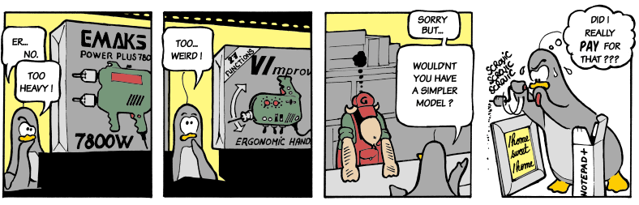
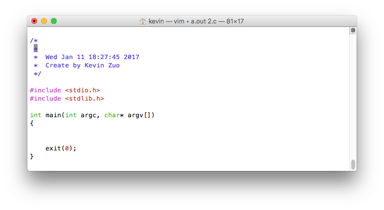

# vi 生成c语言模板

每次写C语言程序，都先会敲一个框架，然后再添加内容。为了省事，就用C语言文件操作函数写了个用于生成模板的c程序。



```c
#include <stdio.h>
int main()
{
    return 0;
}
```

逻辑：创建1.c这个文件，vim 1.c如果文件存在会打开，不存在会创建一个空的文本，现在我想自定义一个程序v，终端下v 1.c时，如果文件存在用vim打开，如果不存在，会用vim打开一个新文件，文件内容为模板内容。代码如下：
```c
/*
 *	用vim写c语言程序时，每次都会写一些重复代码
 *  以后每次想写程序，直接打开这个程序就可以自动生成基本C代码
 *	且带有相关注释，时间戳，作者等信息!
 *  2016/07/09 13:05
 *	Create by Kevin Zuo
 */

#include <stdio.h>
#include <stdlib.h>
#include <fcntl.h>
#include <unistd.h>
#include <errno.h>
#include <string.h>
#include <time.h>

int main(int argc, char* argv[])
{
	if (argc != 2) { // 这里只做2个参数处理，可以添加对无参数处理，直接system(vi);
		printf("参数错误!\n");
		return 1;
	}

	int fd = 0;
	char buf_touch[100] = {0}, buf_vim[100] = {0};
	char date1[100] = {0};

	if ((fd = open(argv[1],O_RDWR | O_CREAT | O_EXCL, 0644)) == -1 && errno == EEXIST)
	{
		//printf("文件已存在!请重新运行\n");
		sprintf(buf_vim, "vim %s +3", argv[1]);
		system(buf_vim);		
		exit(1);
	} 
	
	sprintf(buf_touch, "touch %s", argv[1]); 
	system(buf_touch);  // 用touch命令创建文件

	/*  获取系统时间, 存入timestamp  */	
	time_t long_t = time(0);
	sprintf(date1, " *  %s", ctime(&long_t));

	// 向文件写入内容
	write(fd, "\n", strlen("\n"));
	write(fd, "/*  \n", strlen("/*  \n"));
	write(fd, " *  \n", strlen(" *  \n"));
 	write(fd, date1, strlen(date1));
	write(fd, " *  Create by Kevin Zuo\n", strlen(" *  Create by Kevin Zuo\n"));
	write(fd, " */  \n", strlen(" */  \n"));
	write(fd, "\n", 1);
	write(fd, "#include <stdio.h>\n", strlen("#include <stdio.h>\n"));
	write(fd, "#include <stdlib.h>\n", strlen("#include <stdlib.h>\n"));
	write(fd, "\n", 1);
	write(fd, "int main(int argc, char* argv[])\n", strlen("int main(int argc, char* argv[])\n"));
	write(fd, "{\n", 2);
	write(fd, "\n", 1);
	write(fd, "\n", 1);
	write(fd, "\texit(0);\n", 10);
	write(fd, "}\n", 2);

	close(fd); // close file

	sprintf(buf_vim, "vim %s +3", argv[1]); // 用vim打开程序，光标停留在第三行
	system(buf_vim); 

	exit(0);
}

```

gcc编译文件后命名为v，将v这个程序copy到环境变量，我是copy到了/usr/local/bin下，以后用vim写C程序在终端下直接"v 新建C程序名"，就会生成如下图的模板:



这样就不用每次都手打了，而且自动生成时间戳加自己名字，这样就有点像IDE了。这里只是一个思路，你还可以加入自己想要的一些东西，比如根据文件后缀名生成对应的框架内容。