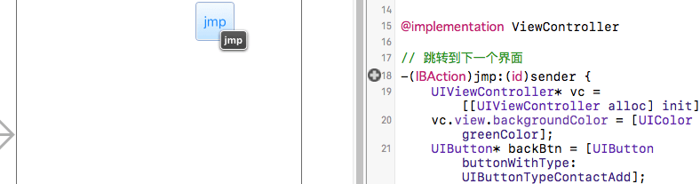
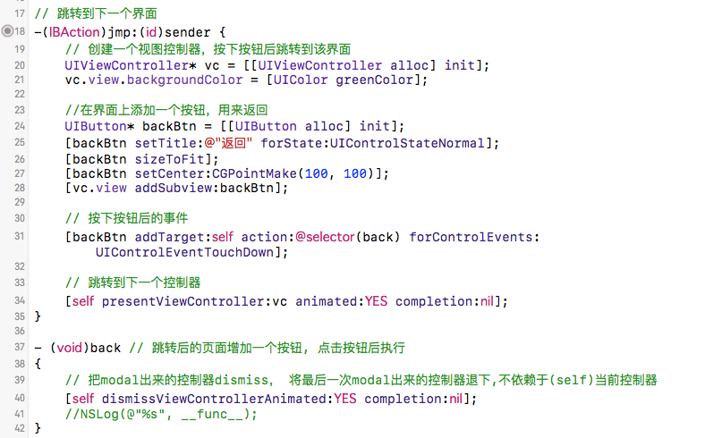
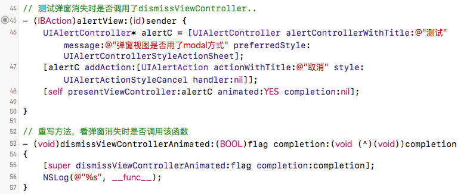

---
{
  "title": "iOS Modal，另一种切换控制器的方法",
  "staticFileName": "ios_modal.html",
  "author": "guoqzuo",
  "createDate": "2016/11/14",
  "description": "之前页面的切换用的一般是push，这里介绍另一种控制器切换的方法: Modal。任何控制器都能通过Modal的形式展示出来。Modal的默认效果:新控制器从屏幕最底部往上钻，直到盖住之前的控制器为止(push的效果为从右至左)",
  "keywords": "iOS Modal,Modal跳转,UIAlertController与Modal,presentViewController跳转,ios modal",
  "category": "iOS"
}
---

# iOS Modal，另一种切换控制器的方法

> 之前页面的切换用的一般是push，这里介绍另一种控制器切换的方法: Modal。任何控制器都能通过Modal的形式展示出来。Modal的默认效果:新控制器从屏幕最底部往上钻，直到盖住之前的控制器为止(push的效果为从右至左)



## presentViewController
用storyboard拖拽一个按钮jmp，将view Controller的类设置为ViewController。在跳转函数里设置相关跳转，关于Modal详情可参见: iOS开发UI篇-Modal简单介绍



## UIAlertController与modal
联想到之前弹窗时用的presentViewController，可能UIAlertController的跳转方式就是modal，于是想看看弹窗结束系统是否调用的dissmiss函数。于是又拖拽了一个按钮来弹窗，并重写dissmiss方法。发现弹窗消失时确实调用了dissmiss函数。



## 代码
```objectivec
#import "ViewController.h"

@interface ViewController ()

@end

@implementation ViewController

// 跳转到下一个界面
-(IBAction)jmp:(id)sender {
    // 创建一个视图控制器，按下按钮后跳转到该界面
    UIViewController* vc = [[UIViewController alloc] init];
    vc.view.backgroundColor = [UIColor greenColor];
    
    //在界面上添加一个按钮，用来返回
    UIButton* backBtn = [[UIButton alloc] init];
    [backBtn setTitle:@"返回" forState:UIControlStateNormal];
    [backBtn sizeToFit];
    [backBtn setCenter:CGPointMake(100, 100)];
    [vc.view addSubview:backBtn];
    
    // 按下按钮后的事件
    [backBtn addTarget:self action:@selector(back) forControlEvents:UIControlEventTouchDown];
    
    // 跳转到下一个控制器
    [self presentViewController:vc animated:YES completion:nil];
}

- (void)back // 跳转后的页面增加一个按钮, 点击按钮后执行
{
    // 把modal出来的控制器dismiss， 将最后一次modal出来的控制器退下,不依赖于(self)当前控制器
    [self dismissViewControllerAnimated:YES completion:nil];
    //NSLog(@"%s", __func__);
}

// 测试弹窗消失时是否调用了dismissViewController..
- (IBAction)alertView:(id)sender {
    UIAlertController* alertC = [UIAlertController alertControllerWithTitle:@"测试" message:@"弹窗视图是否用了modal方式" preferredStyle:UIAlertControllerStyleActionSheet];
    [alertC addAction:[UIAlertAction actionWithTitle:@"取消" style:UIAlertActionStyleCancel handler:nil]];
    [self presentViewController:alertC animated:YES completion:nil];

}

// 重写方法，看弹窗消失时是否调用该函数
- (void)dismissViewControllerAnimated:(BOOL)flag completion:(void (^)(void))completion
{
    [super dismissViewControllerAnimated:flag completion:completion];
    NSLog(@"%s", __func__);
}

- (void)viewDidLoad {
    [super viewDidLoad];
    // Do any additional setup after loading the view, typically from a nib.
}


- (void)didReceiveMemoryWarning {
    [super didReceiveMemoryWarning];
    // Dispose of any resources that can be recreated.
}


@end
```