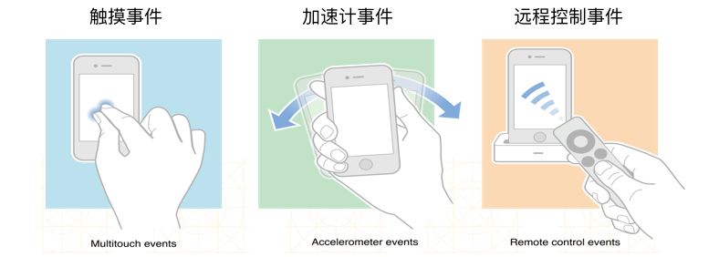
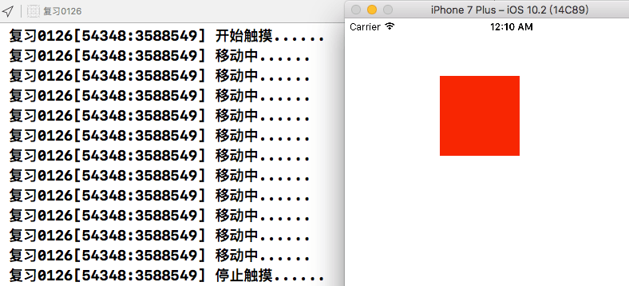
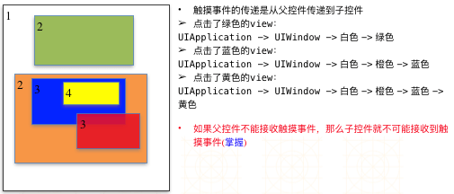
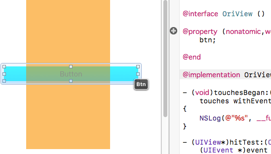
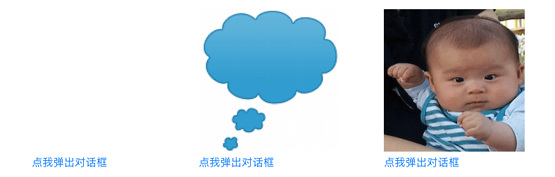
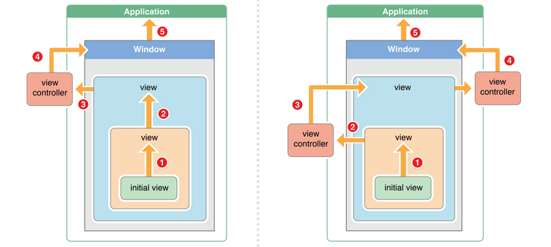

# iOS UIResponder响应者对象，iOS中的事件

在使用app的过程中，会产生各种各样的事件，iOS中的事件可以分为3大类型:触摸事件、加速计事件、远程控制事件。不是任何对象都能处理事件，只有继承了UIResponder的对象，才能接收并处理事件。这些对象被称为响应者对象



## 响应者对象
UIApplication/UIViewController/UIView都继承自UIResponder，他们都能接收并处理事件。先来看看触摸事件，当用户一根手指触摸时，会创建一个与手指关联的UITouch对象，一根手指对应一个UITouch对象。它保持着手指相关信息，如触摸的位置、时间。当手指移动时，系统会更新同一个UITouch对象，使之能够一直保持该手指在的触摸位置。当手指离开屏幕时，系统会销毁相应的UITouch对象。

这里我们在storyboard里拖拽一个UIView，背景设置为红色。修改类为自定义类RedView，在RedView.m文件里，监听该view的移动，用transform设置该view根据手指的移动而移动    



```objectivec
#import "RedView.h"

@implementation RedView

- (void)touchesBegan:(NSSet<UITouch *> *)touches withEvent:(UIEvent *)event
{
    NSLog(@"开始触摸......");
}

- (void)touchesEnded:(NSSet<UITouch *> *)touches withEvent:(UIEvent *)event
{
    NSLog(@"停止触摸......");
}

- (void)touchesMoved:(NSSet<UITouch *> *)touches withEvent:(UIEvent *)event
{
    NSLog(@"移动中......");
    // 实现该视图随着鼠标的移动而移动
    UITouch* touch = [touches anyObject]; // 获取touches中的任意一对象
    CGPoint curP = [touch locationInView:self]; // 当前位置
    CGPoint preP = [touch previousLocationInView:self]; // 之前位置
    CGFloat offsetX = curP.x - preP.x; // x偏移
    CGFloat offsetY = curP.y - preP.y; // y偏移
    
    self.transform = CGAffineTransformTranslate(self.transform, offsetX, offsetY);
}

- (void)touchesCancelled:(NSSet<UITouch *> *)touches withEvent:(UIEvent *)event
{
    NSLog(@"%s", __func__);
}

@end
```

## 事件的产生和传递
发生触摸事件后，系统会将该事件加入到一个由UIApplication管理的事件队列中，UIApplication会从事件队列中找出最前面的事件，将事件分发下去处理，通常先发送给主窗口(keyWindow)主窗口会一层层传递，找到最合适的视图来处理触摸事件



## UIView不接收触摸事件的3种情况
1. 不接收用户交互，userInteractionEnabled = NO;
2. 隐藏 hidden = YES;
3. 透明 alpha = 0.0 ~ 0.01

UIImageView的userInteractionEnabled默认就是NO，因此UIImageView及其子控件默认不接收触摸事件根据事件的传递规, 父控件如果不接收触摸事件，其子控件的触摸事件也会失效

## hitTest方法: 寻找最合适的view
hitTest的底层实现：判断下自己能否接收事件，判断点在不在当前控件上，遍历自己的子控件，如果没有比自己合适的子控件，最合适的view就是自己。

```objectivec
- (UIView *)hitTest:(CGPoint)point withEvent:(UIEvent*)event
```
只要一个事件传递给一个控件，就会调用这个控件的hitTest，返回谁，谁就是最合适的view。在这个方法里return self，就是指定自己处理该事件。

判断下点(point)是不是在当前控件上，重写如果返回NO，则该视图不接收处理事件。

```objectivec
- (BOOL)pointInside:(CGPoint)point withEvent:(UIEvent*)event {
    return NO;
}
```

练习1: 橘色的view在覆盖了button，当点击重合的button区域时，穿透橘色view，让button响应。这里第一层级为UIWidow --> button按钮 --> OriView(橙色视图)，当点击橙色视图和button重合的地方时，默认最佳的响应者为橙色视图，这里我们判断如果点击的位置刚好在和按钮重合的位置上时，就放弃响应，给button去响应。在OriView.m文件中建立btn IBOutlet属性，对应button。



```objectivec
#import "OriView.h"

@interface OriView ()

@property (nonatomic,weak) IBOutlet UIButton* btn;

@end

@implementation OriView

- (UIView*)hitTest:(CGPoint)point withEvent:(UIEvent *)event
{
    // 判断点在不在按钮上
    // 转换坐标系
    // point的点事相对于橙色视图的，而我们要判断点是否在btn上，要将坐标转换为btn上的坐标
    CGPoint btnP = [self convertPoint:point toView:self.btn];
    NSLog(@"转换后: %lf, %lf", btnP.x, btnP.y); // 打印后就明显的看出差距了
    NSLog(@"转换前: %lf,%lf", point.x, point.y);
    // 获取按钮
    if ([self.btn pointInside:btnP withEvent:event]) {
        // 点在按钮上，事件传递 按钮 --> 挡住按钮的橙色视图，返回nil，就给上一级处理
        return nil;
    } else {
        return [super hitTest:point withEvent:event];
    }
}

@end
```
练习2: 子控件超出父控件范围后的点击事件，点击弹出对话框: 为button添加一个子控件，点击控件图片改变，子控件超出父控件范围，点击该弹窗时，不能触发button的点击事件。



```objectivec
// 点击按钮后执行弹窗
- (IBAction)alertChatView:(popButton*)sender {
    UIImage* img1 = [UIImage imageNamed:@"对话框"];
    UIImage* img2 = [UIImage imageNamed:@"小孩"];
    UIButton* button = [UIButton buttonWithType:UIButtonTypeCustom];
    [button setBackgroundImage:img1 forState:UIControlStateNormal];
    [button setBackgroundImage:img2 forState:UIControlStateHighlighted];
    [button sizeToFit];
    
    sender.button = button; // popButton类.h文件中的属性，用来判断点是否在对话框视图上
    
    // 让子视图超出父控件范围
    NSLog(@"%@", button); // frame(0,0,200,202)
    CGSize oriSize = button.bounds.size;
    button.center = CGPointMake(oriSize.width*0.5, -oriSize.height*0.5);
    NSLog(@"%@", button); // frame(0,-202,200,202);
    
    [sender addSubview:button];
}
```
我们给点我弹窗对话框这个按钮专门制定一个类popButton，用来处理hitTest，代码:
```objectivec
- (UIView *)hitTest:(CGPoint)point withEvent:(UIEvent *)event
{
    // 坐标系转换
    CGPoint curP = [self convertPoint:point toView:self.button];

    // 判断点击是否在对话框视图上，在就让他响应
    if ([self.button pointInside:curP withEvent:event]) {
        return self.button;
    } else {
        return [super hitTest:point withEvent:event];
    }
    
}
```
## 事件响应方法
将事件event根据响应者链条向上传递，将事件交给上一个响应者处理


