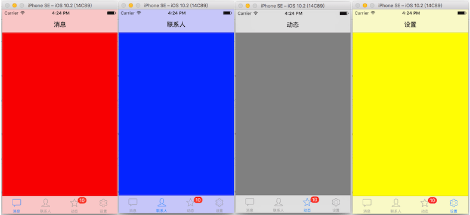
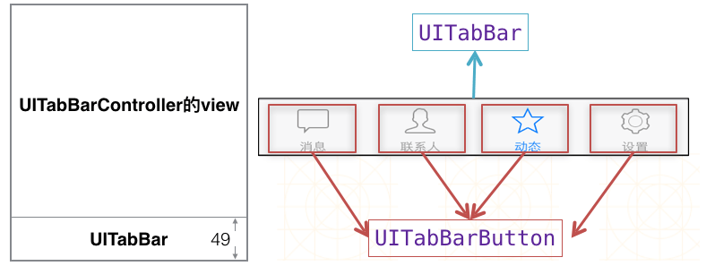
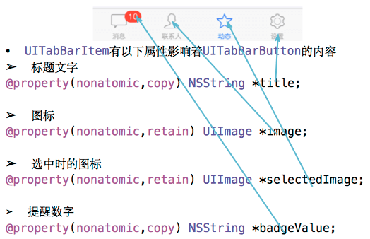
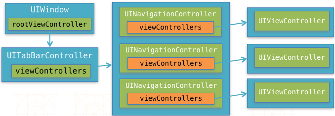
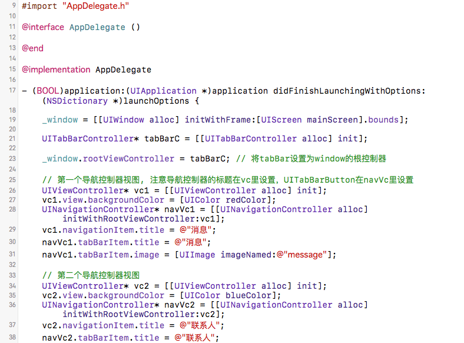
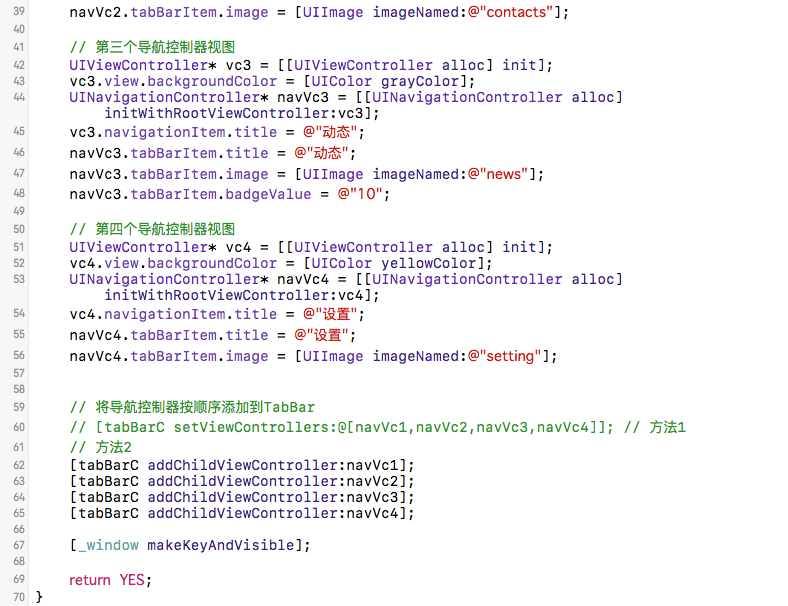

---
{
  "title": "iOS UITabBarController",
  "staticFileName": "ios_tabbar.html",
  "author": "guoqzuo",
  "createDate": "2016/11/10",
  "description": "现在手机里常用的app绝大部分都用到了UITabBarController，也就是最下面的一排按钮，通过点击按钮可以切换页面。它可以轻松管理多个控制器，类似于UINavigationController，一个是在屏幕顶部，一个是在屏幕底部。这里通过一个小例子，来了解UITabBarController。",
  "keywords": "ios tabbar,iOS主流app框架,UITabBarController,UITabBarController与UINavigationController,UITabBarController与导航控制器结合使用",
  "category": "iOS"
}
---

# iOS UITabBarController

> 现在手机里常用的app绝大部分都用到了UITabBarController，也就是最下面的一排按钮，通过点击按钮可以切换页面。它可以轻松管理多个控制器，类似于UINavigationController，一个是在屏幕顶部，一个是在屏幕底部。这里通过一个小例子，来了解UITabBarController。



## UITabBarController结构
UITabBarController的视图底部有一个类似于导航条(高64)的UITabBar(高49)，在不添加子控制器视图的情况下，底部就是一个白色的背景条。我们可以给UITabBarController添加对应的子视图控制器，他们会按顺序依次对应相应的UITabBarButton，通过子视图控制器的的UITabBarItem属性，可设置按钮的标题，图片等。              



UITabBarItem属性相关



## 主流的app框架及应用
关于UITabBarController，可参见: [iOS开发UI篇-UITabBarController简单介绍](https://www.cnblogs.com/wendingding/p/3775488.html)，基本了解UITabBarController之后，我们可以与之前的导航控制器相结合。一般主流app的结构如下。在导航控制器的前面再加一层TabBarController。



不依赖storyboard去掉main的入口，在代理里创建页面。这里的UIViewControlle我们可以根据需要创建对应的控制器如AddViewController，ContactsViewController等，相统一管理导航控制器也可以自定义UINavigationController。





## 代码
```objectivec
#import "AppDelegate.h"

@interface AppDelegate ()

@end

@implementation AppDelegate

- (BOOL)application:(UIApplication *)application didFinishLaunchingWithOptions:(NSDictionary *)launchOptions {
    
    _window = [[UIWindow alloc] initWithFrame:[UIScreen mainScreen].bounds];
    
    UITabBarController* tabBarC = [[UITabBarController alloc] init];
    
    _window.rootViewController = tabBarC; // 将tabBar设置为window的根控制器
    
    // 第一个导航控制器视图, 注意导航控制器的标题在vc里设置，UITabBarButton在navVc里设置
    UIViewController* vc1 = [[UIViewController alloc] init];
    vc1.view.backgroundColor = [UIColor redColor];
    UINavigationController* navVc1 = [[UINavigationController alloc] initWithRootViewController:vc1];
    vc1.navigationItem.title = @"消息";
    navVc1.tabBarItem.title = @"消息";
    navVc1.tabBarItem.image = [UIImage imageNamed:@"message"];
    
    // 第二个导航控制器视图
    UIViewController* vc2 = [[UIViewController alloc] init];
    vc2.view.backgroundColor = [UIColor blueColor];
    UINavigationController* navVc2 = [[UINavigationController alloc] initWithRootViewController:vc2];
    vc2.navigationItem.title = @"联系人";
    navVc2.tabBarItem.title = @"联系人";
    navVc2.tabBarItem.image = [UIImage imageNamed:@"contacts"];
    
    // 第三个导航控制器视图
    UIViewController* vc3 = [[UIViewController alloc] init];
    vc3.view.backgroundColor = [UIColor grayColor];
    UINavigationController* navVc3 = [[UINavigationController alloc] initWithRootViewController:vc3];
    vc3.navigationItem.title = @"动态";
    navVc3.tabBarItem.title = @"动态";
    navVc3.tabBarItem.image = [UIImage imageNamed:@"news"];
    navVc3.tabBarItem.badgeValue = @"10";
    
    // 第四个导航控制器视图
    UIViewController* vc4 = [[UIViewController alloc] init];
    vc4.view.backgroundColor = [UIColor yellowColor];
    UINavigationController* navVc4 = [[UINavigationController alloc] initWithRootViewController:vc4];
    vc4.navigationItem.title = @"设置";
    navVc4.tabBarItem.title = @"设置";
    navVc4.tabBarItem.image = [UIImage imageNamed:@"setting"];
    
    
    // 将导航控制器按顺序添加到TabBar
    // [tabBarC setViewControllers:@[navVc1,navVc2,navVc3,navVc4]]; // 方法1
    // 方法2
    [tabBarC addChildViewController:navVc1];
    [tabBarC addChildViewController:navVc2];
    [tabBarC addChildViewController:navVc3];
    [tabBarC addChildViewController:navVc4];
    
    [_window makeKeyAndVisible];
    
    return YES;
}
```