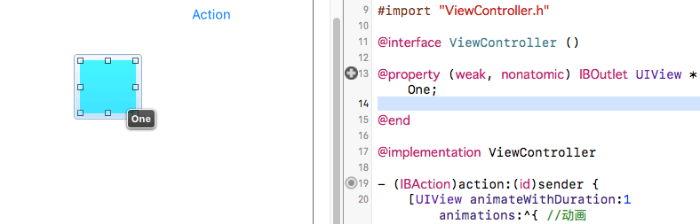
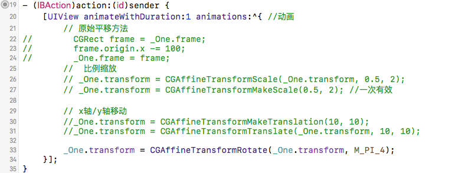

---
{
  "title": "iOS transform设置控件平移、旋转、缩放",
  "staticFileName": "ios_transform.html",
  "author": "guoqzuo",
  "createDate": "2016/11/10",
  "description": "一般情况下，我们可以通过修改UI控件的x，y轴以及长宽来控制控件的形变，iOS提供了transform属性用来专门来处理控件的形变(平移，旋转，缩放等)。所有的UIView控件都有transform这个属性。",
  "keywords": "transform,iOS 形变,控件的移动/缩放/旋转",
  "category": "iOS"
}
---

# iOS transform设置控件平移、旋转、缩放

> 一般情况下，我们可以通过修改UI控件的x，y轴以及长宽来控制控件的形变，iOS提供了transform属性用来专门来处理控件的形变(平移，旋转，缩放等)。所有的UIView控件都有transform这个属性。



## 代码实例: 



```objectivec
@property (weak, nonatomic) IBOutlet UIView *redView;

@end

@implementation ViewController

- (IBAction)action:(id)sender {
    
    // x+100 ,向右平移100
    [UIView animateWithDuration:1 animations:^{ // 动画效果，持续时间1s
        
        // 原始方法平移
        //CGRect frame = _redView.frame;
        //frame.origin.x += 100;
        //_redView.frame = frame;
        
        // MakeTranslation: 基于最开始的位置形变，会把之前的位置情空，一次有效
        //_redView.transform = CGAffineTransformMakeTranslation(100, 0);
        
        // 相对于上一次的形变, 这个就和上面的原始方法的效果一致
        //_redView.transform = CGAffineTransformTranslate(_redView.transform, 100, 0);
        
        // 旋转 M_PI: 180°、M_PI_2: 90°、M_PI_4:45°
        //_redView.transform = CGAffineTransformMakeRotation(M_PI_2);
        //_redView.transform = CGAffineTransformRotate(_redView.transform, M_PI_2);
        
        // 按比例缩放
        // sx: 宽度缩放比例，sy: 高度缩放比例
        _redView.transform = CGAffineTransformScale(_redView.transform, 0.5, 0.5);
        //_redView.transform = CGAffineTransformScale(_redView.transform, 2, 2);
        
    }];
    
}
```