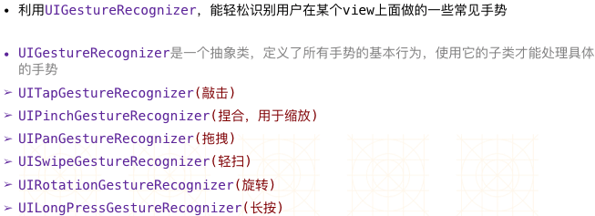

---
{
  "title": "iOS 手势UIGestureRecognizer",
  "staticFileName": "ios_gesture.html",
  "author": "guoqzuo",
  "createDate": "2016/11/14",
  "description": "监听一个view的触摸事件可以先自定义view，再实现它的touches方法来处理事件。通过touches方法监听view触摸事件必须得自定义view，外界对象无法监听view的触摸对象，且不易区分用户的具体手势行为。这里将介绍手势识别类UIGestureRecognizer，它可以更好的识别触摸事件。",
  "keywords": "iOS UIGestureRecognizer手势识别,iOS手势,UIGesture,ios 手势,ios 手势事件",
  "category": "iOS"
}
---

# iOS 手势UIGestureRecognizer

> 监听一个view的触摸事件可以先自定义view，再实现它的touches方法来处理事件。通过touches方法监听view触摸事件必须得自定义view，外界对象无法监听view的触摸对象，且不易区分用户的具体手势行为。这里将介绍手势识别类UIGestureRecognizer，它可以更好的识别触摸事件。



## 点按手势
在storyboard里拖拽一个imageView，用来测试点击事件


当点击图片时，打印点击了。用代理实现只有左半边能点击。


## 长按手势
添加一个长按手势识别


## 轻扫 (有方向, 默认往右滑)    


## 主要代码
ViewController.m
```objectivec
#import "ViewController.h"

@interface ViewController () <UIGestureRecognizerDelegate>

@property (weak, nonatomic) IBOutlet UIImageView *imageView; // 图形视图

@end

@implementation ViewController

- (void)viewDidLoad {
    [super viewDidLoad];
    
    _imageView.userInteractionEnabled = YES; // imageView默认
    UITapGestureRecognizer* t = [[UITapGestureRecognizer alloc] initWithTarget:self action:@selector(tap)];
    t.delegate = self; // 用代理<UIGestureRecognizerDelegate>方法，可禁止接收touch事件
    [_imageView addGestureRecognizer:t]; // 点击后抬起的时候触发
    
    // 长按手势
    UILongPressGestureRecognizer* t2 = [[UILongPressGestureRecognizer alloc] initWithTarget:self action:@selector(longPress:)];
    [_imageView addGestureRecognizer:t2];
    
    // 滑动手势，默认往右滑
    UISwipeGestureRecognizer* t3 = [[UISwipeGestureRecognizer alloc] initWithTarget:self action:@selector(rightSwipe)];
    [_imageView addGestureRecognizer:t3];
    
    // 滑动手势，设置滑动方向
    UISwipeGestureRecognizer* t4 = [[UISwipeGestureRecognizer alloc] initWithTarget:self action:@selector(leftSwipe)];
    t4.direction = UISwipeGestureRecognizerDirectionLeft; // 设置方向为向左滑
    // UISwipeGestureRecognizerDirectionUp  向上
    // UISwipeGestureRecognizerDirectionDown 向下
    [_imageView addGestureRecognizer:t4];
}

- (void)leftSwipe
{
    NSLog(@"向左滑...");
}

- (void)rightSwipe
{
    NSLog(@"往右滑...");
}

- (void)tap
{
    NSLog(@"点击了!");
}

- (void)longPress:(UILongPressGestureRecognizer *)t2
{
    // 长按会调用多次
    NSLog(@"长按.....");
    // 当长按开始的时候做事情, 又要获取t2对象
    if (t2.state == UIGestureRecognizerStateBegan) {
        NSLog(@"长按开始..."); // 只调用一次
    }
}

// 是否允许接收touch
- (BOOL)gestureRecognizer:(UIGestureRecognizer *)gestureRecognizer shouldReceiveTouch:(UITouch *)touch
{
    // return NO; // 不允许点击事件
    // 实现左边可以点，右边不可以点
    CGPoint curP = [touch locationInView:_imageView];
    CGFloat maxX = _imageView.frame.size.width*0.5;
    if (curP.x < maxX) {
        return YES;
    } else {
        return NO;
    }
}


- (void)didReceiveMemoryWarning {
    [super didReceiveMemoryWarning];
    // Dispose of any resources that can be recreated.
}


@end
```