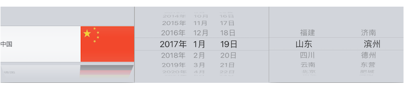

# iOS 自定义UITextField类(国旗、生日、城市键盘)

> 前面介绍了PickerView的简单用法，这里用PickerView和DatePicker来自定义UITextField类，让输入框的inputView不再是键盘，而是选择器。接下来会介绍三种基于选择器的封装键盘类: 国旗键盘、日期键盘、城市键盘。



## 封装国旗键盘
为什么要封装? 如果不封装为一个类，从storyboard将UITextField拖拽到对应的ViewController进行相关设置。代码会很混乱，且可移植性差。如果封装为一个UITextField类以后，只要设置UITextField的类为该封装类就可以调用国旗键盘，非常方便。这里我们创建一个UITextfield的子类FlagField，用来封装国旗键盘。默认的UITextField只要获取焦点就弹出一个键盘，可以用self.inputView方法指定弹出的view，只要是UIView都行。这里我们会将它的inputView设置为PickerView，国旗键盘只有一列，每一行都是label+ImageView，用xib来表示。效果如下:


### 在什么时候修改inputView
也就是将默认弹出的键盘修改为UIpickView，当UITextField从storyboard或xib加载时，会调用- (void)awakeFromNib方法，重写该方法初始化


### 实现<UIPickerViewDataSource, UIPickerViewDelegate>相关方法
1. 准备数据(从资源文件导入，里面存放了国家，与对应的国旗)，将资源文件加载到数组，建立相关模型，这里没有用kvc将字典直接转为对象，后面会使用。


2. 设置每行的UIView, 自定义UIView类FlagView，创建时勾选创建xib。高度100，宽度375: 225+150，只是在4.7寸上模拟，没有加界面约束。


3. 设置pickerView的数据源和代理，数据加载


4. 扩展：KVC, dict -> model，上面的数据转模型的时候可以只用字典初始化数据。

```objectivec
- (NSArray*)flags
{
    if (_flags == nil) {
        _flags = [[NSMutableArray alloc] init];
        // 1.拿到filePath
        NSString* filePath = [[NSBundle mainBundle] pathForResource:@"flags.plist" ofType:nil];
        // 2.根据filePath创建JSON数据
        NSArray* dictArr = [NSArray arrayWithContentsOfFile:filePath];
        // 3.dict -> model
        for (NSDictionary* dict in dictArr) {
            id obj = [Flag flagWithDict:dict];
            [_flags addObject:obj];
        }
    }
    return _flags;
}
```
Flag.h
```objectivec
#import <Foundation/Foundation.h>
#import <UIKit/UIKit.h>

@interface Flag : NSObject

@property (nonatomic, strong) NSString* name;
@property (nonatomic, strong) UIImage* icon;

+ (instancetype)flagWithDict:(NSDictionary *)dict;

@end
```
Flag.m
```objectivec
#import "Flag.h"

@implementation Flag

+ (instancetype)flagWithDict:(NSDictionary *)dict
{
    Flag* flag = [[self alloc] init];
    
    // kvc
    //[flag setValuesForKeysWithDictionary:dict]; 
    [dict enumerateKeysAndObjectsUsingBlock:^(id  _Nonnull key, id  _Nonnull obj, BOOL * _Nonnull stop) {
        // kvc
        [flag setValue:obj forKey:key];
    }];
    return flag;
}

// [flag setValue:@"agt.gif" forKey:@"icon"];
- (void)setIcon:(NSString *)icon
{
    _icon = [UIImage imageNamed:[NSString stringWithFormat:@"guoqi/%@", icon]];
}
@end
```

## 封装日期键盘
与上面相比，日期键盘就简单多了，不用考虑什么协议，代理数据源。稍微不同的地方
```objectivec
- (void)setUp
{
    _datePicker = [[UIDatePicker alloc] init];
    _datePicker.datePickerMode = UIDatePickerModeDate; // 模式显示
    _datePicker.locale = [NSLocale localeWithLocaleIdentifier:@"zh"]; // 设置为中文
    // 添加控制器，监听选泽
    [_datePicker addTarget:self action:@selector(dateChange) forControlEvents:UIControlEventValueChanged];
    self.inputView = _datePicker;
}

// UIDatePicker选中时调用
- (void)dateChange
{
    //NSLog(@"%s", __func__);
    NSLog(@"%@", _datePicker.date);
    // 创建一个日期格式字符串对象
    NSDateFormatter* fmt = [[NSDateFormatter alloc] init];
    fmt.dateFormat = @"yyyy-MM-dd";
    self.text = [fmt stringFromDate:_datePicker.date];
}

// 初始化文本
- (void)initialWithText
{
   [self dateChange];
}
```
## 封装城市键盘
这里有一个二级联动需要注意，其它差不多，要养成写注释的习惯，不然思维容易混乱。这里行列设置有点晕。

CityFeild.m
```objectivec
#import "CityField.h"
#import "City.h"

@interface CityField () <UIPickerViewDataSource, UIPickerViewDelegate>

@property (nonatomic, strong)UIPickerView* pickView;
@property (nonatomic, strong)NSMutableArray* citys;
@property (nonatomic, assign)NSInteger currentRow;
@property (nonatomic, assign)BOOL isInitial;

@end

@implementation CityField

- (void)awakeFromNib
{
    [self setUp];
}

- (instancetype)initWithFrame:(CGRect)frame
{
    if (self = [super initWithFrame:frame]) {
        [self setUp];
    }
    return self;
}

- (NSMutableArray*)citys
{
    if (_citys == nil) {
        _citys = [[NSMutableArray alloc] init];
        NSString* filePath = [[NSBundle mainBundle] pathForResource:@"provinces.plist" ofType:nil];
        NSArray* dictArr = [NSArray arrayWithContentsOfFile:filePath];
        for (id dict in dictArr) {
            id obj = [City cityWithDict:dict];
            [_citys addObject:obj];
        }
    }
    return _citys;
}

- (void)setUp
{
    self.pickView = [[UIPickerView alloc] init];
    self.pickView.delegate = self;
    self.pickView.dataSource = self;
    //NSLog(@"%@", self.citys);
    
    self.inputView = _pickView;
}

#pragma mark - UIPickerViewDataSource

- (NSInteger)numberOfComponentsInPickerView:(UIPickerView *)pickerView
{
    return 2;
}

- (NSInteger)pickerView:(UIPickerView *)pickerView numberOfRowsInComponent:(NSInteger)component
{
    if (component == 0) // 省份
        return self.citys.count;
    else {
        City* tempCity = self.citys[_currentRow];
        return tempCity.cities.count;
    }
}

#pragma mark - UIPickerViewDelegate

- (NSString*)pickerView:(UIPickerView *)pickerView titleForRow:(NSInteger)row forComponent:(NSInteger)component
{
    if (component == 0) { // 省会名称
        City* tempCity = self.citys[row];
        return tempCity.name;
    } else { // 省会下的城市
        City* c = self.citys[_currentRow];
        return c.cities[row];
    }
}

- (void)pickerView:(UIPickerView *)pickerView didSelectRow:(NSInteger)row inComponent:(NSInteger)component
{
    if (component == 0) { // 滚动省份
        _currentRow = row; // 记录省份
        // 刷新第一列的城市
        [pickerView reloadComponent:1]; // 刷新第一列,重新选择第1列第0行默认选中
        [pickerView selectRow:0 inComponent:1 animated:YES];
    }
    
    City* c = self.citys[_currentRow];
    // 获取第0列选中的省会
    NSString* province = c.name;
    // 获取第1列选中的城市
    NSInteger row1 = [pickerView selectedRowInComponent:1];
    NSString* city1 = c.cities[row1];
    
    self.text = [NSString stringWithFormat:@"%@-%@", province, city1];
}

// 初始化文本
- (void)initialWithText
{
    if (_isInitial == NO) {
        [self pickerView:self.pickView didSelectRow:0 inComponent:0];
        _isInitial = YES;
    }
}

@end
```
City.h
```objectivec
#import <Foundation/Foundation.h>
#import <UIKit/UIKit.h>

@interface City : NSObject

@property (nonatomic, strong)NSString* name;
@property (nonatomic, strong)NSArray* cities;

+ (instancetype)cityWithDict:(NSDictionary*)dict;

@end
```
City.m
```objectivec
#import "City.h"

@implementation City

+ (instancetype)cityWithDict:(NSDictionary *)dict
{
    City* city = [[self alloc] init];
    
    //kvc
    [city setValuesForKeysWithDictionary:dict];
    
    return city;
}

@end
```

## 综合(设置初始值，监听过滤输入)
ViewController.m
```objectivec
#import "ViewController.h"
#import "FlagFeild.h"
#import "BirthdayFeild.h"
#import "CityField.h"

@interface ViewController () <UITextFieldDelegate>

@property (weak, nonatomic) IBOutlet FlagFeild *flagFeild;
@property (weak, nonatomic) IBOutlet BirthdayFeild *birthdayFeild;
@property (weak, nonatomic) IBOutlet CityField *cityFeild;

@end

@implementation ViewController

- (void)viewDidLoad {
    [super viewDidLoad];
    _flagFeild.delegate = self;
    _birthdayFeild.delegate = self;
    _cityFeild.delegate = self;
    // Do any additional setup after loading the view, typically from a nib.
}

- (void)didReceiveMemoryWarning {
    [super didReceiveMemoryWarning];
    // Dispose of any resources that can be recreated.
}

// 是否允许用户输入文字，拦截用户输入, 每次输入都会询问代理，是否允许更改文本框内容
- (BOOL)textField:(UITextField *)textField shouldChangeCharactersInRange:(NSRange)range replacementString:(NSString *)string
{
    return NO;
}

@end
```