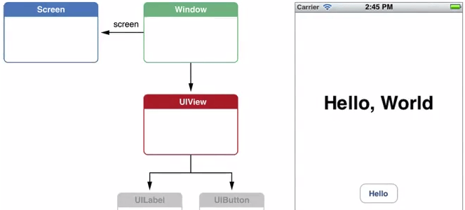

# iOS 自定义ViewController中的view

> 手动加载storyboard时，我们用storyboard创建了ViewController，它会自动创建一个空的view，这个view就是UIView类型。我们拖拽的按钮、label等就是拖拽在这个视图上面。如果需要自定义该view可以在该ViewController的loadView方法里设置。



自定义ViewController中的view过程如下：
1. 去掉Info.plist里的指定Main
2. 手动指定窗口的根控制器为storyboard的控制器

```objectivec
// 创建窗口对象
_window = [[UIWindow alloc] initWithFrame:[UIScreen mainScreen].bounds];
// 指定storyboard的viewcontroller为该窗口的根控制器
UIViewController* vc = [[UIStoryboard storyboardWithName:@"Main" bundle:nil] instantiateInitialViewController];
_window.rootViewController = vc;
// 使窗口可视化
[_window makeKeyAndVisible];
```
3. 新建类UIView的子类BGView，手动指定为控制器的view

```objectivec
// loadView作用: 加载控制器的view，当控制器的view第一次使用(显示)时就会调用
// 加载控制器的view，判断有没有指定storyboard或xib，如果有,会创建其默认的view:UIView，没有就创建一个空的view
// 开发中什么时候使用: 想自定义view时
- (void)loadView {
    // 调用系统的默认方法
    //[super loadView];
    BGView* view = [[BGView alloc] initWithFrame:[UIScreen mainScreen].bounds];
    self.view = view;
    self.view.backgroundColor = [UIColor greenColor];
}

- (void)viewDidLoad {
    [super viewDidLoad];
    // Do any additional setup after loading the view, typically from a nib.
    NSLog(@"%@", self.view);
}
```
4. 通过xib创建控制器view

创建ZUOViewController，设置为窗口的根控制器

```objectivec
_window = [[UIWindow alloc] initWithFrame:[UIScreen mainScreen].bounds];

// 如指定了nibName就加载指定的xib,没指定就看有没有与根控制器同名(或后缀不带controller)的xib，有则加载

ZUOViewController* rootVc = [[ZUOViewController alloc] initWithNibName:nil bundle:nil];

// 或者 ZUOViewController* rootVc = [[ZUOViewController alloc] init]; // 同名的好处

_window.rootViewController = rootVc;  

[_window makeKeyAndVisible];
```


创建xib, 关联到ZUOViewController，设置对应的view


5. 控制器默认为空的view

```objectivec
_window = [[UIWindow alloc] initWithFrame:[UIScreen mainScreen].bounds];
_window.backgroundColor = [UIColor greenColor];

//添加按钮
UIButton* btn = [UIButton buttonWithType:UIButtonTypeContactAdd];
btn.center = CGPointMake(50, 50);
[_window addSubview:btn];

// 2.创建窗口的根控制器  空:黑色  空:几乎透明(不能穿透)
ViewController* vc = [[ViewController alloc] init];
_window.rootViewController = vc;
vc.view.backgroundColor = [UIColor clearColor];
// vc.view.alpha = 0; //完全透明,button可以点击  alpha <= 0.01 完全透明可穿透，>则不可穿透
// vc.view.backgroundColor = [UIColor redColor];

[_window makeKeyAndVisible];
```

6. 控制器view创建时间

```objectivec
_window = [[UIWindow alloc] initWithFrame:[UIScreen mainScreen].bounds];
// 创建控制器，不一定会创建控制器的view
ViewController* vc = [[ViewController alloc] init];
vc.view.backgroundColor = [UIColor redColor]; //这里使用了view，会再这里创建
_window.rootViewController = vc;    
[_window makeKeyAndVisible]; // 如果事先没使用view，在这里才会创建view, 创建view需执行loadview方法

// --------------------------------------------------------------

@implementation ViewController

//- (UIView*)view { // 系统的view方法底层实现 vc.view 时调用
//    if (_view == nil) {
//        [self loadView];
//        [self viewDidLoad];
//    }
//    return _view;
//}

- (void)loadView {
    UIView* view = [[UIView alloc] initWithFrame:[UIScreen mainScreen].bounds];
    view.backgroundColor = [UIColor redColor];
    self.view = view;
    
}

- (void)viewDidLoad {
    [super viewDidLoad];
    // Do any additional setup after loading the view, typically from a nib.
    self.view.backgroundColor = [UIColor blueColor];
    NSLog(@"%s", __func__);
    
}
```