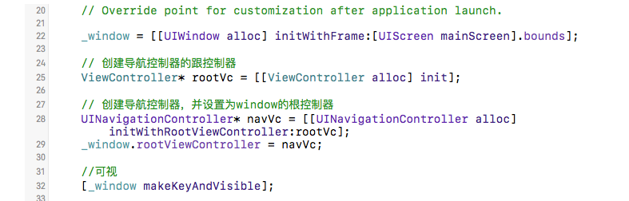
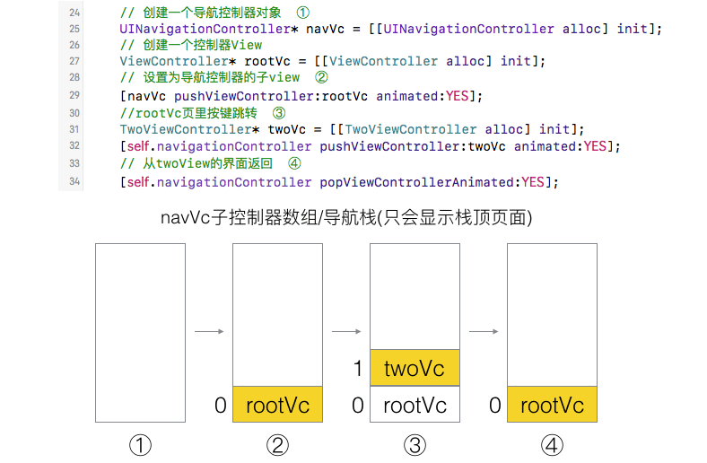
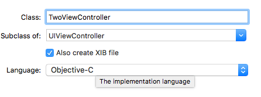
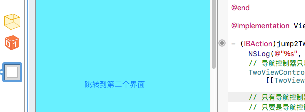
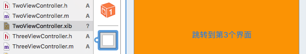
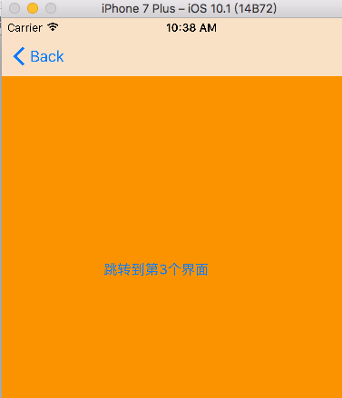
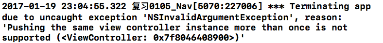
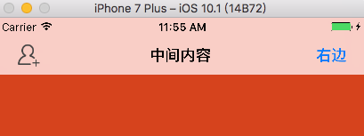
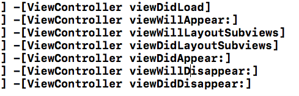

# iOS 页面的切换跳转UINavigationController

> app一般有很多个页面，一个页面会对应一个UIViewController。那怎么控制页面的切换呢？拖线就不讲了！这里介绍一种可以控制页面切换的控制器：导航控制器UINavigationController，就像一个view下面有很多个子view一样，导航控制器会通过添加(push)或删除(pop)其子控制器view，来实现页面的切换，类似于栈。



## UINavigationController的使用
先来看看导航控制器是怎么做到界面切换的，之前手动加载界面时将UIViewController设置为window的根控制器就可以显示该页面了。现在我们将UINavigationController作为window的根控制器。通过向NavgationController对象添加子控制器view的方式，显示页面。



实例操作: 
- 设置不从main加载storyboard。在代理里初始化UINavigationController
- 设置UIWindow的rootViewController为UINavigationController
- 通过push方法将控制器view添加到导航栈

```objectivec
_window = [[UIWindow alloc] initWithFrame:[UIScreen mainScreen].bounds];

// 创建导航控制器的根控制器
ViewController* rootVc = [[ViewController alloc] init];
//rootVc.view.backgroundColor = [UIColor greenColor];

// 创建导航控制器
// 导航控制器也需要有根控制器
UINavigationController* navVc = [[UINavigationController alloc] initWithRootViewController:rootVc];
// initWithRootViewController: 调用了push方法.
// 导航控制器的根控制器就是导航控制器的第一个子控制器

_window.rootViewController = navVc;

[_window makeKeyAndVisible];
```
这里其实就是在viewController中间加了一层NavigationController。顶部会明显的多出一个导航栏，页面的跳转: 上面用ViewController直接定义的导航控制器的根控制器 alloc] init] 后，会默认去加载对应的stroyboard或xib，这里我们建立一个xib对应他，拖拽一个按钮用来跳转到第二个界面, 这里我们需要新建一个viewController来作为目的界面，新建类时勾选Also create XIB file，就可以了。



下面是跳转相关:





ViewController.m
```objectivec
@implementation ViewController

- (IBAction)jump2Two:(id)sender {
    NSLog(@"%s", __func__);
    // 导航控制器只显示栈顶控制器的view
    TwoViewController* twoVc = [[TwoViewController alloc] init];
    
    // 只有导航控制器才有跳转功能
    // 只要是导航控制器的子控制器就能拿到导航控制器
    [self.navigationController pushViewController:twoVc animated:YES];
    // 会把push的控制器添加为导航控制器的子控制器
    NSLog(@"%@", self.navigationController.childViewControllers);
}
```
点击跳转到第二个界面效果  



如果想跳转到一个界面只需要将其控制器push到导航控制器数组里，导航控制器只显示栈顶的控制器。点击back返回就是相当于pop出栈一次, 可以pop到指定的控制器，子控制器里获取导航控制器数组：
```objectivec
self.navigationController.childViewControllers

// 返回，出栈
- (IBAction)back2Pre:(id)sender {
    [self.navigationController popViewControllerAnimated:YES];
}

// 回到根控制器, 跳转到指定的控制器
- (IBAction)back2Root:(id)sender {
    //[self.navigationController popToRootViewControllerAnimated:YES];
    
    [self.navigationController popToViewController:self.navigationController.childViewControllers[0] animated:YES];
}
```
## addChildViewController与push
上面有提到，导航控制器是通过数组来控制器页面切换的，但系统的方法是push和pop，类似于入栈出栈，我试了下直接向导航控制器添加子控制器的方式即  [navVc addChildViewController:rootVc]，在设置根控制器的时候没问题，但在ViewController里面准备跳转到twoVc就不能使用添加子控制器的方法了，只有用push才能跳转，表面是只是添加了子控制器，但push做的不仅仅做了addChildViewController操作，还加了一些隐藏的处理。多次push同一个控制器会出错。



## 导航条内容的设置
导航条的内容是由栈顶控制器的navigationItem决定，也就是当前显示的界面，一般放在viewDidload中加载
```objectivec
@implementation TwoViewController

- (void)viewDidLoad {
    [super viewDidLoad];
    // Do any additional setup after loading the view from its nib.
    
    self.navigationItem.title = @"中间内容";
    
    // 添加导航条右边的按钮
    UIBarButtonItem* item = [[UIBarButtonItem alloc] initWithTitle:@"右边" style:UIBarButtonItemStyleDone target:self action:@selector(click)];
    self.navigationItem.rightBarButtonItem = item;
    
    // 添加左边的按钮
    UIImage* image = [UIImage imageNamed:@"navigationbar_friendsearch"];
    image = [image imageWithRenderingMode:UIImageRenderingModeAlwaysOriginal];
    // 一张图片时
//  UIBarButtonItem* item2 = [[UIBarButtonItem alloc] initWithImage:image style:UIBarButtonItemStyleDone target:nil action:nil];
    
    // 一个按钮两张图片
    UIButton* btn = [UIButton buttonWithType:UIButtonTypeCustom];
    [btn setBackgroundImage:image forState:UIControlStateNormal];
    [btn setBackgroundImage:[UIImage imageNamed:@"navigationbar_friendsearch_highlighted"] forState:UIControlStateHighlighted];
    // 如果是自定义按钮要定义尺寸, 导航条上的内容位置由系统决定, 按钮的尺寸自己可以定义
    btn.frame = CGRectMake(100, 0, 35, 35);
    UIBarButtonItem* item2 = [[UIBarButtonItem alloc] initWithCustomView:btn];
    
    self.navigationItem.leftBarButtonItem = item2;
    // 在apple的API中，只要以Item结尾，都是苹果的模型
    // UINavigationItem: 决定导航条的内容(左，中，右)
    // UIBarButtonItem: 决定导航条上按钮的内容
}

- (void)click
{
    NSLog(@"%s", __func__);
}
```
显示效果如下：   



## 控制器view的生命周期方法
页面第一次加载时:

viewDidLoad -> viewWillAppear -> viewWillLayoutSubviews -> viewDidLayoutSubviews -> viewDidAppear

跳转到其他页面时执行 viewWillDisappear -> viewDidDisappear

再次回到该界面时 viewWillAppear ->  viewDidAppear 




当出现内存警告时执行 didReceiveMemoryWarning方法，清空一些缓存，一般清空图片，一些没用的数据

在非ARC环境下常用的方法:

viewWillUnload、viewDidUnload 控制器view即将/完成销毁