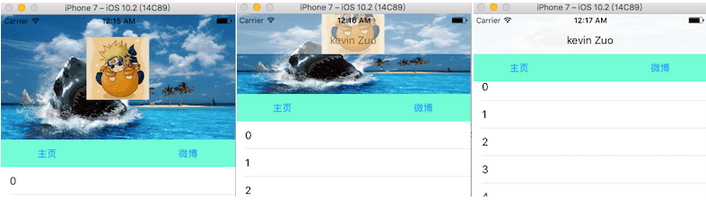
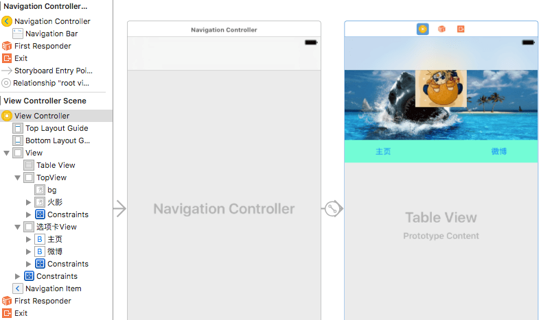
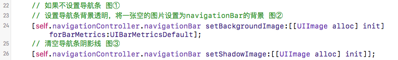
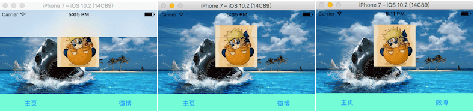
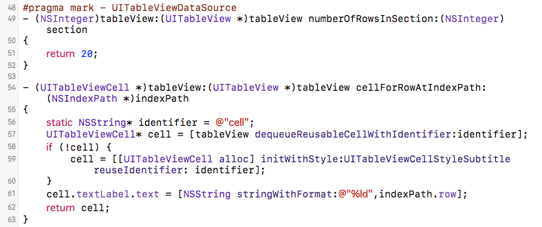
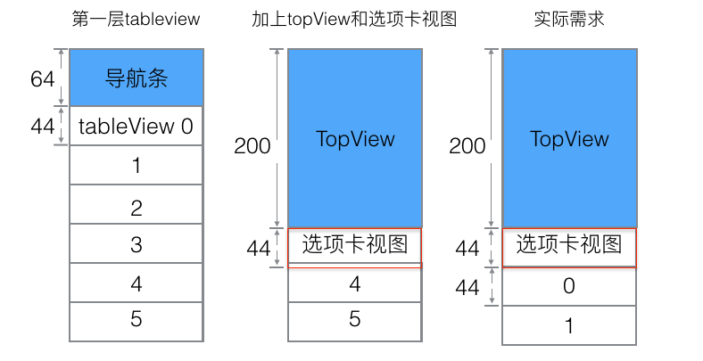
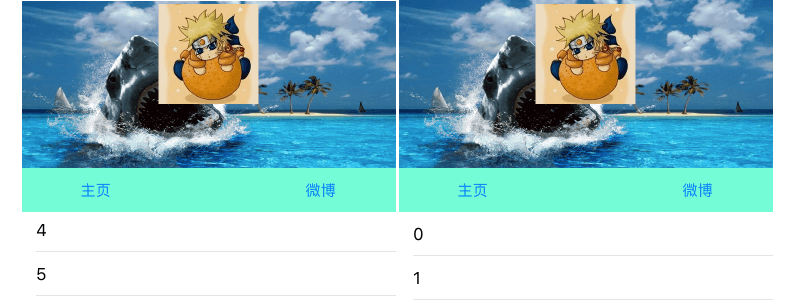
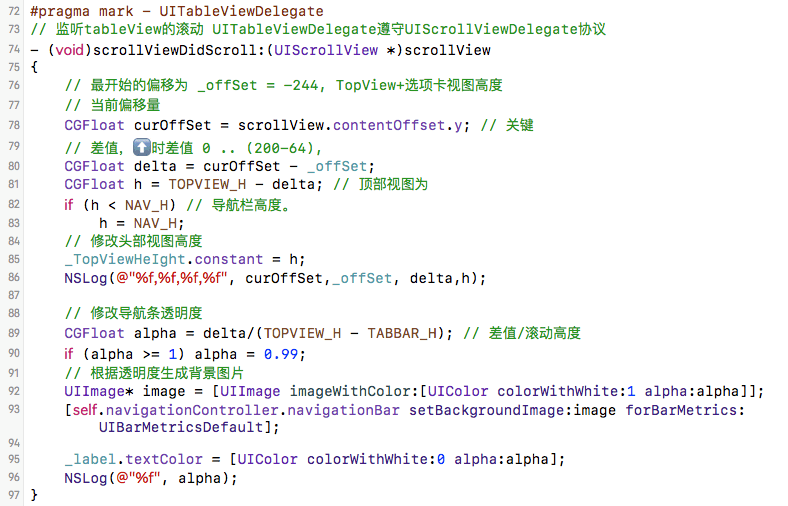

# iOS微博个人详情页面

> 用storyboard拖线来做个微博个人详情页面的UI。导航栏刚开始透明，滚动tableView的时候，上面的两个视图会向上，导航条也会从完全透明到不透明。这里会图解UITableView显示滚动区域的相关细节。



## storyboard拖拽UI
这里是在4.7寸上拖拽。

1. 拖拽一个Navigation Controller，删除自带的rootViewController，把其根控制器设置为系统给出的ViewController。在导航控制器的属性里勾选Is Initial View Controller，设置为启动页面。

2. 拖拽一个tableView放在ViewController里，x:0, y:0，约束为top:0, bottom:0, left:0, right:0;

3. 拖拽一个UIView命名为TopView，宽375，高200。x:0, y:0，界面约束top:0, left:0, height:200, right:0;

4. 拖拽两个ImageView到TopView，先拖背景bg，其位置、长宽、约束和TopView一样，第二个是头像，长宽都是100，水平居中，y:36，界面约束，height:100, width:100, bottom:64, align center x to bg，在属性里设置对应的image，素材见资源打包。

5. 再拖拽一个UIView命名为选项卡视图，宽375，高44，x:0, y:200，界面约束height:44, left:0,right:0,top:0px;

6. 在拖拽两个button到选项卡视图上，命名为主页，微博，高度统一为44，宽50，左边x:50，右边x：275，界面约束为height:44, top:0, bottom:0，第四个约束条件左边left:50，右边right:50 

7. 注意图层分级。图层不对可以拖拽，下图为storyboard参考层级。



## 效果设置
1. 导航条背景透明，我们将View Controller的类设置为ViewController，在viewDidLoad里面修改相关设置





2. 设置TableView数据源和代理，首先在viewDidLoad方法里将tableView的数据源和代理都设置为self，遵守UITableViewDataSource和UITableViewDelegate协议。实现数据源方法:



3. 显示问题，iOS7之后，apple会自动给导航控制器里的所有UIScrollView添加额外的滚动区域top:64，让导航栏不挡住ScrollView的数据显示。UITableView继承自UIScrollView，给UITableView添加额外的滚动区域top，那么tableview的显示区域会往下挤，带导航条的下挤了64。我们这里刚开始不用显示导航条，要显示topView+选项卡视图,一起高度是244,那需要添加额外滚动区域200+44，本来就有64，则还需额外添加244-64，这里的导航条一直都在只是刚开始背景设置为透明了。



```objectivec
// 设置tableView的滚动区域，TopView高200，主页微博高度44，导航条64，ok后效果如下图右
self.tableView.contentInset = UIEdgeInsetsMake(200 + 44 -64, 0, 0, 0);
```



4. 滚动效果设置，向下滚动时，我们根据滚动的y值，来判断当前相对原来(-244)偏移了多少，根据修改topView的高度(界面约束)，来使页面有整体上移的效果。到视图高度减少到64时，就不再减了。这个过程中顶部视图的背景会逐渐从透明到不透明。这里用到了一个分类，根据透明度生成图片。



## 源码
```objectivec
#import "ViewController.h"
#import "UIImage+Image.h"

#define TOPVIEW_H 200  // TopView视图高度
#define TABBAR_H 44 // 选项卡视图高度
#define NAV_H 64    // 导航条高度

@interface ViewController () <UITableViewDataSource, UITableViewDelegate>

@property (weak, nonatomic) IBOutlet NSLayoutConstraint *TopViewHeIght; //topView高度约束
@property (weak, nonatomic) IBOutlet UITableView *tableView; // 对应tableView
@property (weak, nonatomic) UILabel* label; // 导航条label，方便设置tableView滑动时的透明度
@property (assign, nonatomic) CGFloat offSet; // 最开始的偏移量 -244
@end

@implementation ViewController

- (void)viewDidLoad {
    [super viewDidLoad];
    
    // 如果不设置导航条 图①
    // 设置导航条背景透明，将一张空的图片设置为navigationBar的背景 图②
    [self.navigationController.navigationBar setBackgroundImage:[[UIImage alloc] init] forBarMetrics:UIBarMetricsDefault];
    // 清空导航条阴影线 图③
    [self.navigationController.navigationBar setShadowImage:[[UIImage alloc] init]];
    
    UILabel* label = [[UILabel alloc] init];
    label.text = @"kevin Zuo";
    label.textColor = [UIColor clearColor]; // 设置为透明色
    _label = label;
    [label sizeToFit];
    self.navigationItem.titleView = label; // 设置为标题
    
    
    _tableView.dataSource = self;
    _tableView.delegate = self;
    
    // 设置最初偏移量 -244
    self.offSet = -(TOPVIEW_H+TABBAR_H);
   // self.automaticallyAdjustsScrollViewInsets = NO;
    // 设置tableView的滚动区域
    self.tableView.contentInset = UIEdgeInsetsMake(TOPVIEW_H + TABBAR_H - NAV_H, 0, 0, 0);
}

#pragma mark - UITableViewDataSource
- (NSInteger)tableView:(UITableView *)tableView numberOfRowsInSection:(NSInteger)section
{
    return 20;
}

- (UITableViewCell *)tableView:(UITableView *)tableView cellForRowAtIndexPath:(NSIndexPath *)indexPath
{
    static NSString* identifier = @"cell";
    UITableViewCell* cell = [tableView dequeueReusableCellWithIdentifier:identifier];
    if (!cell) {
        cell = [[UITableViewCell alloc] initWithStyle:UITableViewCellStyleSubtitle reuseIdentifier: identifier];
    }
    cell.textLabel.text = [NSString stringWithFormat:@"%ld",indexPath.row];
    return cell;
}


#pragma mark - UITableViewDelegate
// 监听tableView的滚动 UITableViewDelegate遵守UIScrollViewDelegate协议
- (void)scrollViewDidScroll:(UIScrollView *)scrollView
{
    // 最开始的偏移为 _offSet = -244, TopView+选项卡视图高度
    // 当前偏移量
    CGFloat curOffSet = scrollView.contentOffset.y; // 关键
    // 差值，时差值 0 .. (200-64),
    CGFloat delta = curOffSet - _offSet;
    CGFloat h = TOPVIEW_H - delta; // 顶部视图为
    if (h < NAV_H) // 导航栏高度。
        h = NAV_H;
    // 修改头部视图高度
    _TopViewHeIght.constant = h;
    NSLog(@"%f,%f,%f,%f", curOffSet,_offSet, delta,h);
    
    // 修改导航条透明度
    CGFloat alpha = delta/(TOPVIEW_H - TABBAR_H); // 差值/滚动高度
    if (alpha >= 1) alpha = 0.99;
    // 根据透明度生成背景图片
    UIImage* image = [UIImage imageWithColor:[UIColor colorWithWhite:1 alpha:alpha]];
    [self.navigationController.navigationBar setBackgroundImage:image forBarMetrics:UIBarMetricsDefault];
    
    _label.textColor = [UIColor colorWithWhite:0 alpha:alpha];
    NSLog(@"%f", alpha);
}


- (void)didReceiveMemoryWarning {
    [super didReceiveMemoryWarning];
    // Dispose of any resources that can be recreated.
}

@end
```