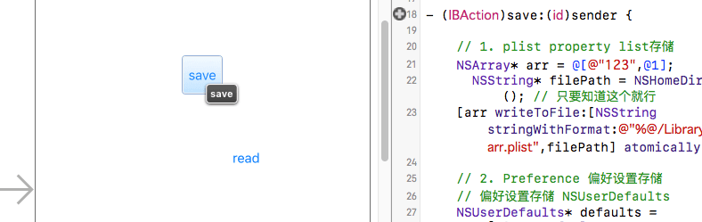
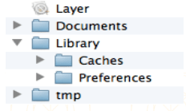
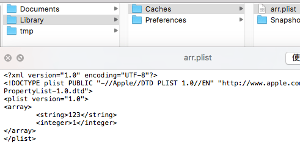
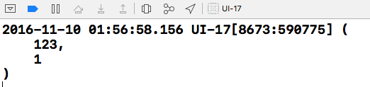
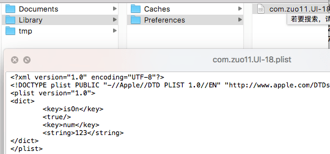
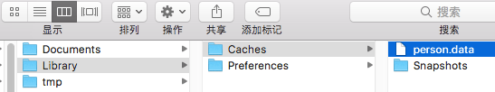

# iOS数据持久化(存储数据)

iOS里有一个专有名词叫数据持久化，可以理解为数据存储。iOS数据持久化有5种方式：
1. XML属性列表 (plist文件) 
2. Preference (偏好设置) 
3. NSKeyedArchiver归档 (NSCoding) 
4. SQLite3 
5. Core Data

这里先讲前三种。



## 应用沙盒
  


每个iOS应用都有自己的应用沙盒(就是文件系统目录), 与其他文件系统隔离，应用必须待在自己的沙盒里。其他应用不能访问该沙盒。应用沙盒的文件系统目录，如上图所示(假设app名称为Layer)

### 沙盒路径
```objectivec
NSString* homePath = NSHomeDirectory();
```
也可以通过函数获取 NSDocumentDirectory / NSCachesDirectory / NSPreferencePanesDirectory
```objectivec
// 参数1: 搜索文件夹   
// 参数2: 在哪个范围搜索 NSUserDomainMask // user's home directory
// 参数3: YES，全路径  NO, ~ 代替沙盒路径
NSSearchPathForDirectoriesInDomains(NSCachesDirectory, NSUserDomainMask, YES)[0];
```

### 应用程序包
上图中的Layer, 包含了所有的资源文件和可执行文件
```objectivec
NSString* path  = [NSbundle mainBundle] bundlePath];
```
### Documents 
保存app运行时生成的需要持久化的数据, iTunes同步时会备份该目录 (文件存这,app可能会被拒)

### tmp
保存app运行时所需的临时数据，app没有运行时，系统可能清楚该目录下的文件，iTunes同步不会备份        
```objectivec
NSString *tmp = NSTemporaryDirectory();
```
### Library/Caches 
保存app运行时需要持久化的数据, iTunes同步不会备份, 一般存储体积大不需备份的非重要数据 (用的多)

### Library/Preference
保存应用的偏好设置, iOS的Setting应用会在该目录查找app的设置信息，iTunes同步时会备份

## plist存储
注意事项: plist文件不能存储用户自定义对象
```objectivec
// plist存储
- (IBAction)save:(id)sender {
    // Plist存储本质，就是生成一个plist文件
    // 一般plist文件由数组，字典组成
    NSArray* arr = @[@"123", @1];
    
    // 找到应用沙盒的目录，存到Libaray/Caches文件
    NSString* cachesPath = NSSearchPathForDirectoriesInDomains(NSCachesDirectory, NSUserDomainMask, YES)[0];
    NSLog(@"%@", cachesPath);
    
    //将数组写入plist文件
    //[arr writeToFile:[NSString stringWithFormat:@"%@/arr.plist",cachesPath] atomically:YES];
    [arr writeToFile:[cachesPath stringByAppendingPathComponent:@"arr.plist"] atomically:YES];
}

// plist读取
- (IBAction)read:(id)sender {
    NSString* cachesPath = NSSearchPathForDirectoriesInDomains(NSCachesDirectory, NSUserDomainMask, YES)[0];
    // 读取，以什么形式存储就以什么形式读取
    NSArray* arr = [NSArray arrayWithContentsOfFile:[cachesPath stringByAppendingPathComponent:@"arr.plist"]];
    NSLog(@"%@", arr);
}
```
路径:

/Users/kevin/Library/Developer/CoreSimulator/Devices/5E144187-C238-412C-B2C2-E198C9626F98/data/Containers/Data/Application/71B35379-47B9-4D57-A3C3-96E3ACC644C4/Library/Caches
    
写入的文件



读取结果



## 偏好设置存储(Preference)
偏好设置好处: 
1. 快速进行键值对的存储 
2. 不关系文件名, 自动生成dict结构的plist文件, 键值对的存取方便

```objectivec
- (IBAction)save:(id)sender {
    // 偏好设置存储 NSUserDefaults
    // 获取NSUserDefaults单列对象
    NSUserDefaults* defaults = [NSUserDefaults standardUserDefaults];
    
    //NSLog(@"%@", NSSearchPathForDirectoriesInDomains(NSCachesDirectory, NSUserDomainMask, YES));
    [defaults setObject:@"123" forKey:@"num"];
    [defaults setBool:YES forKey:@"isOn"];
}

- (IBAction)read:(id)sender {
    // 获取NSUserDefaults单列对象
    NSUserDefaults* defaults = [NSUserDefaults standardUserDefaults];
    
    NSString* num = [defaults objectForKey:@"num"];
    BOOL isOn = [defaults objectForKey:@"isOn"];
    NSLog(@"num: %@, isON :%d", num, isOn);
}
```



2016-11-10 02:45:34.539 UI-18[8878:616370] num: 123, isON :1

## 归档(NSKeyedArchiver)
可存储自定义对象，当自定义对象需要遵循NScoding协议, 实现对应归档，解档方法
```objectivec
- (IBAction)save:(id)sender {
    // 存储自定义对象，可使用归档，但需要遵循NSCoding协议，实现对应方法
    Person* p = [[Person alloc] init];
    p.age = 18;
    p.name = @"zgq";
    
    // 获取caches文件夹
    NSString* cachesPath = NSSearchPathForDirectoriesInDomains(NSCachesDirectory, NSUserDomainMask, YES)[0];
    NSString* path = [cachesPath stringByAppendingPathComponent:@"person.data"];
    NSLog(@"%@", cachesPath);
    
    // object: 需要归档的对象，任何对象都可以进行归档  file: 文件的全路径
    [NSKeyedArchiver archiveRootObject:p toFile:path];
}

- (IBAction)read:(id)sender {
    // 存进去是什么 就怎么取出
    Person* p = [NSKeyedUnarchiver unarchiveObjectWithFile:[NSSearchPathForDirectoriesInDomains(NSCachesDirectory, NSUserDomainMask, YES)[0] stringByAppendingPathComponent:@"person.data"]];
    NSLog(@"age: %ld , name: %@", p.age, p.name);
}
```



2016-11-10 13:42:30.328 UI-19[9601:719889] age: 18 , name: zgq    

Person.m
```objectivec
@implementation Person

// 什么作用: 告诉系统，模型中的那些属性需要归档
// 把一个自定义对象归档的时候调用
- (void)encodeWithCoder:(NSCoder *)aCoder
{
    //aCode用来归档
    [aCoder encodeInteger:_age forKey:@"age"];
    [aCoder encodeObject:_name forKey:@"name"];
}

// 作用: 告诉系统中那些属性需要解档
// 解档文件时调用
// storyboard也是一个文件，系统storyboard上控件的解析绘制也会调用initWithCoder方法
- (nullable instancetype)initWithCoder:(NSCoder *)aDecoder
{
    // 一定要给成员属性赋值
    if (self = [super init]) {
        _name = [aDecoder decodeObjectForKey:@"name"];
        _age = [aDecoder decodeIntegerForKey:@"age"];
    }
    
    return self;
}

@end
```

## SQLite3
待完善

## Core Data
待完善，关于ios数据持久化可以参见: [iOS中几种数据持久化方案](https://www.jianshu.com/p/7616cbd72845)