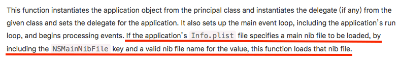
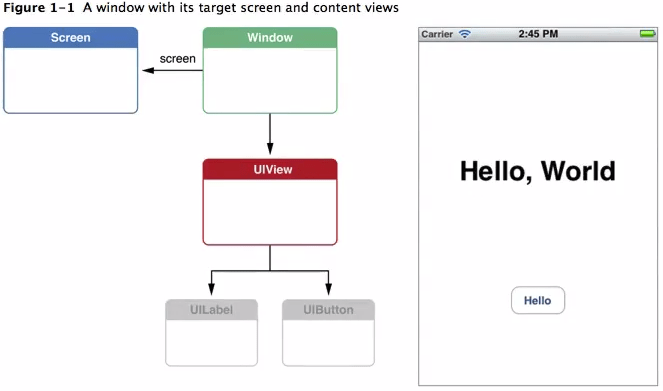
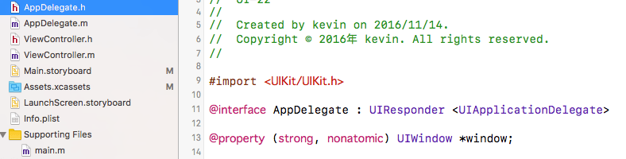
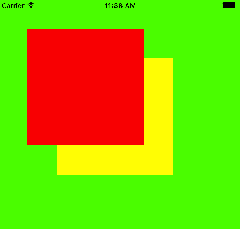
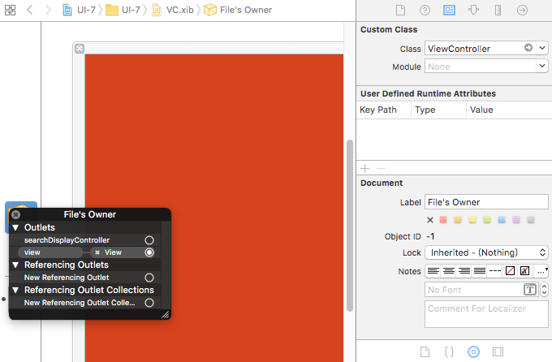

---
{
  "title": "iOS程序启动过程，视图加载UIWindow与ViewController",
  "staticFileName": "ios_startup_viewload.html",
  "author": "guoqzuo",
  "createDate": "2016/11/01",
  "description": "初步了解了iOS程序的启动过程、UIApplication和AppDelegate后，就要开始步入正题了，界面的显示问题。开启主运行循环后，会看Info.plist文件是否指定了main storyboard，有则加载。加载storyboard会创建UIWindow对象，再将默认的ViewController设置为该window的根控制器，然后将ViewController的view可视化",
  "keywords": "UIWindow,ViewController,代码手动加载storyboard,代码加载xib,iOS启动过程",
  "category": "iOS"
}
---
# iOS程序启动过程，视图加载UIWindow与ViewController

> 初步了解了iOS程序的启动过程、UIApplication和AppDelegate后，就要开始步入正题了，界面的显示问题。开启主运行循环后，会看Info.plist文件是否指定了main storyboard，有则加载。加载storyboard会创建UIWindow对象，再将默认的ViewController设置为该window的根控制器，然后将ViewController的view可视化。



## 程序启动过程延伸
main函数执行UIApplicationMain(): 
1. 创建UIApplication对象 
2. 创建代理对象，设置为UIApplication的代理
3. 开启事件循环 
4. 加载Info.plist文件，如果指定了Main, 就去加载

默认是指定了Main storyboard的. Main Storyboard的初始化过程
- It instantiates a window for you.  // 实例化一个window
- It loads the main storyboard and instantiates its initial view controller. 
- It assigns the new view controller to the window's rootViewController property and then makes the window visible on the screen.

## UIWindow
它是一种特殊的UIView，一个app中至少会有一个UIWindow。

iOS程序启动完毕后，创建的第一个视图控件就是UIWindow，接着创建控制器的view，最后将view添加到UIWindow上，于是控制器的view就显示到屏幕上了。

没有UIWindow，就看不到任何UI界面

A UIScreen object that identifies a physical screen connected to the device. A UIWindow object that provides drawing support fot the screen. A set of UIView objects to perform the drawing. These objects are attached to the window and draw their contents when the window asks them to.



## 不指定Main storyboard, 自己初始化window 
在代理AppDelegate.m里，程序启动完成后调用:
```objectivec
// 1.实例化一个window(创建窗口对象) 注意点:1.不能是局部变量 2.必须设置窗口的尺寸
_window = [[UIWindow alloc] initWithFrame:[UIScreen mainScreen].bounds];
// _window.backgroundColor = [UIColor redColor];

// 2.创建窗口的根控制器, 并赋值
// 对应界面的事情，交给对应的控制器管理
UIViewController* rootVc = [[UIViewController alloc] init];
rootVc.view.backgroundColor = [UIColor greenColor];

UIButton* btn = [UIButton buttonWithType: UIButtonTypeContactAdd];
btn.center = CGPointMake(50, 50);
[rootVc.view addSubview:btn];

// 一旦设置窗口的根控制器，就会把根控制器的view添加到窗口
_window.rootViewController = rootVc;

// 3.显示窗口 显示窗口_window.hidden = NO;成为主窗口application.keyWindow = _window;
[_window makeKeyAndVisible];
```



## 多个窗口与层级
```objectivec
// 1.创建窗口
_window = [[UIWindow alloc] initWithFrame:[UIScreen mainScreen].bounds];
_window.backgroundColor = [UIColor greenColor];

// 2.设置窗口的根控制器
UIViewController* rootVc = [[UIViewController alloc] init];
_window.rootViewController = rootVc;

// 3.显示窗口
[_window makeKeyAndVisible];
  
// 创建第二个窗口
_window1 = [[UIWindow alloc] initWithFrame:CGRectMake(50, 50, 200, 200)];
_window1.backgroundColor = [UIColor redColor];
UIViewController* rootVc1 = [[UIViewController alloc] init];
_window1.rootViewController = rootVc1;
_window1.hidden = NO;
_window1.windowLevel = UIWindowLevelAlert+1;

// 创建第3个窗口
_window2 = [[UIWindow alloc] initWithFrame:CGRectMake(100, 100, 200, 200)];
_window2.backgroundColor = [UIColor yellowColor];
UIViewController* rootVc2 = [[UIViewController alloc] init];
_window2.rootViewController = rootVc2;
_window2.hidden = NO;
_window2.windowLevel = UIWindowLevelAlert;

NSLog(@"%@", application.windows);
```



## 手动加载默认的storyboard，通过storyboard创建控制器
```objectivec
// 1.创建window
_window = [[UIWindow alloc] initWithFrame:[UIScreen mainScreen].bounds];

// 2.加载main.storyboard, 创建mian.storyboard描述的控制器
// UIStoryboard专门用来加载storyboard
UIStoryboard* storyboard = [UIStoryboard storyboardWithName:@"Main" bundle:nil];
// 加载storyboard描述的控制器，默认会加载箭头指向的viewController
UIViewController* vc = [storyboard instantiateInitialViewController];
_window.rootViewController = vc;

// 3.显示窗口
[_window makeKeyAndVisible];
```

## 通过xib创建控制器

```objectivec
// xib加载控制器步骤，有view去描述控制器，让xib和控制器产生联系，告诉xib是用来描述一个控制器的
- (BOOL)application:(UIApplication *)application didFinishLaunchingWithOptions:(NSDictionary *)launchOptions {
  // Override point for customization after application launch.
  
  // 为什么通过xib或者storyboard
  _window = [[UIWindow alloc] initWithFrame:[UIScreen mainScreen].bounds];
  
  UIViewController* vc = [[ViewController alloc] initWithNibName:@"VC" bundle:nil];
  
  _window.rootViewController = vc;
  
  [_window makeKeyAndVisible];
  
  return YES;
}
```
VC.xib 相关设置:


