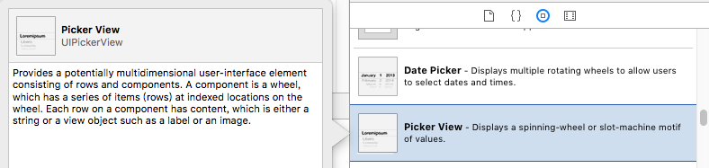

# iOS选择器UIPickerView和UIDatePicker

> Apple提供了两个选择器对象：UIPickerView和UIDatePicker，就像网页里的select。UIDatePicker是时间方面的选择器，用法和UIPickerView差不多，这里先介绍UIPickerView，它可以自定义选择的行和列，每行显示的内容可以是自定义的视图。



## storyboard拖拽picker view
这里就不用手动指定了，旨在了解基本的picker view，直接将pickerView控件拖拽到storyboard


数据我们用plist文件存储，foods.plist文件:
```xml
<plist version="1.0">
<array>
    <array>
        <string>榴莲</string>
        <string>西瓜</string>
        <string>樱桃</string>
        <string>橘子</string>
        <string>菠萝</string>
        <string>苹果</string>
        <string>香蕉</string>
    </array>
    <array>
        <string>水煮肉片</string>
        <string>东坡肉</string>
        <string>红烧肉</string>
        <string>番茄鸡蛋</string>
    </array>
    <array>
        <string>果蔬汁</string>
        <string>矿泉水</string>
        <string>果味饮料</string>
        <string>功能饮料</string>
        <string>茶饮料</string>
        <string>酸梅汤</string>
        <string>常温牛奶</string>
    </array>
</array>
</plist>
```

## 数据加载
如果不进行任何设置，运行后你会发现什么都看不到，我们还需要设置相关数据。将控件拖拽关联到ViewController里相应的属性。这里需要遵守UIPickViewDataSource和UIPickerViewDelegate协议，在viewDidLoad函数将pickerView的代理和数据源设置为该控制器view，然后用相应的方法设置数据。详情代码如下：
```objectivec
#import "ViewController.h"

@interface ViewController () <UIPickerViewDataSource,UIPickerViewDelegate>

@property (strong, nonatomic) NSArray* arr; // 根据plist文件加载数据
@property (weak, nonatomic) IBOutlet UILabel *label;  // 对应storyboard 的label
@property (weak, nonatomic) IBOutlet UIPickerView *pickView; // 对应storyboard的pickview

@end

@implementation ViewController

- (NSArray*)arr // 将foods.plist文件数据加载到数组
{
    if (_arr == nil) {
        NSString* filePath = [[NSBundle mainBundle] pathForResource:@"foods.plist" ofType:nil];
        _arr = [[NSArray alloc] initWithContentsOfFile:filePath];
    }
    return _arr;
}

// UIPickerViewDataSource协议必须实现的方法
// returns the number of 'columns' to display.
- (NSInteger)numberOfComponentsInPickerView:(UIPickerView *)pickerView {
    //return 3;
    //return _arr.count; // 会加载不出数据，以后最好使用self，少用_开头的方式，.会默认调用get，set方法
    return self.arr.count; // 数组列数
}

// returns the # of rows in each component..
- (NSInteger)pickerView:(UIPickerView *)pickerView numberOfRowsInComponent:(NSInteger)component
{
    // return 5;
    NSArray* arr1 = self.arr[component];
    return arr1.count; // 对应每一列的行数
}

// 设置行高
//- (CGFloat)pickerView:(UIPickerView *)pickerView rowHeightForComponent:(NSInteger)component __TVOS_PROHIBITED {
//    return 100;
//}
// 返回对component列第row行的标题
- (nullable NSString *)pickerView:(UIPickerView *)pickerView titleForRow:(NSInteger)row forComponent:(NSInteger)component __TVOS_PROHIBITED {
//    if (row == 1 && component == 1) // 第一行第一列(从零开始)
//        return @"abc";
//    else
//        return @"kkk";
    NSArray* arr1 = self.arr[component];
    return arr1[row];
}
// 给文本添加一些属性, 富文本, 可设置文本颜色，字体，阴影等
//- (nullable NSAttributedString *)pickerView:(UIPickerView *)pickerView attributedTitleForRow:(NSInteger)row forComponent:(NSInteger)component NS_AVAILABLE_IOS(6_0) __TVOS_PROHIBITED; // attributed title is favored if both methods are implemented
//- (UIView *)pickerView:(UIPickerView *)pickerView viewForRow:(NSInteger)row forComponent:(NSInteger)component reusingView:(nullable UIView *)view __TVOS_PROHIBITED;
//
//
// 监听选中
- (void)pickerView:(UIPickerView *)pickerView didSelectRow:(NSInteger)row inComponent:(NSInteger)component __TVOS_PROHIBITED {
    //NSLog(@"%ld %ld", component, row);
    NSString* title = self.arr[component][row];
    _label.text = title;
}

- (void)viewDidLoad {
    [super viewDidLoad];
    // Do any additional setup after loading the view, typically from a nib.
    _pickView.dataSource = self;
    _pickView.delegate = self;
    
}
```
效果:

