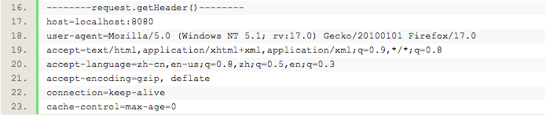

---
{
  "title": "javaweb判断是否为移动端访问",
  "staticFileName": "web_ismobile.html",
  "author": "guoqzuo",
  "createDate": "2016/12/25",
  "description": "一般java后台，会先用servlet获取数据，再跳转到前端页面。在servlet里获取数据时，我们可以根据request.getheader(User-Agent&quot)的内容，判断是否为移动端访问，再转发到相应的页面。可以在保持url不变的情况下，生成两种页面。",
  "keywords": "javaweb判断是否为移动端访问,java判断是否为移动端访问,判断是否为移动端访问",
  "category": "后端数据库等"
}
---

# javaweb判断是否为移动端访问

> 一般java后台，会先用servlet获取数据，再跳转到前端页面。在servlet里获取数据时，我们可以根据request.getheader(User-Agent&quot)的内容，判断是否为移动端访问，再转发到相应的页面。可以在保持url不变的情况下，生成两种页面。



## 测试功能
先创建一个Test的servlet来测试，在doGet函数里面写如下测试代码:
```java
String ua = request.getHeader("User-Agent");	
if (this.checkAgentIsMobile(ua))
    response.getWriter().print("YES");
else 
    response.getWriter().print("NO");
```
在该servlet内实现checkAgentIsMobile方法:
```java
/**
 * 判断User-Agent 是不是来自于手机
 * @param ua
 * @return
 */
public  boolean checkAgentIsMobile(String ua) {
    /*  System.out.print(ua); */
    boolean flag = false;
    if (!ua.contains("Windows NT") || (ua.contains("Windows NT") && ua.contains
    ("compatible; MSIE 9.0;"))) {
        // 排除 苹果桌面系统
        if (!ua.contains("Windows NT") && !ua.contains("Macintosh")) {
	    for (String item : agent) {
	        if (ua.contains(item)) {
		    flag = true;
		    break;
	        }
            }
        }
    }
    return flag;
}
private final static String[] agent = { "Android", "iPhone", "iPod","iPad", "Wi
ndows Phone", "MQQBrowser" };
```
访问该servlet看是YES还是NO，可以用google浏览器根据不同的设备调试。

## 在本站中的应用
这个原理其实很简单，就是获取ua后抓关键字，有对应的关键字就是移动端。我这个站有3个servlet需要判断，我就封装了一个IsMobileDevice类
```java
public class IsMobileDevice {
    public  boolean checkAgentIsMobile(String ua) {
	boolean flag = false;
	if (!ua.contains("Windows NT") || (ua.contains("Windows NT") && ua.cont
	ains("compatible; MSIE 9.0;"))) {
	    // 排除 苹果桌面系统
	    if (!ua.contains("Windows NT") && !ua.contains("Macintosh")) {
		for (String item : agent) {
		    if (ua.contains(item)) {
			flag = true;
			break;
		    }
	        }
	    }
	}
	return flag;
    }
    private final static String[] agent = { "Android", "iPhone", "iPod","iPad",
     "Windows Phone", "MQQBrowser" };
}
```
实际中的应用:
```java
String ua = request.getHeader("User-Agent");
IsMobileDevice isMobile = new IsMobileDevice();
String url = "index.jsp";
if (isMobile.checkAgentIsMobile(ua)) { // 判断是否为移动端
    url = "m_index.jsp";
}
request.getRequestDispatcher(url).forward(request, response);
```

参考：[Java语言如何判断请求是否来自移动端](https://jingyan.baidu.com/article/870c6fc30708f7b03fe4be06.html)