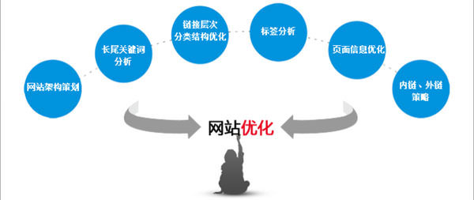
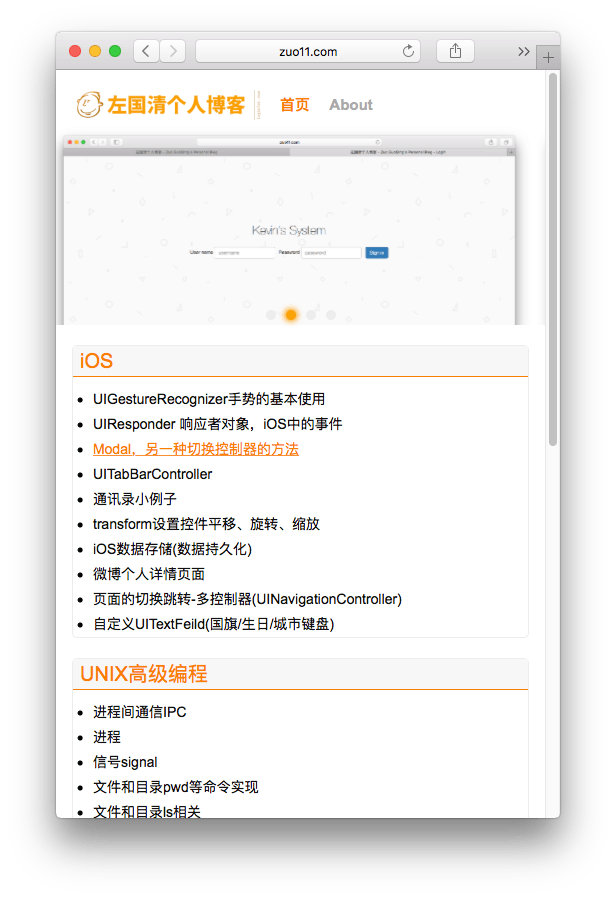
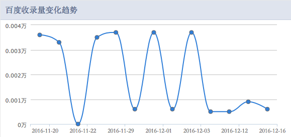

---
{
  "title": "web站点优化 关于最近的改版",
  "staticFileName": "web_optimize_1.html",
  "author": "guoqzuo",
  "createDate": "2016/12/18",
  "description": "最近花了点时间将网站的前端重新改了下，顺便对移动端也做了专门处理。之前首页只是从笔记中挑选了最新的10篇放在首页，现在将各个分类的最近10篇笔记都展现在了首页，且加上了后台系统的轮播图片，站点有了一定的提升，下面总结了一些改进细节。",
  "keywords": "zuo11.com站点优化记录,PC站转移动站,移动端适配",
  "category": "网站建设与SEO"
}
---

# web站点优化 关于最近的改版

> 最近花了点时间将网站的前端重新改了下，顺便对移动端也做了专门处理。之前首页只是从笔记中挑选了最新的10篇放在首页，现在将各个分类的最近10篇笔记都展现在了首页，且加上了后台系统的轮播图片，站点有了一定的提升，下面总结了一些改进细节。



## 百度快照乱码
查看百度快照发现有乱码，原来是空格的原因，就将UINX 高级编程中的空格去掉了。


## 移动端的特殊处理
用document.ready检测是否是移动端访问，如果是跳到m_index.jsp执行，本来打算用二级域名m.zuo11.com来处理，但在研究时发现二级域名绑定ip或目录都比较麻烦，我只是小改一下页面，其实可以不用跳转，直接改css也行，但用js处理css相关比较麻烦，而且我的元素定义时乱用class，导致都不好获取。感觉响应式布局，屏幕自适应也没什么，只是css相关的改变罢了。



## 畅言评论系统的不足
畅言的广告有时候显示的效果比较差，最大的硬伤是wap版的回复问题，用iphone SE调试时，只有横屏才能显示正常，竖屏有bug，最后索性将评论系统换成了多说，不过多说确实还是比较好一点，只是用起来稍微麻烦一点，它主要推广的是wordpress等直接安装，找自定义代码的入口比较费劲。


## UEditor富文本插件的不足
在pc端，文章加载的还行。但移动端图片加载越界，有些复制粘贴的代码也有越界的,img的用css加了个约束就好了, 但代码还是要用插件自带的代码来写，但ueditor的代码插入不支持oc，有时间得找个更合适的插件。 
```css
img { width:auto;height:auto;max-width:100%;max-height:100%; }
```


## seo相关
最近有段时间没有更新了文章了，蜘蛛抓的频次很低，百度收录波动比较大，看来还是要定期更新几篇文章.



