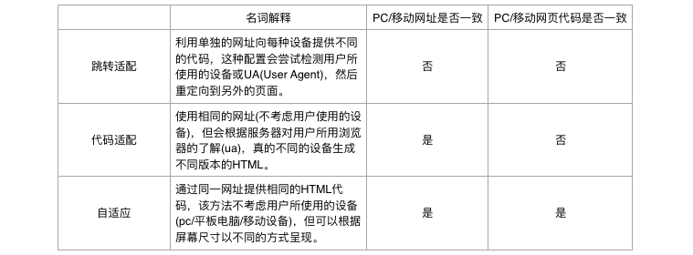

# 移动端适配

> 最近一有时间就刷刷百度站长/百度统计，展现量和收录没怎么变化，上不去。虽然从表面上看站点已经OK了，但网站的流量想要做上去，离不开搜索引擎。流量就是一切，想要做好网站就必须做好SEO，现在主要的问题是移动端的处理，百度从搜索引擎的角度将对移动端的处理方式分为三种，现在我的实现很尴尬，界定模糊。



## 跳转方式
现在zuo11.com的跳转方式又像跳转适配又像代码适配，当访问站点时，浏览器通过链接向服务器发出请求。web.xml配置了默认打开index.woe的servlet页面，获取数据库内容后转发给前端页index.jsp，Tomcat解析完成后生成html传回给浏览器。
```java
if (request.getParameter("action") != null) {
    request.getRequestDispatcher("m_index.jsp").forward(request, response);
} else {
    request.getRequestDispatcher("index.jsp").forward(request, response);
}
```
第一次访问时action肯定是null，就进了index.jsp。这个页面我用了js来判断是否为移动端，如果是就再次请求index.woe但传了一个action值，使页面跳转到另一个页面m_index.jsp。
```java
document.ready = start;
function start(){
    if (navigator.userAgent.match(/(iPhone|iPod|Android|ios)/i)) {
        window.location.href = "index.woe?action=m";
    }
}
```
站点前端只用了三个页面来完成: index.jsp, notes.jsp, about.jsp，分别有相应的移动处理页面m_index.jsp, m_notes.jsp, m_about.jsp。由于是servlet的forward，表面上的链接其实是
```bash
主页:
http://zuo11.com/index.woe    对应index.jsp
http://zuo11.com/index.woe?action=m 对应m_index.jsp 
笔记分类:ios/apue等
http://zuo11.com/Notes.woe?action=iOS 对应notes.jsp 
http://zuo11.com/Notes.woe?mobile=true&action=iOS  对应m_notes.jsp 
笔记详情:
http://zuo11.com/Notes.woe?action=detail&note_id=55 对应notes.jsp 
http://zuo11.com/Notes.woe?mobile=true&action=detail&note_id=55 对应m_notes.jsp 
关于:
http://zuo11.com/Timeline.woe 对应about.jsp 
http://zuo11.com/Timeline.woe?action=m 对应m_about.jsp
```
从上面的分类来看有跳转，像是跳转适配，但我更倾向于第二种代码适配，所以得把网址url弄成一样，因为如果同一篇文章如果有两个链接，那么百度收录怎么怎么处理，明显同一篇文章，同一个链接更适合收录，所以我想用session来处理，根据session的值来判断是否转发值，这样三个页面我都需要检测浏览器的版本，判断session，防止非主页进入本站。

## 百度推荐
关于移动配置，百度不建议的做法: 
- 单一域名下请使用同一种配置方式(跳转适配、代码适配、自适应)，例如，不要把移动站的页面作为pc站网址中的一个子目录来配置。
- 如果使用跳转适配的方式，请不要使用JS对ua进行适配跳转。这种方式存在两个缺点：
  - 对用户：会加大由重定向的客户端造成的延迟；这是因为客户端需要先下载网页，接着解析并执行JavaScript，然后才能触发重定向。301或302则不会有这个延迟。
  - 对搜索：爬虫也需要使用支持JS渲染的爬虫，才能发现此重定向。

现在这两点我全占了，目前能想到的最合适的处理方法就是在js的ready函数里，判断是否为移动端并设置session。或者可以试试ajax传值。其次是找到除js外判断是否为移动端并跳转的方法。之后还要用MIP改造移动端。

参考资料:

[百度站长平台-移动搜索](https://ziyuan.baidu.com/college/courseinfo?id=156)


2016-12-25 06:24:26 更新

距离写上面一大堆的内容不过10小时，现在发现在这之前自己是多么的low，明明是很简单的一个问题，但当你不知道怎么处理时，就很头疼，当知道了后就豁然开朗了，不知道这是多少次有这种感觉，每有一次就算是进步了。不管遇到什么问题，总会解决的。解决方法: java web判断是否为移动端访问

