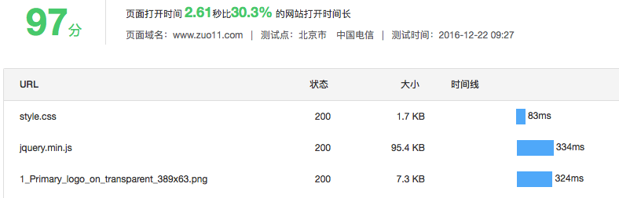
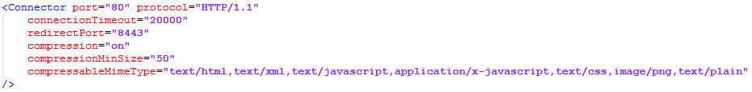
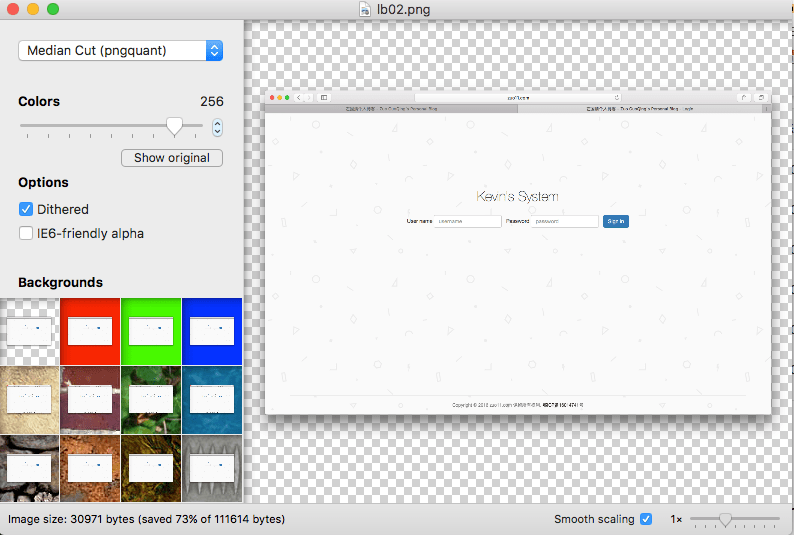
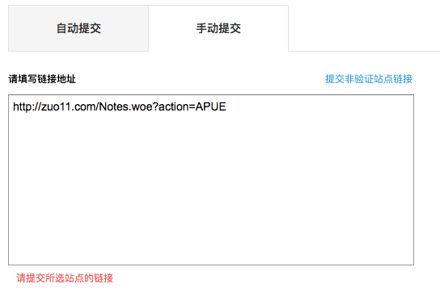
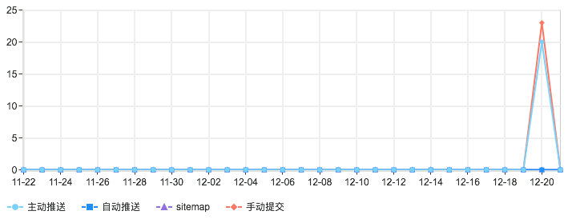

---
{
  "title": "网站打开速度优化",
  "staticFileName": "web_more_speed.html",
  "author": "guoqzuo",
  "createDate": "2016/12/22",
  "description": "最近用百度统计的网站测速工具测了下网站的打开时间，结果要7秒多，最后根据上面的提示进行了相关修改：将png图片压缩、开启GZip压缩、合并js文件等。将速度降到了不到3秒，同时在百度站长上处理了一些死链，提交了一些链接。",
  "keywords": "zuo11.com站点优化记录,Tomcat开启GZIP压缩,网站打开速度优化,tomcat 开启gzip",
  "category": "网站建设与SEO"
}
---

# 网站打开速度优化

> 最近用百度统计的网站测速工具测了下网站的打开时间，结果要7秒多，最后根据上面的提示进行了相关修改：将png图片压缩、开启GZip压缩、合并js文件等。将速度降到了不到3秒，同时在百度站长上处理了一些死链，提交了一些链接。

## 将零散的css、js文件合并为一个
减少加载文件的个数, 将js声明，处理放到代码末尾。

## 启用GZip压缩
tomcat下开启GZip需设置tomcat安装目录conf下的server.xml文件

## 用ImageAlpha将png图片无损压缩    
  

首页的图片有5张，logo加上4张轮播的图片,用ImageAlpha无损压缩后大小变化:

112kb => 32kb, 328kb =>105kb, 331kb => 105kb, 207k=> 57kb, 19kb => 8kb    

在关于页面用手机拍的照片直接1.2M，最后直接截图，567kb，压缩后145kb,这样加载速度就明显提升了

## 关于百度链接提交的问题
之前想把链接提交给百度只能提交主页zuo11.com这个链接，其他的页面链接都不能提交，最后发现习惯不写www是错误的关键

不然一直提示提交的不是本站的站点，前面加上www完整的链接就能成功一下子将页面的所有链接都提交了

