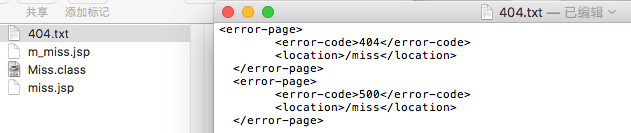

---
{
  "title": "404及500跳转处理",
  "staticFileName": "web_404.html",
  "author": "guoqzuo",
  "createDate": "2017/01/24",
  "description": "这几天百度的收录慢慢开始上升，但收录的有些页面是改版之前的旧内容，要么删了要么URL变了，造成访问出现404或者500的情况。404的问题可以提交死链，但500的问题就头疼了，当时在写后台的时候没有处理笔记id找不到的情况，如果随便输入id就会出现空指针异常，返回500。网上查了下，发现一般seo都需要专门对这些进行处理，于是就小改了一下。",
  "keywords": "404跳转,网站404跳转处,web 404跳转处理,web 500跳转处理,web.xml配置404和500的跳转",
  "category": "网站建设与SEO"
}
---
# 404及500跳转处理

> 这几天百度的收录慢慢开始上升，但收录的有些页面是改版之前的旧内容，要么删了要么URL变了，造成访问出现404或者500的情况。404的问题可以提交死链，但500的问题就头疼了，当时在写后台的时候没有处理笔记id找不到的情况，如果随便输入id就会出现空指针异常，返回500。网上查了下，发现一般seo都需要专门对这些进行处理，于是就小改了一下。



## web.xml配置404或500跳转
在web.xml设置error-page可以对404及500重定向到指定的页面，于是就弄了个链接/miss。
```xml
<web-app>
  <error-page>
  	<error-code>404</error-code>
  	<location>/miss</location>
  </error-page>
  <error-page>
  	<error-code>500</error-code>
  	<location>/miss</location>
  </error-page>
</web-app>

<servlet>
  <servlet-name>Miss</servlet-name>
  <servlet-class>com.kevin.zblog.Tools.Miss</servlet-class>
</servlet>
<servlet-mapping>
  <servlet-name>Miss</servlet-name>
  <url-pattern>/miss</url-pattern>
</servlet-mapping>
```
## 跳转页面制作
miss链接和笔记用的链接基本一样，一个页面处理的事情多了，比较混乱。于是就单独做了个页面来处理，这个页面更像是一篇特殊的笔记。笔记部分细节代码:
```html
<div class="note">
    <h4> <font color="#ff7f00">你可能访问了一个假网页</font> </h4>
    <%
        java.text.SimpleDateFormat formatter = new java.text.SimpleDateFormat("yyyy-MM-dd HH:mm");
        java.util.Date currentTime = new java.util.Date(); //得到当前系统时间 
	String str_date1 = formatter.format(currentTime);
    %>
    Miss / <%=str_date1 %>
    <hr>
    <p>
        访问页面不存在(404)或发生内部错误(500)，处理细节请参见: 
        <a href="http://zuo11.com/Notes.woe?action=detail&note_id=65" title="404或500的跳转处理">站点优化记录7 - 404及500的跳转处理</a> 
    </p>
    <p></p>
    <br>
    <!-- 多说评论框 Start -->
    <div class="ds-thread" data-thread-key="miss" data-title="你可能访问了一个假网页" data-url="zuo11.com/miss"></div>
    <!-- 多说评论框 end -->
</div>
```
显示效果: 


## 总结
在pc端和移动端的的处理中，发现之前前端写的都很乱，能实现就行了。移动端mip改的也还不够彻底，不怎么满意，特别是a的_blank太影响用户体验了，还是得换成mip-link。有时间得改改，无意中发现技术好像比以前有了一定的进步，对页面的结构和布局更熟悉了。