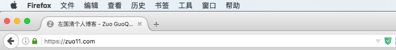
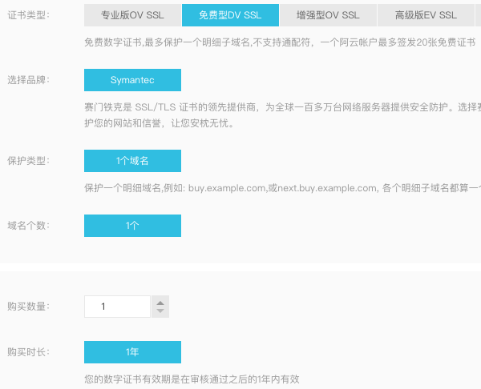
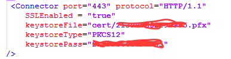
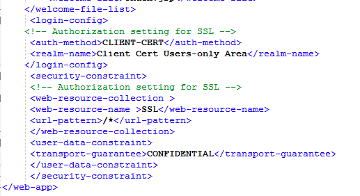

---
{
  "title": "http转https",
  "staticFileName": "web_https.html",
  "author": "guoqzuo",
  "createDate": "2017/01/10",
  "description": "在玩微信小程序的时候发现网络请求必须是https开头的，但我的数据都在我的web服务器上，只是简单的http，于是就在网上找ssl证书，发现居然有免费1年的SSL，还是阿里云的，果断申请使用。顺便将web的数据打包为json做了一个接口。",
  "keywords": "免费SSL,阿里云DV SSL使用实例,http转https,80端口转443端口,tomcat配置https",
  "category": "http与https"
}
---

# http转https

> 在玩微信小程序的时候发现网络请求必须是https开头的，但我的数据都在我的web服务器上，只是简单的http，于是就在网上找ssl证书，发现居然有免费1年的SSL，还是阿里云的，果断申请使用。顺便将web的数据打包为json做了一个接口。

## 阿里云SSL:
阿里云一年免费DV SSL申请    

## Tomcat配置https
tomcat默认是8080的端口，由于http访问时默认是80端口，就将tomcat配置为了80端口。需要知道的是https在访问的时候默认访问443端口，需要进行相关设置，阿里云有相关教程，但有些细节不一样,我的配置如下:

tomcat目录下conf/server.xml   `service` tag下添加如下配置:

这样设置后重启tomcat，不出什么意外，https就可以访问了。这里虽然可以访问https了，但默认访问的还是http，如果想要访问http自动跳转到https需要做如下处理：
1. 80端口redirctPort设置为443

2. 在conf/web.xml下加上如下代码, 这样访问http://zuo11.com 会自动跳转到https://zuo11.com

参考:

[阿里云SSL下载，配置说明文档](https://yundun.console.aliyun.com/?spm=5176.2020520163.1002.d10cas.UB7mOZ&p=cas#/cas/download/213995662290985)

[SSL/TLS协议运行机制的概述](http://www.ruanyifeng.com/blog/2014/02/ssl_tls.html)

