---
{
  "title": "iOS通讯录小列子",
  "staticFileName": "web_address_list.html",
  "author": "guoqzuo",
  "createDate": "2017/01/22",
  "description": "小马哥视频里讲的通讯录小例子登录界面用了动画，用的是storyboard拖线跳转，顺便讲了segue，页面传值及发送通知。这里简单的实现通讯录的基本功能，动画就不做了，主要练习页面的跳转以及tableView相关使用，只是了解基本的使用，可以根据实际情况进行优化。",
  "keywords": "UITableView的使用,通讯录小例子,UITableView左滑删除功能",
  "category": "iOS"
}
---

# iOS通讯录小列子

> 小马哥视频里讲的通讯录小例子登录界面用了动画，用的是storyboard拖线跳转，顺便讲了segue，页面传值及发送通知。这里简单的实现通讯录的基本功能，动画就不做了，主要练习页面的跳转以及tableView相关使用，只是了解基本的使用，可以根据实际情况进行优化。

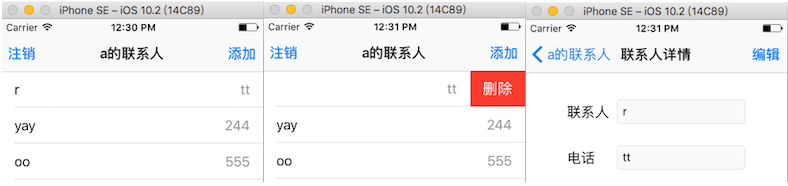

## 登录界面
1. 从storyboard启动，拖拽一个导航控制器，将子控制器设置为默认给的View Controller，对应类ViewController，拖拽用户名密码控件什么的就不说了。

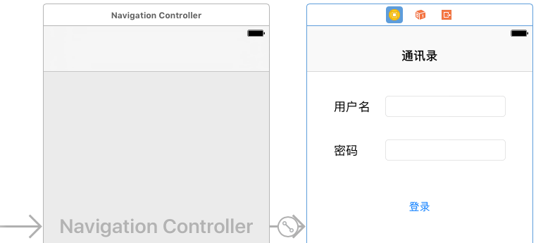

2. 界面OK后，来看看逻辑：密码的输入框要有遮挡；两个输入框当输入文本的时右边出现删除按钮；登录按键先不让点击，等两个文本框有问题了才能点；登录时判断用户名或密码是否正确，错误弹一个alert框，正确跳转到TableView界面，也就是通讯录的主界面。

首先我们需要将两个输入框和登录按钮拖拽到ViewController，分别对应的变量。从storyboard上拖拽下来的控件都不用再new，再进行上面的一些设置。

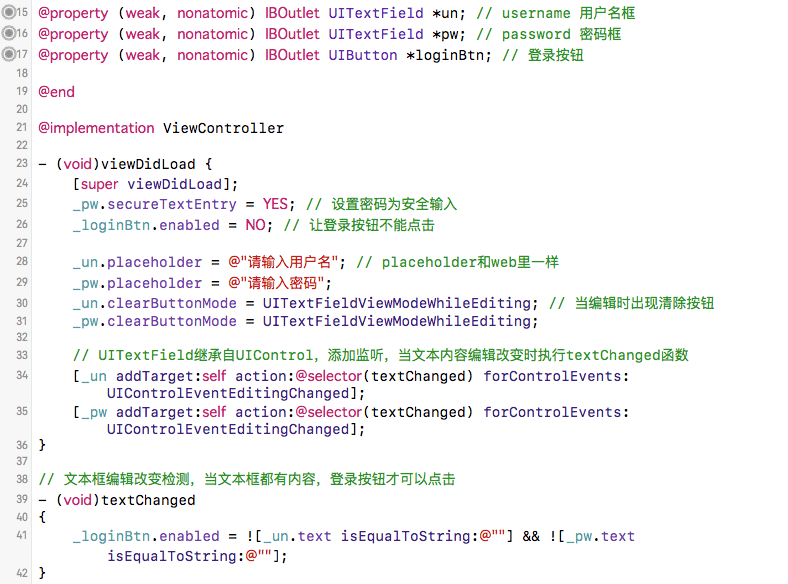

登录判断跳转，这里只是模拟，假设账号和密码都为a才能登录成功否则弹窗登录失败，这里会用到UIAlertController(UIActionSheet+UIAlertView后面通讯录页面的注销时有对比)。成功后跳转到通讯录tableview界面，在创建UITableViewController的子类ContactViewController时，勾选xib，用的时候直接alloc] init]就可以。再push该控制器到导航栈。

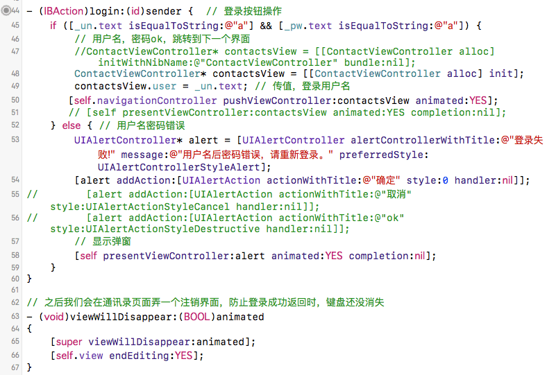

## 通讯录界面
1. 前面提到过ContactViewController，这个页面用xib来描述，不做任何拖拽。数据加载以及导航条的标题、左右按钮都用代码来实现。

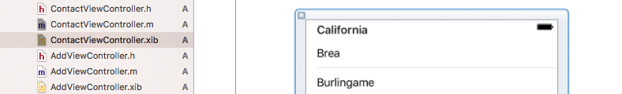

2. 导航条设置，在viewDidLoad里设置导航条内容，设置注销弹窗，注销时导航栈pop一次，返回登录页面，添加联系人的函数addContact后面会介绍。

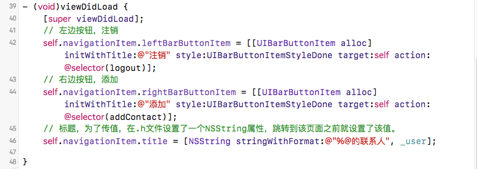

关于弹窗，参见: [iOS SDK详解之UIAlertController](http://www.itnose.net/detail/6235874.html)，iOS8后代替AlertView和ActionSheet

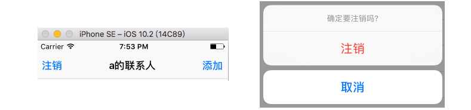

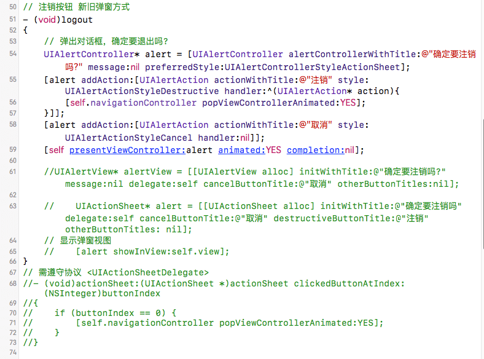

3. 通讯录数据加载，这里用了一个数据模型，用了kvc

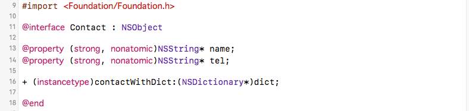

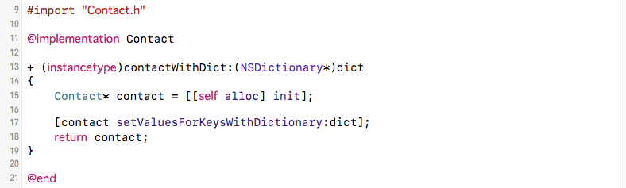

数据载入，这里数据是存在沙盒的Library/Caches文件夹的data.plist里，以字典数组的形式存放。从文件中读入到数组arr，再将这个数组的元素逐一转化为模型，存入新的数组contactsArr，这些操作都在contactArr的get方法里进行。在tableView的数据源方法使用contactsArr时会执行。

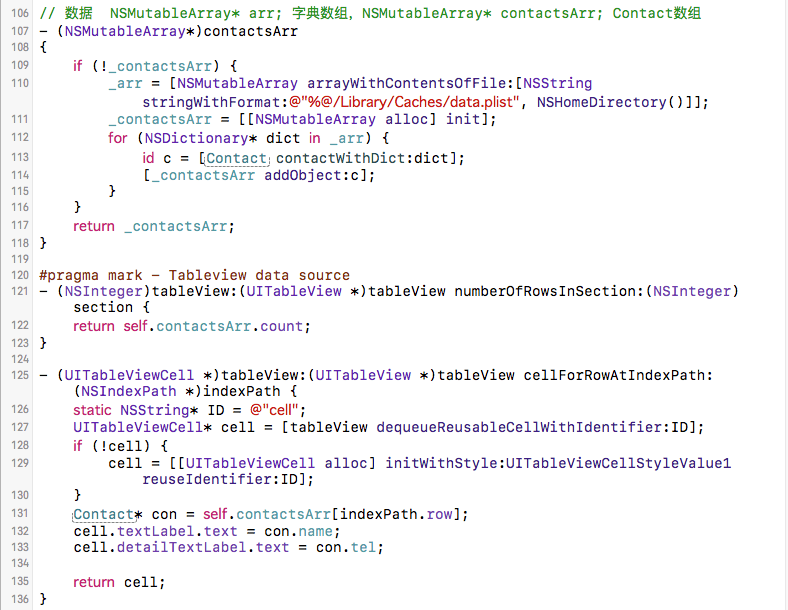

4. tableView细节处理, 添加左滑删除功能，与点击后跳转到编辑界面。关于tableView的基本操作可参见：[tableview 添加左滑删除](http://www.jianshu.com/p/bf6a60151dde)，[iOS -- UITableView基本使用](http://www.jianshu.com/p/284fd7d8c9e9)

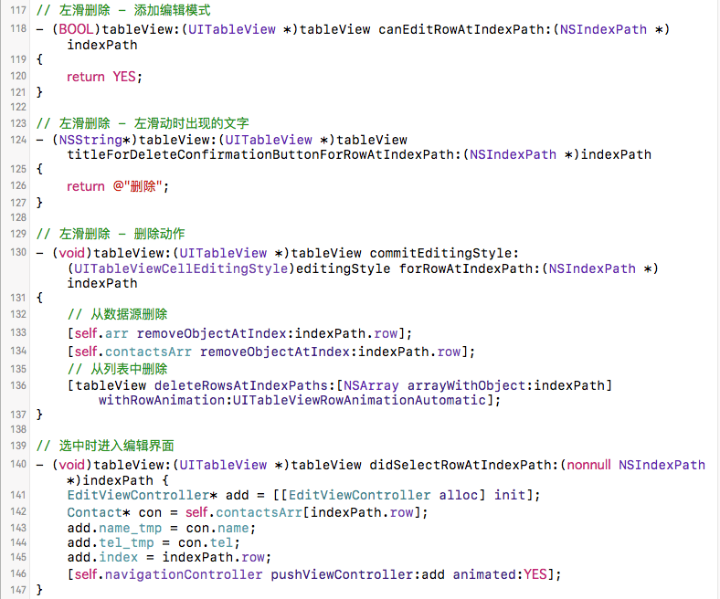

这里还有需要处理的是删除数据之后数据的重新写入文件，及当添加或修改联系人重新回到该界面时的数据刷新，其实可以用通知来实现。这里直接用了两个控制器的生命周期函数来处理。

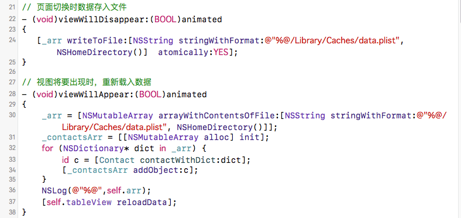

## 添加或修改内容
1. 添加联系人和修改联系人都是由xib加载。

```objectivec
- (void)addContact
{
    AddViewController* addView = [[AddViewController alloc] init];
    [self.navigationController pushViewController:addView animated:YES];
}
```

2. add添加数据，从文件首次读入数据是在arr的get方法里。

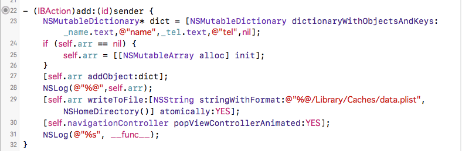

3. 修改数据，和上面一样，添加或修改完成后返回上一个界面。其实可以发个通知将添加或修改的数据发送给tableView界面，这里就不用读写文件了。

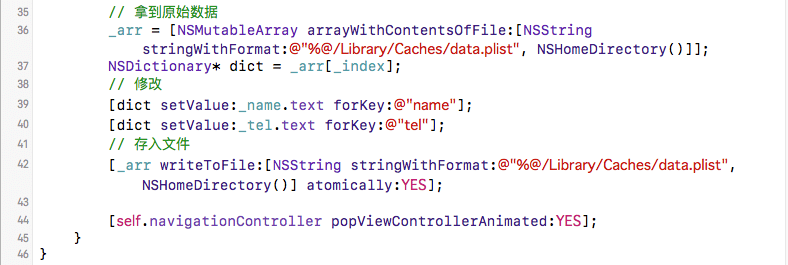

## 主要代码
ContactViewController.m

```objectivec
#import "ContactViewController.h"
#import "AddViewController.h"
#import "Contact.h"
#import "EditViewController.h"
@interface ContactViewController () <UIActionSheetDelegate>

@property (strong, nonatomic) NSMutableArray* arr;
@property (strong, nonatomic) NSMutableArray* contactsArr;
@end

@implementation ContactViewController

// 页面切换时数据存入文件
- (void)viewWillDisappear:(BOOL)animated
{
   [_arr writeToFile:[NSString stringWithFormat:@"%@/Library/Caches/data.plist",NSHomeDirectory()]  atomically:YES];
}

// 视图将要出现时，重新载入数据
- (void)viewWillAppear:(BOOL)animated
{
    _arr = [NSMutableArray arrayWithContentsOfFile:[NSString stringWithFormat:@"%@/Library/Caches/data.plist", NSHomeDirectory()]];
    _contactsArr = [[NSMutableArray alloc] init];
    for (NSDictionary* dict in _arr) {
        id c = [Contact contactWithDict:dict];
        [_contactsArr addObject:c];
    }
    NSLog(@"%@",self.arr);
    [self.tableView reloadData];
}

- (void)viewDidLoad {
    [super viewDidLoad];
    // 左边按钮，注销
    self.navigationItem.leftBarButtonItem = [[UIBarButtonItem alloc] initWithTitle:@"注销" style:UIBarButtonItemStyleDone target:self action:@selector(logout)];
    // 右边按钮，添加
    self.navigationItem.rightBarButtonItem = [[UIBarButtonItem alloc] initWithTitle:@"添加" style:UIBarButtonItemStyleDone target:self action:@selector(addContact)];
    // 标题，为了传值，在.h文件设置了一个NSString属性，跳转到该页面之前就设置了该值。
    self.navigationItem.title = [NSString stringWithFormat:@"%@的联系人", _user];
    
}

// 注销按钮 新旧弹窗方式
- (void)logout
{
    // 弹出对话框，确定要退出吗?
    UIAlertController* alert = [UIAlertController alertControllerWithTitle:@"确定要注销吗?" message:nil preferredStyle:UIAlertControllerStyleActionSheet];
    [alert addAction:[UIAlertAction actionWithTitle:@"注销" style:UIAlertActionStyleDestructive handler:^(UIAlertAction* action){
        [self.navigationController popViewControllerAnimated:YES];
    }]];
    [alert addAction:[UIAlertAction actionWithTitle:@"取消" style:UIAlertActionStyleCancel handler:nil]];
    [self presentViewController:alert animated:YES completion:nil];
    
    //UIAlertView* alertView = [[UIAlertView alloc] initWithTitle:@"确定要注销吗?" message:nil delegate:self cancelButtonTitle:@"取消" otherButtonTitles:nil];
    
    //    UIActionSheet* alert = [[UIActionSheet alloc] initWithTitle:@"确定要注销吗" delegate:self cancelButtonTitle:@"取消" destructiveButtonTitle:@"注销" otherButtonTitles: nil];
    // 显示弹窗视图
    //    [alert showInView:self.view];
}
// 需遵守协议 <UIActionSheetDelegate>
//- (void)actionSheet:(UIActionSheet *)actionSheet clickedButtonAtIndex:(NSInteger)buttonIndex
//{
//    if (buttonIndex == 0) {
//        [self.navigationController popViewControllerAnimated:YES];
//    }
//}

- (void)didReceiveMemoryWarning {
    [super didReceiveMemoryWarning];
    // Dispose of any resources that can be recreated.
}

- (void)addContact
{
    AddViewController* addView = [[AddViewController alloc] init];
    [self.navigationController pushViewController:addView animated:YES];
}

// 数据  NSMutableArray* arr; 字典数组，NSMutableArray* contactsArr; Contact数组
- (NSMutableArray*)contactsArr
{
    if (!_contactsArr) {
        _arr = [NSMutableArray arrayWithContentsOfFile:[NSString stringWithFormat:@"%@/Library/Caches/data.plist", NSHomeDirectory()]];
        _contactsArr = [[NSMutableArray alloc] init];
        for (NSDictionary* dict in _arr) {
            id c =
             [Contact contactWithDict:dict];
            [_contactsArr addObject:c];
        }
    }
    return _contactsArr;
}

#pragma mark - Tableview data source
- (NSInteger)tableView:(UITableView *)tableView numberOfRowsInSection:(NSInteger)section {
    return self.contactsArr.count;
}

- (UITableViewCell *)tableView:(UITableView *)tableView cellForRowAtIndexPath:(NSIndexPath *)indexPath {
    static NSString* ID = @"cell";
    UITableViewCell* cell = [tableView dequeueReusableCellWithIdentifier:ID];
    if (!cell) {
        cell = [[UITableViewCell alloc] initWithStyle:UITableViewCellStyleValue1                                      reuseIdentifier:ID];
    }
    Contact* con = self.contactsArr[indexPath.row];
    cell.textLabel.text = con.name;
    cell.detailTextLabel.text = con.tel;
    
    return cell;
}

// 左滑删除 - 添加编辑模式
- (BOOL)tableView:(UITableView *)tableView canEditRowAtIndexPath:(NSIndexPath *)indexPath
{
    return YES;
}

// 左滑删除 - 左滑动时出现的文字
- (NSString*)tableView:(UITableView *)tableView titleForDeleteConfirmationButtonForRowAtIndexPath:(NSIndexPath *)indexPath
{
    return @"删除";
}

// 左滑删除 - 删除动作
- (void)tableView:(UITableView *)tableView commitEditingStyle:(UITableViewCellEditingStyle)editingStyle forRowAtIndexPath:(NSIndexPath *)indexPath
{
    // 从数据源删除
    [self.arr removeObjectAtIndex:indexPath.row];
    [self.contactsArr removeObjectAtIndex:indexPath.row];
    // 从列表中删除
    [tableView deleteRowsAtIndexPaths:[NSArray arrayWithObject:indexPath] withRowAnimation:UITableViewRowAnimationAutomatic];
}

// 选中时进入编辑界面
- (void)tableView:(UITableView *)tableView didSelectRowAtIndexPath:(nonnull NSIndexPath *)indexPath {
    EditViewController* add = [[EditViewController alloc] init];
    Contact* con = self.contactsArr[indexPath.row];
    add.name_tmp = con.name;
    add.tel_tmp = con.tel;
    add.index = indexPath.row;
    [self.navigationController pushViewController:add animated:YES];
}

@end
AddViewController.m

#import "AddViewController.h"
#import "Contact.h"
@interface AddViewController ()

@property (weak, nonatomic) IBOutlet UITextField *name;
@property (weak, nonatomic) IBOutlet UITextField *tel;
@property (weak, nonatomic) IBOutlet UIButton *addBtn;
@property (strong, nonatomic) NSMutableArray* arr;

@end

@implementation AddViewController

- (IBAction)add:(id)sender {
    NSMutableDictionary* dict = [NSMutableDictionary dictionaryWithObjectsAndKeys:_name.text,@"name",_tel.text,@"tel",nil];
    if (self.arr == nil) {
        self.arr = [[NSMutableArray alloc] init];
    }
    [self.arr addObject:dict];
    NSLog(@"%@",self.arr);
    [self.arr writeToFile:[NSString stringWithFormat:@"%@/Library/Caches/data.plist",NSHomeDirectory()] atomically:YES];
    [self.navigationController popViewControllerAnimated:YES];
    NSLog(@"%s", __func__);
}

- (void)viewDidLoad {
    [super viewDidLoad];
    
    _addBtn.enabled = NO;
    [_name addTarget:self action:@selector(textChanged) forControlEvents:UIControlEventEditingChanged];
    [_tel addTarget:self action:@selector(textChanged) forControlEvents:UIControlEventEditingChanged];
    _name.clearButtonMode = UITextFieldViewModeWhileEditing;
    _tel.clearButtonMode = UITextFieldViewModeWhileEditing;
    
    self.navigationItem.title = @"添加联系人";
    self.navigationItem.leftBarButtonItem = [[UIBarButtonItem alloc] initWithTitle:@"取消" style:UIBarButtonItemStyleDone target:self action:@selector(back)];
    
    // Do any additional setup after loading the view from its nib.
}

- (void)textChanged
{
    _addBtn.enabled = ![_name.text isEqualToString:@""] && ![_tel.text isEqualToString:@""];
}

- (void)back
{
    [self.navigationController popViewControllerAnimated:YES];
}

- (void)didReceiveMemoryWarning {
    [super didReceiveMemoryWarning];
    // Dispose of any resources that can be recreated.
}


- (NSMutableArray*)arr
{
    if (!_arr) {
        _arr = [NSMutableArray arrayWithContentsOfFile:[NSString stringWithFormat:@"%@/Library/Caches/data.plist", NSHomeDirectory()]];
    }
    return _arr;
}

@end
EditViewController.m

#import "EditViewController.h"

@interface EditViewController ()

@property (weak, nonatomic) IBOutlet UITextField *name;
@property (weak, nonatomic) IBOutlet UITextField *tel;
@property (weak, nonatomic) IBOutlet UIButton *editBtn;
@property (strong, nonatomic)NSMutableArray* arr;

@end

@implementation EditViewController

// 修改
- (IBAction)edit:(id)sender {
    if ([_name.text isEqualToString:@""] || [_tel.text isEqualToString:@""]) {
        // 有空的。
        UIAlertController* alertC = [UIAlertController alertControllerWithTitle:@"联系人或电话不能为空" message:nil preferredStyle:UIAlertControllerStyleAlert];
//        [alertC addAction:[UIAlertAction actionWithTitle:@"取消" style:UIAlertActionStyleDefault handler:^(UIAlertAction* action){
//        
//        }]];
        [alertC addAction:[UIAlertAction actionWithTitle:@"确定" style:UIAlertActionStyleDefault handler:^(UIAlertAction* action){
            
        }]];
        [self presentViewController:alertC animated:YES completion:nil];
    } else {  // 修改
        // 拿到原始数据
        _arr = [NSMutableArray arrayWithContentsOfFile:[NSString stringWithFormat:@"%@/Library/Caches/data.plist", NSHomeDirectory()]];
        NSDictionary* dict = _arr[_index];
        // 修改
        [dict setValue:_name.text forKey:@"name"];
        [dict setValue:_tel.text forKey:@"tel"];
        // 存入文件
        [_arr writeToFile:[NSString stringWithFormat:@"%@/Library/Caches/data.plist", NSHomeDirectory()] atomically:YES];
        
        [self.navigationController popViewControllerAnimated:YES];
    }
}

- (void)viewDidLoad {
    [super viewDidLoad];
    _editBtn.hidden = YES;
    _name.text = _name_tmp;
    _tel.text = _tel_tmp;
    _name.clearButtonMode = UITextFieldViewModeWhileEditing;
     _tel.clearButtonMode = UITextFieldViewModeWhileEditing;
    _name.enabled = NO;
    _tel.enabled = NO;
    self.navigationItem.title = @"联系人详情";
    self.navigationItem.rightBarButtonItem = [[UIBarButtonItem alloc] initWithTitle:@"编辑" style:UIBarButtonItemStyleDone target:self action:@selector(enableEdit)];
    // Do any additional setup after loading the view from its nib.
}

- (void)enableEdit
{
    _name.enabled = YES;
    _tel.enabled = YES;
    _editBtn.hidden = NO;
}

- (void)didReceiveMemoryWarning {
    [super didReceiveMemoryWarning];
    // Dispose of any resources that can be recreated.
}

@end
```