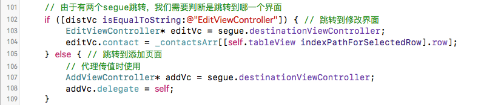

# iOS页面之间传值 - Segue、通知、代理

> 之前做通讯录的时候用的是navigation以代码的方式push跳转，tableView的传值只是用了控制器.h文件的一个变量。这里用拖线的方式跳转，通过添加和修改联系人练习segue、通知及代理传值。


## 界面拖拽
打开storyboard，删除系统给的viewController，拖拽一个Navigation Controller。将导航控制器设置为Initial View Controller。在talbeView里设置里设置导航标题，拖拽一个UIBarButtonItem做添加按钮。拖拽两个viewController用来做修改和新增联系人界面。再分别选中添加按钮，tableView cell按controller键拖拽对应添加联系人控制器view，修改联系人控制器view，选择show。根据代码来看，show也是向导航栈添加了子控制器。新建3个类ContactsViewController、AddViewController、EditViewController分别对应tableView控制器，添加界面，修改界面。这里两个viewController视图里点击修改导航条的内容是不行的，需要在对应控制器view的属性里设置title。

## TableView数据相关
1. 数据方面，由于只是练习页面之间传值，所以直接用一个模型数组，不做数据持久化。用了一个Contact类


2. 数据源


## 新增联系人传值 - 逆传
### 用通知Notification传值
如果上面的UI拖拽没有问题，那点击添加会跳转到添加界面，输入姓名和电话点击添加，我们就用这个添加动作函数来处理传值。关于通知传值还可参考：[iOS通知传值的使用](http://blog.sina.com.cn/s/blog_6317728d0102v779.html)


- 通讯录界面监听通知，及处理


- 注销通知，为什么要注销，详情可参考: [尽量不要在viewWillDisappear方法中移除通知](http://www.cocoachina.com/ios/20151214/14596.html)


### 用代理传值
在AddViewController里添加一个代理属性delegate，遵守协议AddViewControllerDelegate，在sugue跳转或pop跳转到下一个页面时，设置AddViewController的delegate为self，实现对应的方法用来处理数据。关于传值可以参见: [iOS界面传值总结 - 简书](http://www.jianshu.com/p/b5c5a8199b9b)

1. 先新建一个协议，弄一个遵守该协议的delegate属性，到时将delegate设置为tableView控制器


2. 在添加按钮按下处理函数， 通知通讯录tableView控制器接收数据


3. tableView遵守协议，segue里设置代理，处理值




## 修改联系人传值 - 顺传
点击tableView的cell时跳转到修改页面，需要将数据对象传到下一个页面。由于segue跳转之前会执行函数-(void) prepareForSegue:(UIStoryboardSegue *)segue sender:(id) sender，这里可以用segue获取目的控制器view对象。我们在目的控制器view的.h文件里声明一个模型对象。在此时对这个模型对象赋值就可以了，修改完成后都不用再逆传回去了，用的都是数据源里的那个对象，需要注意的只是修改按钮完成赋值后，需通知tableView刷新数据。这里要发送一个通知，到时监听收到此通知后，[self.tableView reloadData]就可以了。

### 准备跳转前的传值


### 接收到值的处理


## 主要代码(不含代理传值代码)

ContactsViewController.m
```objectivec
#import "ContactsViewController.h"
#import "Contact.h"
#import "AddViewController.h"
#import "EditViewController.h"

@interface ContactsViewController ()

@property (strong, nonatomic)NSMutableArray* contactsArr; //通讯录数组

@end

@implementation ContactsViewController

- (void)viewDidLoad {
    [super viewDidLoad];

    // 接收通知，修改联系人，提示刷新数据
    [[NSNotificationCenter defaultCenter] addObserver:self selector:@selector(updateTable) name:@"updateTable" object:nil];
    
    // 接收通知, 添加联系人，用userInfo传回数据
    [[NSNotificationCenter defaultCenter] addObserver:self selector:@selector(addContact:) name:@"addMessage" object:nil];
    
}

// 接收到通知后的函数处理
- (void)addContact:(NSNotification*) text
{
    Contact* temp = text.userInfo[@"contact"]; // 获取数据
    if (!_contactsArr) {
        _contactsArr = [[NSMutableArray alloc] init];
    }
    [self.contactsArr addObject:temp];
    // NSLog(@"%@,%@",temp.name,temp.cellPhone);
    [self.tableView reloadData];
}

- (void)updateTable
{
    [self.tableView reloadData];
}

- (void)didReceiveMemoryWarning {
    [super didReceiveMemoryWarning];
    // Dispose of any resources that can be recreated.
}

// 通讯录数组NSMutableArray* contactsArr; get方法
- (NSMutableArray*)contantsArr
{
    if (!_contactsArr) {
        _contactsArr = [[NSMutableArray alloc] init];
    }
    return _contactsArr;
}

#pragma mark - Table view data source

- (NSInteger)tableView:(UITableView *)tableView numberOfRowsInSection:(NSInteger)section {
    return self.contactsArr.count;
}

- (UITableViewCell *)tableView:(UITableView *)tableView cellForRowAtIndexPath:(NSIndexPath *)indexPath
{
    static NSString* identifier = @"cell";
    UITableViewCell* cell = [tableView dequeueReusableCellWithIdentifier:identifier];
    if (!cell) {
        cell = [[UITableViewCell alloc] initWithStyle:UITableViewCellStyleValue1 reuseIdentifier:identifier];
    }
    
    Contact* c = self.contactsArr[indexPath.row];
    cell.textLabel.text = c.name;
    cell.detailTextLabel.text = c.cellPhone;
    cell.imageView.image = [UIImage imageNamed:@"火影"];
    
    return cell;
}

- (void)prepareForSegue:(UIStoryboardSegue *)segue sender:(id)sender
{
    NSString* distVc = NSStringFromClass([segue.destinationViewController class]);
    
    // 由于有两个segue跳转，我们需要判断是跳转到哪一个界面
    if ([distVc isEqualToString:@"EditViewController"]) { // 跳转到修改界面
        EditViewController* editVc = segue.destinationViewController;
        editVc.contact = _contactsArr[[self.tableView indexPathForSelectedRow].row];
    } else { // 跳转到添加页面
    
    }
    // 修改返回按钮的文字
    UIBarButtonItem* item = [[UIBarButtonItem alloc] init];
    item.title = @"返回";
    self.navigationItem.backBarButtonItem = item;
    
    NSLog(@"%@", NSStringFromClass([segue.destinationViewController class]));
}

- (void)dealloc // 释放资源时，移除监听
{
    [[NSNotificationCenter defaultCenter] removeObserver:self]; //移除监听
}

@end
```
AddViewController.m

```objectivec
#import "AddViewController.h"
#import "Contact.h"

@interface AddViewController ()

@property (weak, nonatomic) IBOutlet UITextField *name; // 姓名
@property (weak, nonatomic) IBOutlet UITextField *cellPhone; // 电话
@property (strong, nonatomic)Contact* contact; // 传值用的对象

@end

@implementation AddViewController

- (IBAction)addContact:(id)sender {
    if([_name.text isEqualToString:@""] || [_cellPhone.text isEqualToString:@""]) {
        UIAlertController* alertC = [UIAlertController alertControllerWithTitle:@"添加失败" message:@"姓名或电话不能为空"  preferredStyle:UIAlertControllerStyleActionSheet];
        [alertC addAction:[UIAlertAction actionWithTitle:@"确定" style:UIAlertActionStyleCancel handler:^(UIAlertAction* action){
        
        }]];
        [self presentViewController:alertC animated:YES completion:nil];
    } else { // 两个框都有值，将添加的数据发送给上一个页面, 并返回上一个页面，刷新数据
        
        // 准备数据
        _contact = [Contact contactWithName:_name.text AndCellPhone:_cellPhone.text];
        // userInfo需要用字典类型
        NSDictionary* dict = [NSDictionary dictionaryWithObjectsAndKeys:_contact,@"contact", nil];
        // 创建通知
        NSNotification* addMessage = [NSNotification notificationWithName:@"addMessage" object:nil userInfo:dict];
        // 发送通知
        [[NSNotificationCenter defaultCenter] postNotification:addMessage];
        // 返回上一级页面
        [self.navigationController popViewControllerAnimated:YES];
    }
}

- (void)viewDidLoad {
    [super viewDidLoad];
    // Do any additional setup after loading the view, typically from a nib.
    NSLog(@"%@", self.navigationController.childViewControllers);
}


- (void)didReceiveMemoryWarning {
    [super didReceiveMemoryWarning];
    // Dispose of any resources that can be recreated.
}


@end
```

EditViewController.m

```objectivec
#import "EditViewController.h"
#import "Contact.h"

@interface EditViewController ()

@property (weak, nonatomic) IBOutlet UITextField *name;
@property (weak, nonatomic) IBOutlet UITextField *cellPhone;

@end

@implementation EditViewController

// 修改按钮点击时，这里就不考虑空值的问题了
- (IBAction)editContact:(id)sender {
    _contact.name = _name.text;
    _contact.cellPhone = _cellPhone.text;
    
    [[NSNotificationCenter defaultCenter] postNotificationName:@"updateTable" object:nil];
    
    [self.navigationController popViewControllerAnimated:YES];
}

- (void)viewDidLoad {
    [super viewDidLoad];
    // 设置默认数据
    _name.text = _contact.name;
    _cellPhone.text = _contact.cellPhone;
}

- (void)didReceiveMemoryWarning {
    [super didReceiveMemoryWarning];
    // Dispose of any resources that can be recreated.
}

@end
```

