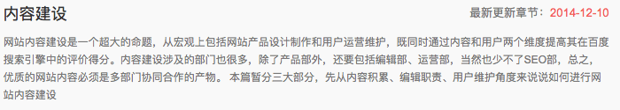
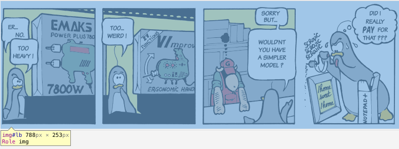
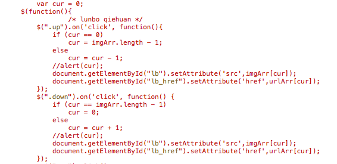

# seo内容建设

> 我身边的很多朋友都曾抱怨过百度搜索的内容太杂，没有google搜索的内容质量高。之前感觉没什么，但有了这个站点后，写的内容也会提交给百度。当在百度搜索时，呈现的内容可能就是自己的笔记。如果我都没有用心去记录好内容，那还有什么理由去抱怨搜索引擎。

## 初衷
看了百度站长学院的内容建设，才意识到之前自认为不错的博文在搜索引擎面前就是垃圾。没有排版，没有插图，思路混乱等。之前创建这个站点的初衷是用来记录学到的东西，方便日后查看，所以没有考虑太多，只要自己看的懂就行。现在发现自己学到了知识没什么，可贵的是将学到的知识和经验与需要的人分享......我得把笔记记录的更加清晰，希望能帮助更多的后来者，避过我之前走过的坑。虽然自身的水平有限，写的笔记可能有错误，但我会用心去做到最好。好吧，上面的原因都是其次，最主要的原因是为了做知识积累以及提高百度对站点的评价，如果蜘蛛在抓取的时候都觉得站点垃圾，那对seo来说，百害而无一利。为了收录、权重、流量，必须将内容做好。

## 修改记录
1. 图片大小与压缩，之前主页轮播图片本来截图非常清晰，但在显示的时候由于大小限制，图片有缩放，很模糊，看起来很low，修图还是很重要的。最近才通过Chrome浏览器F12来查看各个模块的大小布局，发现笔记显示的宽度为788px，之后笔记里的图尽量截为788的宽度，如果不够，就设置图片居中，一般不会超过788，以保证图片的清晰度。偶尔可以借助Keynote来画图。图片处理好之后最好进行无损压缩，以加快网页加载速度，之前的ImageAlpha是用来压缩png图像的，后来找了jpg压缩软件JPEGmini，挺好用的。

2. 网站图标 favicon.ico，在easyicon.net上找了个字母Z的图片，用的是64*64的，放在了网站的根目录。具体设置可参考张戈的博客: [关于网站图标favicon那些事儿](https://zhangge.net/4344.html)

3. 修改了图片轮播div大小，切换方式，以前每次想想到轮播都会去无脑搜插件。现在觉得没什么就自己写了个简单的图片轮播，不过是手动切换的，代替了原先的大图，看起来效果还行。详情见我主页的轮播效果，代码可以直接查看主页源码。

4. h1、h2等标签处理，在网上查了查，发现网页的标题最好是h1，一个页面只用一个h1，可以有多个h2。由于各个浏览器可能对h1渲染的方式不一样，首先都要对这些标签初始化，再同一设置大小，具体设置参见: [HTML之h1 h2 h3 h4标签知识经验篇](http://www.divcss5.com/html/h328.shtml)

## 以后
之后在写内容时，会先列个简单的提纲，再填充内容，这样逻辑会稍微严谨点。通过最近对站点的修改优化，无意中发现了macOS的一些新功能，非常好用。于是总结了macbook的几个优点。1. 系统有自带的做笔记的工具都很方便；2. 自带数码测色剂应用，看到什么颜色，取一下就知道RGB数据了；3. Keynote画图很好使，界面优美；4. 截图功能非常好使，本站的截图大部分都是shift+command+4截的; 4.QuickTime 有自带的屏幕录制工具，可全屏或选择区域，生成的mov格式视频，可直接修改后缀为mp4，在web里用h5 的video标签就可以显示到网页上；5. 图片预览，选中图片，按空格键可预览。6. 基于unix系统，关于terminal下的开发模拟，再也不用依赖Ubuntu了；7. app资源丰富好用；8. 一般不关机，用完直接盖住，要用再打开；9. 薄，携带方便。总之macbook办公还是非常不错的，千万别买来装windows了，macOS还是非常出色的。

参考资料:

[百度站长学院 - 内容建设](http://zhanzhang.baidu.com/college/courseinfo?id=152)