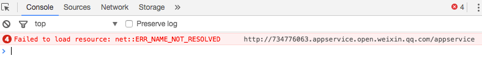
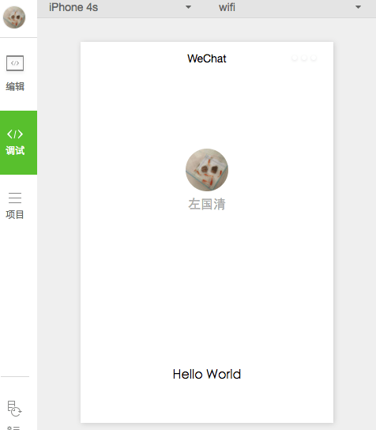
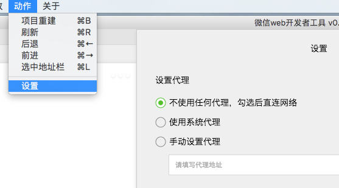

---
{
  "title": "微信小程序Failed to load resource: net::ERR_NAME_NOT_RESOLVED",
  "staticFileName": "web_mp_vpn.html",
  "author": "guoqzuo",
  "createDate": "2017/01/09",
  "updateDate": "2022/06/04",
  "description": "mac版的微信小程序最开始的demo调试时无法运行，报错Failed to load resource:... 网上查了很多资料，是开了网络代理造成的，关掉就可以了，为了方便后来的人更快找到解决方法，就专门写了这篇记录。",
  "keywords": "Failed to load resource: net::ERR_NAME_NOT_RESOLVED,微信小程序Failed to load resource: net::ERR_NAME_NOT_RESOLVED",
  "category": "微信开发"
}
---

# 微信小程序Failed to load resource: net::ERR_NAME_NOT_RESOLVED

mac版的微信小程序最开始的demo调试时无法运行，报错Failed to load resource:... 网上查了很多资料，是开了网络代理造成的，关掉就可以了，为了方便后来的人更快找到解决方法，就专门写了这篇记录。

关掉代理，重新运行后就可以正常运行了。

或者可以在微信小程序里面设置:  动作-设置-不使用任何代理

参考资料:
http://www.henkuai.com/forum.php?mod=viewthread&tid=15371
