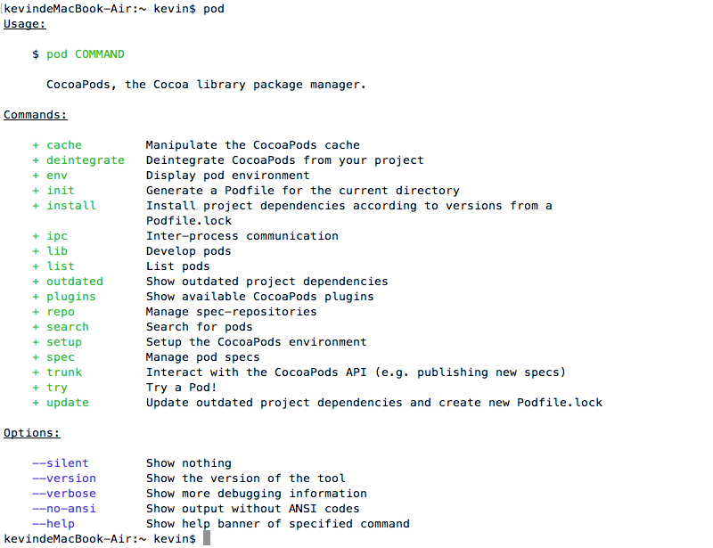
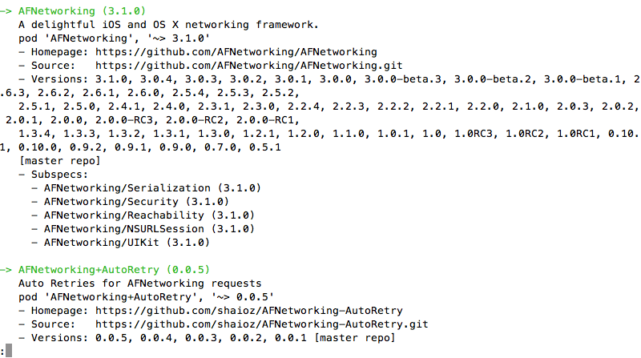
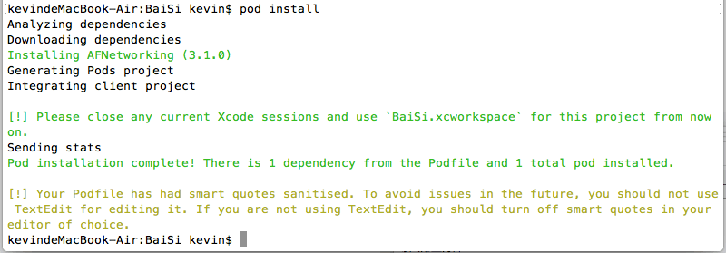

# CocoaPods安装及使用

> 在导入某个框架时，你可能还需要导入这个框架依赖的其他框架，这样就比较麻烦。如果用CocoaPods导入一个框架，它会自动导入这个框架所依赖的所有框架。在导入AFNetworking时用到了它，这里总结了安装方法及一些需要注意的细节。


## CocoaPods安装
1. 安装ruby环境，下面的所有操作都在终端(Terminal)下输入命令执行

```bash
gem source -a https://gems.ruby-china.com
```

2. 检查上面命令是否执行成功

```bash
gem sources -l
# 执行结果:
# kevindeMacBook-Air:~ kevin$ gem sources -l
# *** CURRENT SOURCES ***

# https://gems.ruby-china.com/
```

3. 安装CocoaPods，这里需要等一会

```bash
sudo gem install cocoapods
执行结果:
kevindeMacBook-Air:~ kevin$ sudo gem install cocoapods
Password:
Fetching: i18n-0.7.0.gem (100%)
Successfully installed i18n-0.7.0
Fetching: thread_safe-0.3.5.gem (100%)
Successfully installed thread_safe-0.3.5
Fetching: tzinfo-1.2.2.gem (100%)
Successfully installed tzinfo-1.2.2
...
...
Parsing documentation for gh_inspector-1.0.2
Installing ri documentation for gh_inspector-1.0.2
Parsing documentation for cocoapods-1.1.1
Installing ri documentation for cocoapods-1.1.1
26 gems installed
kevindeMacBook-Air:~ kevin$
```

4. 检查CocoPods是否安装成功，终端下直接输入pod命令，会显示帮助内容，如下图:



## 用CocoaPods导入AFNetworking框架到Xcode项目
1. 搜索AFNetworking框架，这里好像会更新一些东西。出现Setting up CocoPods master repo，要等很久，如果有朋友或同事下载好的，可以拷贝一份，文件路径 ~/.cocoaPods

```bash
pod search AFNetworking
执行结果:
kevindeMacBook-Air:~ kevin$ pod search AFNetworking
Setting up CocoaPods master repo # 我第一次ctrl+c中断过一次，这次下载失败了
[!] /usr/bin/git clone https://github.com/CocoaPods/Specs.git master

Cloning into 'master'...
error: RPC failed; curl 18 transfer closed with outstanding read data remaining
fatal: The remote end hung up unexpectedly
fatal: early EOF
fatal: index-pack failed

kevindeMacBook-Air:~ kevin$ pod search AFNetworking # 重新输入该命令
Setting up CocoaPods master repo   # 我在这里卡了很久等了几个小时
Setup completed
Creating search index for spec repo 'master'.. Done!
[!] Unable to find a pod with name, author, summary, or description matching `AFNetworking`
[!] Skipping `0` because the podspec contains errors.
[!] Skipping `1` because the podspec contains errors.
...
kevindeMacBook-Air:~ kevin$
```

刚开始我还以为卡死了，看其他教程，这一步只需要几秒。可能是改版了，等了n久。如果出现了上面执行结果里的错误，就再次执行该命令。可能跟网络环境有关系，第一次下载失败，再次下载。你可以按Command+t组合键再打开一个终端，输入命令查看安装进度

```bash
du -sh ~/.cocoaPods
# 隔一段时间查一次，下载的非常慢
kevindeMacBook-Air:~ kevin$ du -sh ~/.cocoaPods
 60K	/Users/kevin/.cocoaPods
kevindeMacBook-Air:~ kevin$ du -sh ~/.cocoaPods
168M	/Users/kevin/.cocoaPods
kevindeMacBook-Air:~ kevin$ du -sh ~/.cocoaPods
373M	/Users/kevin/.cocoaPods
kevindeMacBook-Air:~ kevin$ du -sh ~/.cocoaPods
965M	/Users/kevin/.cocoaPods
kevindeMacBook-Air:~ kevin$
```
安装完成后出现了一个错误，搜索时出现问题: 
```sh
kevindeMacBook-Air:~ kevin$ pod search AFNetworking
[!] Unable to find a pod with name, author, summary, or description matching `AFNetworking`
```

解决方法: 输入下面两条命令，再次查找，等一会就OK了。如果遇到问题可参见: CocoaPods: pod search 搜索类库失败的解决办法

```bash
pod setup
rm ~/Library/Caches/CocoaPods/search_index.json
```

```bash
pod search AFNetworking
Creating search index for spec repo 'master'.. Done! # 需要等一会，搜索结果如下
```



2. search可以用了之后就开始正式准备导入Xcode项目了

```bash
cd /Users/kevin/Desktop/Projects/BaiSi  # 进入项目目录
ls  # 查看是否是正确的目录
BaiSi		BaiSi.xcodeproj	BaiSiTests	BaiSiUITests
touch podfile # 创建podfile文件
open podfile #打开文件
# 输入如下内容:  (BaiSi为项目名，第二行为sreach里搜到的内容)
target 'BaiSi' do     
pod 'AFNetworking', '~> 3.1.0'
end
pod install # 安装，成功后的界面如下图
```



3. 进入工程目录，打开新生成的BaiSi.xcworkspace文件，进入工程，就可以使用AFNetworking框架了


参考资料: 

[CocoaPods安装和使用及问题：Setting up CocoaPods master repo](http://blog.csdn.net/zhangjunjian127/article/details/47954981)

[CocoaPods安装和使用教程](http://code4app.com/article/cocoapods-install-usage)

[2016最新CocoaPods安装和错误解决](http://www.jianshu.com/p/2ef8a38416c4)

