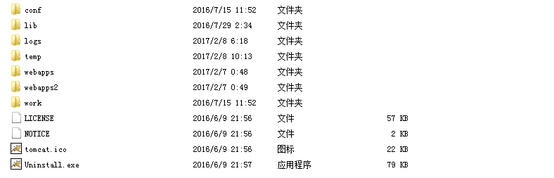
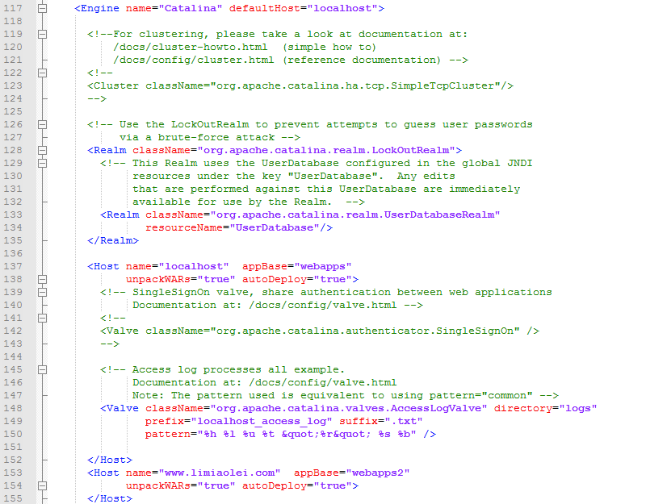
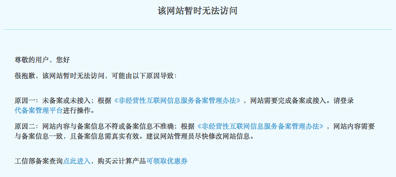

# Tomcat将多个域名解析到服务器的不同目录

> 昨天好基友买了个域名limiaolei.com，并解析到了我的服务器。然后访问他的域名就进入了我的网站，于是就想怎么让同一ip上的两个域名访问不同的内容。由于不知道具体的方法，我用的搜索词都不怎么准确，找了好久才找到解决方法。就是配置Tomcat，当访问limiaolei.com时，指定为其它目录。



## 将多个域名解析到不同的工程目录
打开tomcat安装目录下的conf文件夹里的server.xml文件，找到Engine标签下的Host便签，在下面添加相应域名的目录配置，默认情况下，网站访问的是webapps目录下ROOT工程。Host标签的name属性可以配置域名，appBase属性可以配置该域名对应的目录。我这里将limiaolei.com的域名解析到了webapps2的目录，新建一个webapps2目录，将工程目录改为ROOT，放到这个目录，就可以访问对应的index了。



## 具体操作
在系统默认的`Host`标签的结束标签`Host`下面一行添加设置。默认Host的主机将localhost自动解析到webapps，如果没有额外添加对域名的解析处理，默认会访问webapps目录下的ROOT工程。

```xml
// </Host>下添加的内容，这里需要设置两个
<Host name="www.limiaolei.com"  appBase="webapps2"
            unpackWARs="true" autoDeploy="true">
</Host>
<Host name="limiaolei.com"  appBase="webapps2"
            unpackWARs="true" autoDeploy="true">
</Host>

// 扩展，你也可以设置对应的二级域名,或其他域名，解析到不同的工程目录
<Host name="m.zuo11.com"  appBase="webapps3"
            unpackWARs="true" autoDeploy="true">
</Host>
```
访问效果: 


## 拓展问题
1. 将局域网电脑用做服务器，网上的教程一般都是要设置路由器，需要将外网的ip映射到局域网内用作服服务器的电脑。我的外网ip和路由器的wan口ip分配的不一致，可能是宽带运营商设置了什么，基本无解。

2. https的ssl证书也分种类，有可以给多个不同域名使用的，不知道阿里云的行不，现在limiaolei.com访问时会有证书错误的提示，我的域名配置解析多了ssl的一个解析，等他的域名开始用时，可能要想办法解决这个问题。

3. 备案问题，域名如果解析到的是阿里云的服务器，且该域名没有备案，阿里云会自动将主页重定向到提示备案页面，如果以https开头来访问可避开重定向。备案需要服务号，一个阿里云ECS最多可以有5个备案服务号，也就是最多支持5个一级域名的备案。




