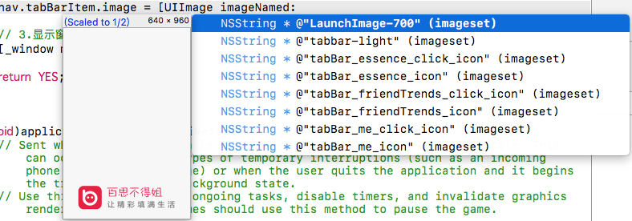
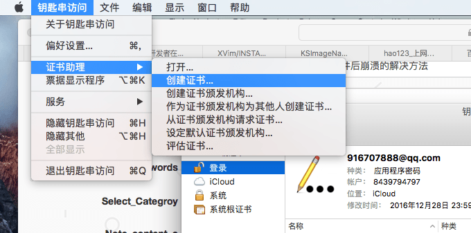
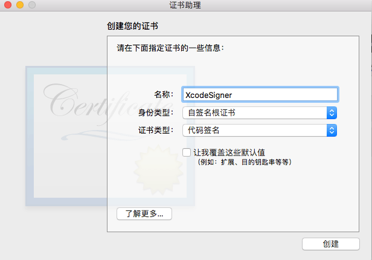
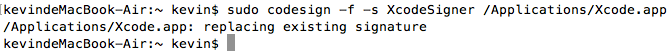

# Xcode8安装KSImageNamed插件后崩溃的解决方法

> 苹果在Xcode8中取消了对第三方插件的支持，安装了KSImageNamed插件后，Xcode8会不停的崩溃。这里总结了网上找到了一种重新签名Xcode(re-codesign Xcode)的方法，可以解决这个问题。对于是否影响上架还有待考证。



1. 删除已经安装的KSImageNamed插件
```sh
rm -rf ~/Library/Developer/Xcode/Plug-ins/KSImageNamed.ideplugin/
```

2. 完全退出Xcode，创建代码签名证书XcodeSigner，打开应用程序 - 实用工具 - 钥匙串访问，创建证书



后面会执行一条命令，这里的名称如果你填了其它的，那命令的名称也需要改过来。



3. 重新签名Xcode(Re-signing Xcode)
```sh
sudo codesign -f -s XcodeSigner /Applications/Xcode.app
```
这里需要注意的是这条命令执行可能需要点时间，稍等一下，让它执行完，就像真机调试时一样，不要急。



4. 上面的命令执行后，会弹窗问你是否允许XcodeSigner的一些操作，点总是允许就可以了。再打开从GitHub上下载的KSimageNamed工程，Command+R运行一遍就会自动安装该插件到对应的目录了。如果不能直接打开该工程，请参考下面给的GitHub链接里AMEstudio的相关回答。

5. 完全退出Xcode，再次打开会有一个弹窗，点击loadBundle就可以了，我的就是这样解决的。


参考及扩展:

[Install XVim for Xcode8](https://github.com/XVimProject/XVim/blob/master/INSTALL_Xcode8.md)

[Github KSImageNamed Xcode8 in crash AMEstudio‘s comment](https://github.com/ksuther/KSImageNamed-Xcode/issues/86)

[如何评价Xcode8不支持第三方插件? - 知乎](https://www.zhihu.com/question/47925267/answer/122133690?from=profile_answer_card)