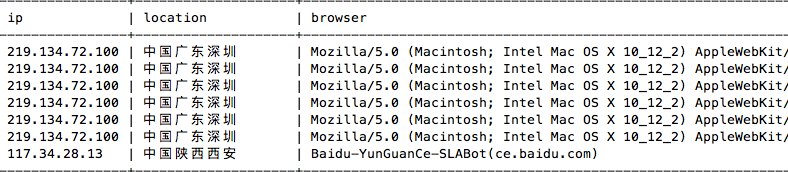
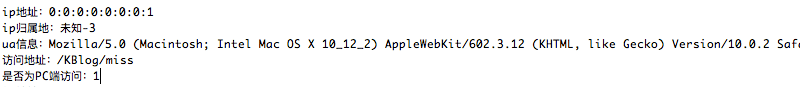

# java web获取访客信息(ip,归属地等)

> 之前写过一篇servlet判断是否为移动端访问的文章，是为了代码适配移动端或PC。这次需要记录访客信息。写了个类方法来获取访问者的ip、归属地、UA、访问URL以及是否为PC端访问。



## 获取访客信息
这里用Access类来存放相关信息，调用时只需要传入request就可以了。通过ip来查归属地用的是新浪的接口，为了减少代码量没有用json数据，改为str，新浪的接口速度还行。本来打算抽取ua里的浏览器版本及操作系统的，但接触的UA信息少，怕截取的不准确，就直接抓取完整的ua信息了，事实证明这是不错的选择。有意外收货，谁用谁知道...
```java
package com.kevin.zblog.Tools;

import javax.servlet.http.HttpServletRequest;
import com.kevin.zblog.Dao.Access;
import org.apache.commons.lang.StringUtils;
import java.util.Scanner;
import java.net.URL;
import java.io.IOException;

public class UserInfo {
	/*
		private String ip; // ip地址
		private String locatioin; // ip地址地域
		private String browser; // 浏览器 --> ua
		 ---- private String os; // 操作系统 --> ua
	    private String url; // 访问地址
		private int isPc; // 是否是pc端访问
		private int count; // 本次是该ip第几次访问
		private int isForbid; // 是否禁止该ip访问 
		private String time; // 访问时间
	*/
	public Access getUserInfor(HttpServletRequest request) {
		Access user = new Access();
		
		/**
		 * Java获取用户访问IP     http://blog.csdn.net/mydwr/article/details/9357187
		 * 1.获取访问者IP, 在一般情况下使用Request.getRemoteAddr()即可，但是经过nginx等反向代理软件后，这个方法会失效。
		 * 本方法先从Header中获取X-Real-IP，如果不存在再从X-Forwarded-For获得第一个IP(用,分割)，如果还不存在则调用Request .getRemoteAddr()。
		 */
		String ip = request.getHeader("X-Real-IP");
		if (!StringUtils.isBlank(ip) && !"unknown".equalsIgnoreCase(ip)) {
			user.setIp(ip);
		} else {
			ip = request.getHeader("X-Forwarded-For");
			if (!StringUtils.isBlank(ip) && !"unknown".equalsIgnoreCase(ip)) {
				// 多次反向代理后会有多个IP值，第一个为真实IP。
				int index = ip.indexOf(',');
				if (index != -1) {
					user.setIp(ip.substring(0, index));
				} else {
					user.setIp(ip);
				}
			} else {
				user.setIp(request.getRemoteAddr());
			}
		}
		
		/**
		 * 2.获取ip归属地的文本信息,可以获取json的format
		 * 新浪ip接口 http://int.dpool.sina.com.cn/iplookup/iplookup.php?format=str&ip=
		 * ip = "58.60.124.75"; // 1-1-1中国广东深圳
		 * ip = "192.168.0.1";  // -1192.168.0.1
		 * 0:0:0:0:0:0:0:1   // -3 
		 */
		ip = user.getIp();
		try { 
			Scanner scanner; 
			StringBuilder ipStr = new StringBuilder("");  
			String url = "http://int.dpool.sina.com.cn/iplookup/iplookup.php?format=str&ip=" + ip;  
			scanner = new Scanner(new URL(url).openConnection().getInputStream(), "GBK");  
			while (scanner.hasNext()) {  
				ipStr.append(scanner.next());  
			}  
			scanner.close();
			// 结果处理,如果IP头两位数为-1，就截取后面的ip   -1192.168.0.1，否则截取
			String ret = ipStr.substring(0, 2);
			if (ret.equals("-1")) { //后面会接IP，局域网内部
				user.setLocatioin("本地局域网");
			} else if (ret.equals("1-")) { // 正常情况下截取1-1-1之后的内容
				user.setLocatioin(ipStr.substring(5));
			} else { // 未知+错误代码
				user.setLocatioin("未知"+ret);
			}
			//System.out.println(ipStr);
		} catch (IOException e) {
			// System.out.println("获取失败!");
			user.setLocatioin("获取失败"); //请求失败
		}
		
		/**
		 * 3.获取UA信息存入browser,本来打算将浏览器版本和操作系统提取出来，还是算了，怎样简单就怎样弄
		 */
		String ua = request.getHeader("User-Agent");
		user.setBrowser(ua);
		
		/**
		 * 4. 获取访问url  
		 * 参考: JSP中获取当前访问URL、URL参数等信息的小结。 https://my.oschina.net/MiniBu/blog/83340  +
		 * http://www.cnblogs.com/tianyuchen/p/6004073.html
		 */
//		String path = request.getContextPath();
//		String basePath = request.getScheme()+"://"+request.getServerName()+":"+request.getServerPort()+path; 
//		String url = basePath + request.getServletPath().substring(0,request.getServletPath().lastIndexOf("/")+1);
		String url = request.getRequestURI();
		if(request.getQueryString()!=null) {   
		    url+="?"+request.getQueryString();           
		} 
		user.setUrl(url);
		
		/** 
		 * 5.判断是否为移动端访问 
		 */
		if(this.checkAgentIsMobile(ua)) { // 如果是移动端访问
			user.setIsPc(0);
		} else {
			user.setIsPc(1);
		}
		
		/**
		 * 当前访问时间就省略了，写入数据库开始，该字段自动生成
		 */
		
		System.out.println("ip地址：" + user.getIp());
		System.out.println("ip归属地：" + user.getLocation());
		System.out.println("ua信息：" + user.getBrowser());
		System.out.println("访问地址：" + user.getUrl());
		System.out.println("是否为PC端访问：" + user.getIsPc());
		
		/*  
		  PC访问测试
		  	ip地址：0:0:0:0:0:0:0:1
		  	ip归属地：未知-3
		  	ua信息：Mozilla/5.0 (Macintosh; Intel Mac OS X 10_12_2) AppleWebKit/602.3.12 (KHTML, like Gecko) Version/10.0.2 Safari/602.3.12
		  	访问地址：http://localhost:8080/KBlog
		  	是否为PC端访问：1

 		  手机访问测试：
		  	ip地址：192.168.0.101
		  	ip归属地：本地局域网
		  	ua信息：Mozilla/5.0 (iPhone; CPU iPhone OS 10_2 like Mac OS X) AppleWebKit/602.3.12 (KHTML, like Gecko) Version/10.0 Mobile/14C92 Safari/602.1
		  	访问地址：http://192.168.0.100:8080/KBlog
		  	是否为PC端访问：0
		*/
		return user;
	}
	
	/* 判断是否为移动端访问 */
	public  boolean checkAgentIsMobile(String ua) {
		boolean flag = false;
		if (!ua.contains("Windows NT") || (ua.contains("Windows NT") && ua.contains("compatible; MSIE 9.0;"))) {
			// 排除 苹果桌面系统
			if (!ua.contains("Windows NT") && !ua.contains("Macintosh")) {
				for (String item : agent) {
					if (ua.contains(item)) {
						flag = true;
						break;
					}
				}
			}
		}
		return flag;
	}
	private final static String[] agent = { "Android", "iPhone", "iPod","iPad", "Windows Phone", "MQQBrowser" };
}
```



## 本站中的应用
在servlet的请求中，新建UserInfo类，调用方法，就可以获取信息了
```java
UserInfo info = new UserInfo();
Access user = info.getUserInfor(request);

// 将本次访问记录写入表，先查询本次ip是第几次访问
AccessDao accessDao = new AccessDao();
int n = accessDao.findCoutnByIp(user.getIp()); // 查询该ip是第几次访问
n = n + 1;
user.setCount(n);
//System.out.println("本次是第"+n+"次访问");
accessDao.addAccess(user); // 写入表

String url = "index.jsp";
if (user.getIsPc() == 0) { // 判断是否为移动端
    url = "m_index.jsp";
}
request.getRequestDispatcher(url).forward(request, response);
```

## 搜索引擎蜘蛛UA
开启了这个功能后，发现了google、百度、360的蜘蛛，有点小激动。从数据库检索的最近的一些UA信息
```bash
谷歌蜘蛛User-Agent
中国台湾 | Mozilla/5.0 (compatible; Googlebot/2.1; +http://www.google.com/bot.html)
中国台湾 | Mozilla/5.0 (Linux; Android 6.0.1; Nexus 5X Build/MMB29P) AppleWebKit/537.36 (KHTML, like Gecko) Chrome/41.0.2272.96 Mobile Safari/537.36 (compatible; Googlebot/2.1; + 

360蜘蛛
中国河南郑州 | Mozilla/5.0 (Windows NT 6.2) AppleWebKit/537.36 (KHTML, like Gecko) Chrome/31.0.1650.63 Safari/537.36 QIHU 360SE; 360Spider
中国河南郑州 | Mozilla/5.0 (compatible; MSIE 9.0; Windows NT 6.1; Trident/5.0); 360Spider 
中国北京北京 | 360spider(http://webscan.360.cn) 

百度蜘蛛
中国广东广州 | baidumib
中国北京北京 | mip
中国陕西西安 | Baidu-YunGuanCe-SLABot(ce.baidu.com) 
中国北京北京 | Baiduspider+(+http://www.baidu.com/search/spider.htm)
中国北京北京 | Mozilla/5.0 (compatible; Baiduspider/2.0; +http://www.baidu.com/search/spider.html)  
中国北京北京 | Mozilla/5.0 (Linux;u;Android 4.2.2;zh-cn;) AppleWebKit/534.46 (KHTML,like Gecko) Version/5.1 Mobile Safari/10600.6.3 (compatible; Baiduspider/2.0; +http://www.baidu.com/search/spider.html£© 

奇怪的UA
中国香港 | Cpanel-HTTP-Client/1.0
中国北京北京 | Python-urllib/2.6
中国北京北京 | Jakarta Commons-HttpClient/3.1
英国伦敦 | Mozilla/5.0 (compatible; XML Sitemaps Generator; https://www.xml-sitemaps.com) Gecko XML-Sitemaps/1.0 
中国上海上海| Mozilla/4.0 (compatible; MSIE 6.0; Windows NT 5.1;Alibaba.Security.Heimdall.5448812.elasticsearch_unauthorized)
```

## 延伸
这里在每次访问页面时都有去请求新浪的接口，可能会对访问速度有影响，比较合理的方法是用js来获取这些信息。页面都载入后，再执行js是个不错的选择，js获取访问信息的版本等有机会会研究下...

