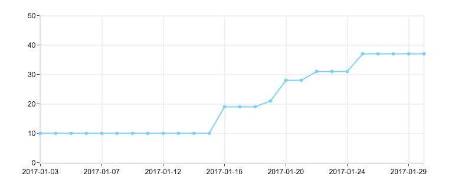

---
{
  "title": "站点优化 新增访客记录、新UI及mip等",
  "staticFileName": "web_optimize_2.html",
  "author": "guoqzuo",
  "createDate": "2017/02/01",
  "description": "认真去做内容建设后，百度收录和索引量有了明显的提升。把之前笔记修改完后，发现mip限制的_blank属性用户体验非常差，加上之前没有做访客记录功能。就打算再改改移动端，顺便新增访客记录功能。花了4天时间勉强改完了，把页面效果提升了一个level，mip页面也新增了4个。",
  "keywords": "站点优化,mip改造,Servlet获取访问信息,web新增访客记录功解决方法能,prism代码高亮使用,UEditor过滤code便签的解决方法",
  "category": "网站建设与SEO"
}
---

# 站点优化 新增访客记录、新UI及mip等

> 认真去做内容建设后，百度收录和索引量有了明显的提升。把之前笔记修改完后，发现mip限制的_blank属性用户体验非常差，加上之前没有做访客记录功能。就打算再改改移动端，顺便新增访客记录功能。花了4天时间勉强改完了，把页面效果提升了一个level，mip页面也新增了4个。



## 前端页面修改
和之前改版一样，从阿里云入口远程登录到服务器，将线上版本代码打包，通过FileZilla下载到本地，再导入Eclipse。在增加访问记录功能之前，又感觉前端可以再改改。现在文章也才40篇左右，想把所有的文章链接都放到主页，且显示文章的评论数，阅读量，时间等信息。页面的基调模仿了张戈博客，footer是模仿了开源中国。以前改前端就是改改css，再看效果，现在学会了用safari开发的里查看元素，对整个页面的布局掌控更加得心应手，将别人的页面搬到自己的页面更加轻松，颜色不知道的就用系统自带的取色剂，就是每次需要将十进制的RGB转换为十六进制。有一点很赞，就是bootstrap自带了一些padding效果，以前都不知道是怎么回事，现在只要查看元素就可以了。对于页面布局，看到什么效果就能能模仿出什么效果的感觉不错。不足的是js方面提升较慢，对于响应式布局研究的还少，还是通过微信小程序才了解到相关基本设置，有时间得研究研究。在改About界面时，支付的图片经过keynote处理后效果还不错。


```css
/* 4s/5s 根据屏幕宽度设置对应css */
@media screen and (max-width: 320px) { 
  swiper {height: 230px}
} 

/* 6s/6plus */
@media screen and (min-width: 375px) { 
  swiper {height: 276px}
}
```

## 新增访问记录表
PC前端的页面修改好后，就是数据库访问记录表的规划了。访客每次访问的信息需要存入数据库，这样就可以知道文章的访问量了。也可以统计移动端和PC端各自的访问量，先在记事本里初步记录，再创建对应的数据表。


这次创建数据表增加了预留列，因为之前笔记里面没有增加description和keywords属性后来添加时改来改去的比较麻烦，这次修改了文章加载方式，文章概要用的description，图片由于懒得再加属性了，直接用了title_e。规划时多加几个预留的还是很有必要的。数据表OK后就是对应的Dao了，将这个表抽象为一个类。增加数据库相关dao方法。包括查询最近100次访问记录、新增行、查询所有总访问数、查询pc访问数、移动端访问数等。


## servlet获取访问信息
将数据表与对应的Dao弄好后就要开始在servlet准备数据时记录访客信息了。这就需要获取访问的ip，归属地，UA信息，访问链接，是否为移动端访问了。之前写过一个servlet判断是否为移动端访问的类，这次将这些信息的获取都封装成了一个类方法，只需要传入request，就会返回一个Access对像，记录访问信息。具体方法我额外写了一篇文章来记录。详情参见: servlet获取访问信息


这里还有一些细节处理，插入访问记录后，如果是访问具体的文章，会将该文章对应的access访问量+1，About界面及404、500的跳转界面访问次数的统计无法写入对应表。如果之前将这两个界面规划为文章，那就好办了。还可以少写两个界面，现在也懒得再改了。关于UA，发现了很多奇怪的UA，大部分是蜘蛛，如果单独读取该表的记录数，那访客数是不准的，需要过滤掉这些蜘蛛，那样访问量才是准确的。‍将最近的UA看了下，发现了好几种蜘蛛，如下图:


## prism代码高亮
以前的代码高亮用的是UEditor里自带的SyntaxHighlighter，效果差，超出界限，还不支持OC语言。弄得之前写的iOS笔记代码很多都是截的图。顺带提一提fix在顶部的导航条，代码框pre或图片网上翻时会挡住导航条，在header里加了个属性z-index:999就可以了。这次UI都改了，就打算彻底弄一下这个，网上找了下，发现只要包含一个css文件一个js文件就可以用固定的格式来显示高亮代码。它是用pre标签里面增加code标签，用新页面调试好没问题后就打算用到UEditor的pre里，但操蛋的问题来了，UEditor过滤了pre下的code标签，怎么都添加不进去。网上查了很多资料，就是找不到解决方案，最后在前端用字符串替换的方法解决了这个问题。代码高亮js、css下载、文档：Prism，这里发现英文文档也没什么，只要用心去解决问题，多动手尝试，问题就可以迎刃而解了。
```html
/* 这里是jstl将UEditor编辑的html富文本进行字符串替换 */
<c:set var="string2" value="${fn:replace(note.content_c,'false">','false"><code class="language-objectivec">')}" />
${fn:replace(string2,'</pre>','</code></pre>')}
```

## 第二次mip改造
趁着mip改造的契机，将移动端也美化了下。查了官方文档，发现a标签的_blank不再是强制的了，本来还打算用mip-link的，看来没这个必要了。百度mip的css对图片增加了自适应放大处理，有图片需要保持一定的大小的，可以用单独的css来固定。mip好像又改进了不少，图片轮播也增加了新功能。百度统计，只需要一句话，引入一个js就OK了。这次将移动端主页，关于界面，分类的4个界面都转为了标准的mip。


由于不准自定义js，只允许内联css。UEditor的富文本很难符合这一点。再说我还想要代码高亮呢。只要解决代码高亮、UEditor编辑出的富文本转mip标准文本、多说评论插件这三个问题就可以实现移动端全站都符合mip规范，但现在而言基本不可能。我能想到的UEditor编辑出的html富文本转mip规范html的唯一方法就是字符串的替换，或许可以写个插件，但暂时没这精力。目前已经尽力去mip化了。还有一点是mip在校验的时候不知道是不是移动UA蜘蛛抓取，而我是根据UA来判断访问设备类型，给出对应的页面的。除了百度站长里手动移动UA抓取测试，就没看见移动UA主动抓取过，百度蜘蛛抓的都是pc版，不知道提交的mip页面能否生效。


## 总结
现在访问记录功能还比较满意，还需要弄得是多说评论数同步到本地数据库的操作，访问量过滤掉蜘蛛访问。不算很重要，以后有时间弄都行，这次本来可以将笔记详情的URL变短，但考虑到对百度收录的影响，还是算了。这4天下来，收获不错，经验确实需要点滴积累，前期规划还是很重要的!

