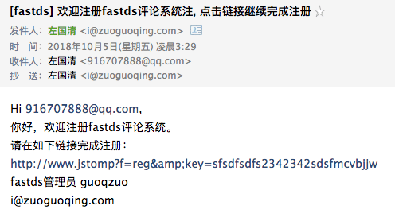
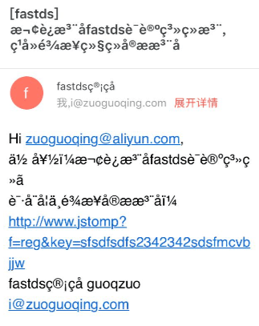
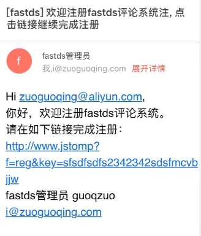

---
{
  "title": "php发送邮件",
  "staticFileName": "web_php_mail.html",
  "author": "guoqzuo",
  "createDate": "2018/10/05",
  "description": "邮件发送是一个很重要的功能，具体应用包括注册时邮箱验证、评论回复提醒、推送广告、线上异常报告等。一般网上php教程里面邮件发送很简单，一个mail()函数就搞定。但这个方法如果你去试，90%是不成功的。然后就会去搜php怎么发送邮件，搜到的答案基本没有直接使用mail()的，都是使用PHPMailer这个开源库，我一般的思路是在能不使用第三方库的时候尽量不去使用。但后面发现还是要使用这个库。",
  "keywords": "php发送邮件,php发送邮件乱码,php 发邮件,php使用qq邮箱发邮件",
  "category": "后端数据库等"
}
---

# php发送邮件

> 邮件发送是一个很重要的功能，具体应用包括注册时邮箱验证、评论回复提醒、推送广告、线上异常报告等。一般网上php教程里面邮件发送很简单，一个mail()函数就搞定。但这个方法如果你去试，90%是不成功的。然后就会去搜php怎么发送邮件，搜到的答案基本没有直接使用mail()的，都是使用PHPMailer这个开源库，我一般的思路是在能不使用第三方库的时候尽量不去使用。但后面发现还是要使用这个库。

## php发送邮件的两种方式
### 直接使用系统的mail()函数(需要本地邮件服务器)
最开始使用这个一直发送不出去，后面就在想如果这个发送成功了，接收到邮件时，来源的邮箱、名称会是什么，貌似根本就没有设置过。
```php
try {
    // $email = $un;
    $subject = "[fastds] 评论系统注册链接".$un;
    $message = "Hi ".$un.",<br> 你好，欢迎注册fastds评论系统。<br> 请在如下链接完成注册：<br> http://www.jstomp?f=reg&key=sfsdfsdfs2342342sdsfmcvbjjw<br>fastds管理员 guoqzuo<br>i@zuoguoqing.com";
    $k = mail($un, $subject, $message);
    echo $k;
    // echo "邮件发送成功";
} catch (Exception $e) {
    echo $e;
}
```
后面查了下，在php.ini可以设置相关参数，但后来在网上收了下，这个方法需要本地安装有邮件服务器，但这种方式显然是不可行的，自己去配置太麻烦，而且就算发出邮件了，可能会直接被屏蔽。关键是网上的教程不好找，很少有这么做的。我的想法是依托qq邮箱来发送邮件。这样会稳定一点。PHPMailer有很多这种教程，是大家比较推荐的。

### 使用PHPMailer(可使用qq发邮件)
关于 PHPMailer - A full-featured email creation and transfer class for PHP，在github开源，有1w+ star，应该比较靠谱。现有的百度PHPMailer使用qq发邮件的教程都是比较旧的，直接将项目考到根目录使用，且目录结构、文件名都有变化。最后还是打算以官方文档为主，于是知道了composer，是php里面的一个引入第三方包的工具，会自动安装依赖。类似于node的npm，python的pip。目前来说是比较主流的。

#### 在项目中引入composer
- 在系统中安装composer

```js
// 这个命令会将composer.phar文件下载到当前目录
// curl -sS https://getcomposer.org/installer | php
// 将这个文件改名为composer并移动到系统的环境变量里，方便在任何目录使用
// mv composer.phar /usr/local/bin/composer
```

- 在项目根目录创建 composer.json文件

```json
{
    "name": "fastds/fastds",
    "description": "comment system",
    "require": {
        "phpmailer/phpmailer": "^6.0",
        "monolog/monolog": "^1.23"
    }
}
```

- 执行composer安装

运行下面的命令(二选1)可以安装composer.json里面配置的依赖，如果没有composer.json文件会出错

```bash
# 如果下载composer.phar后没改名移动到环境变量
php composer.phar install
# 如果改名了且移动到了全局变量 
composer install

# 也可以在不配置composer.json里面的require，直接运行命令安装最新phpmailer最新版本的
composer require phpmailer/phpmailer
```

- 安装完成后，会多出一个composer.lock文件和一个vendor目录，vendor目录相当于node的node_modules目录

#### 开始发送邮件

```php
<?php
// Import PHPMailer classes into the global namespace
// These must be at the top of your script, not inside a function
use PHPMailer\PHPMailer\PHPMailer;
use PHPMailer\PHPMailer\Exception;

//Load Composer's autoloader
require '../vendor/autoload.php';

$mail = new PHPMailer(true);

try {
    //Server settings
    $mail->SMTPDebug = 1;                     // Enable verbose debug output
    $mail->isSMTP();                                 // Set mailer to use SMTP
    $mail->Host = 'smtp.qq.com';            // Specify main and backup SMTP servers
    $mail->SMTPAuth = true;                   // Enable SMTP authentication
    $mail->Username = '916707888@qq.com';  // SMTP username                    
    $mail->Password = 'xxxxxxxxxxxxxxx';      // SMTP password，这里隐去了密码
    $mail->SMTPSecure = 'ssl';             // Enable TLS encryption, `ssl` also accepted
    $mail->Port = 465;                         // TCP port to connect to
    $mail->CharSet = "UTF-8";       // 防止发送阿里云邮箱中文乱码

    //Recipients
    $mail->setFrom('i@zuoguoqing.com', 'fastds管理员');  // 设置来源的邮箱/名称
    // $mail->addAddress('joe@example.net', 'Joe User');     // Add a recipient
    $mail->addAddress($un);               // Name is optional, $un为目标邮件地址
    $mail->addCC('i@zuoguoqing.com');  // add cc，抄送

    //Attachments
    // $mail->addAttachment('/var/tmp/file.tar.gz');         // Add attachments
    // $mail->addAttachment('/tmp/image.jpg', 'new.jpg');    // Optional name

    //Content
    $mail->isHTML(true);                                  // Set email format to HTML
    $mail->Subject = "[fastds] 欢迎注册fastds评论系统, 点击链接继续完成注册";
    $mail->Body    = "Hi ".$un.",<br> 你好，欢迎注册fastds评论系统。<br> 请在如下链接完成注册：<br> http://www.jstomp?f=reg&key=sfsdfsdfs2342342sdsfmcvbjjw<br>fastds管理员 guoqzuo<br>i@zuoguoqing.com";
    $mail->AltBody = 'This is the body in plain text for non-HTML mail clients';

    $mail->send();
    echo 'Message has been sent';
} catch (Exception $e) {
    echo 'Message could not be sent. Mailer Error: ', $mail->ErrorInfo;
}
?>
```

## 发送邮件遇到的问题

1. SMTP Error: Could not authenticate 
一开始一直报上面的错误，搜了很多答案。按照网上的方式改了PHPMailer.php里面的一个位置，都没用，还是这个提示
``` php
  public function isSMTP()
    {
        $this->Mailer = 'SMTP';
    }
```
后面才发现$mail->Password不是qq邮箱的登录密码，而是在qq邮箱后台服务设置开启pop3/smtp功能时，给出的一个密码。如果忘记了改密码，关闭这个功能，重新开启就可以获得新密码了。改完密码后就发送成功了。



2. 阿里云收到邮件乱码的问题，直接被认定为垃圾箱



直接加一句 $mail->CharSet = "UTF-8";  即可，再发邮件就正常了，不会归到垃圾邮件了



