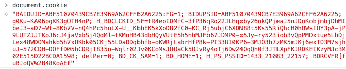

# 前端cookie的使用

http是基于请求和响应的无状态协议，无法保存状态，如果有数据需要在浏览器关闭后，下次进入还保存，就可以用cookie来解决这个问题。

## 前端cookie的读取
前端cookie可以用document.cookie来读取，格式为key=value;key=value键值对的形式，如下图



如果需要读取特定key的值，需要写一个函数来实现，思路为字符串的查找与切分，也可以使用正则来匹配
``` js
// 获取cookie里的值
function getCookie(name) {
  let cookieStr = document.cookie
  let tempName = `${name}=`
  let indexStart = cookieStr.indexOf(tempName)

  // cookie里面没值，或者不包含name cookie
  if (name === '' || cookieStr.length <= 0 || indexStart < 0) {
    return `no cookie: ${name}`
  }
  indexStart = indexStart + tempName.length
  let indexEnd = cookieStr.indexOf(';', indexStart)
  if (indexEnd === -1) {
    indexEnd = cookieStr.length
  }
  // 解码
  return decodeURIComponent(cookieStr.substring(indexStart, indexEnd))
}
```
## 前端cookie的写入，设置有效时间
前端直接给document.cookie赋值就可以设置token，但默认不会覆盖原来的值，会将key=val添加进去
```js
document.cookie = "key=val"
```
除了key=val外，我们对key这个属性可以添加一些其他参数，比如有效期expires，max-age，secure等cookie的主要构成如下
``` js
name:一个唯一确定的cookie名称。通常来讲cookie的名称是不区分大小写的。
value:存储在cookie中的字符串值。最好为cookie的name和value进行url编码
domain:cookie对于哪个域是有效的。所有向该域发送的请求中都会包含这个cookie信息。这个值可以包含子域(如：yq.aliyun.com)，也可以不包含它(如：.aliyun.com，则对于aliyun.com的所有子域都有效).
path: 表示这个cookie影响到的路径，浏览器跟会根据这项配置，像指定域中匹配的路径发送cookie。
expires:失效时间，表示cookie何时应该被删除的时间戳(也就是，何时应该停止向服务器发送这个cookie)。如果不设置这个时间戳，浏览器会在页面关闭时即将删除所有cookie；不过也可以自己设置删除时间。这个值是GMT时间格式，如果客户端和服务器端时间不一致，使用expires就会存在偏差。
max-age: 与expires作用相同，用来告诉浏览器此cookie多久过期（单位是秒），而不是一个固定的时间点。正常情况下，max-age的优先级高于expires。
HttpOnly: 告知浏览器不允许通过脚本document.cookie去更改这个值，同样这个值在document.cookie中也不可见。但在http请求张仍然会携带这个cookie。注意这个值虽然在脚本中不可获取，但仍然在浏览器安装目录中以文件形式存在。这项设置通常在服务器端设置。
secure: 安全标志，指定后，只有在使用SSL链接时候才能发送到服务器，如果是http链接则不会传递该信息。就算设置了secure 属性也并不代表他人不能看到你机器本地保存的 cookie 信息，所以不要把重要信息放cookie就对了
```
针对上面的一些属性，我们将前端设置cookie，封装为一个函数
``` js
function setCookie(name, value, options) {
  // 传值校验
  if (!name) {
    return 'name不能为空'
  }
  value = (value !== null && value !== undefined) ? value.toString() : ''
  options = options || {}

  let resultArr = []
  // 设置基础的name=value值
  resultArr.push(`${encodeURIComponent(name)}=${encodeURIComponent(value)}`)

  // 处理options，其他属性传值
  if (options.domain) {   // domain中必须包含两个点号
    resultArr.push("domain=" + options.domain)
  }
  if (options.path) {
    resultArr.push("path=" + options.path)
  }
  // 如果不设置expires和max-age浏览器会在页面关闭时清空cookie
  if (options.expires) {
    resultArr.push("expires=" + options.expires.toGMTString())
  }
  if (options.maxAge && typeof options.maxAge === "number") {
    resultArr.push("max-age=" + options.maxAge)
  }
  if (options.httpOnly) { 
     resultArr.push("HTTPOnly")
  }
  if (options.secure) {
     resultArr.push("secure")
  }
  document.cookie = resultArr.join(";")
}
```
## 前端cookie的删除
如果给cookie设置一个过去的时间，浏览器会立即删除该cookie
``` js
// 从cookie中删除name
setCookie(name, null, {'expires':new Date(0)})
```
## 服务端写入cookie
待完善
## 服务端读cookie
待完善
## 其他存储方式 localStorage
待完善

参考资料:

[HTTP-服务器端CooKie与浏览器端Cookie](https://blog.csdn.net/qiqingjin/article/details/51760343)

[阅读记录——利用httponly提高cookie安全性](https://www.jianshu.com/p/2d79d548c635)

[Mitigating Cross-site Scripting With HTTP-only Cookies](https://msdn.microsoft.com/en-us/library/ms533046.aspx)
