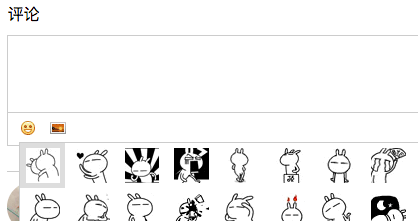

---
{
  "title": "富文本编辑器使用execCommand插入图片不生效的问题",
  "staticFileName": "web_richtext.html",
  "author": "guoqzuo",
  "createDate": "2018/10/02",
  "description": "execcommand插入图片光标消失，最近打算实现一个评论系统，评论如果只能回复文字就太low了，于是就打算自己做一个简单的富文本编辑器。一般回复内容，我第一个想到的是textarea，做完回复文字的功能后，想着如果插入图片貌似不可行。",
  "keywords": "execcommand插入图片光标消失,富文本编辑器使用execCommand插入图片不生效的问题,execCommand插入图片不生效",
  "category": "JavaScript"
}
---

# 富文本编辑器使用execCommand插入图片不生效的问题

> 最近打算实现一个评论系统，评论如果只能回复文字就太low了，于是就打算自己做一个简单的富文本编辑器。

## 思路
- 一般回复内容，我第一个想到的是textarea，做完回复文字的功能后，想着如果插入图片貌似不可行。
- 百度了下富文本编辑器的实现，发现一般常规的做法是依靠contentEditable属性，让div成为可编辑元素。然后用execCommand命令来实现一些交互。后来在翻js高程3的时候发现在第14章表单脚本里面也有富文本编辑的介绍，也是用的同样的方法，就仔细看了下。
- 确定方法后，就是实现了，于是有了如下图的demo



- 搜索了一些人的demo后发现触发表情、斜体、粗体等操作一般用的是a或button元素，我用img元素发现document.execCommand执行的是否总是返回false操作不成功，后来就按照网上的方法用了，有时可以，就是又不行。我就很郁闷了，浏览器肯定是支持的，执行的命令也是正确的，难道document.execCommand对触发的标签有要求？网上搜了下没有答案。
- 于是我想着直接向div可编辑元素插入子元素的方式，可以是可以，但发现不能插入到编辑光标所在的位置，这种方式还是不行，还是必须用execCommand
```js
// 在可编辑的富文本里插入图片
var img = ``;
document.getElementsByClassName("editor")[0].insertAdjacentHTML("beforeend", img)
```
- 记得之前在使用css的calc功能是总是不成功，后来隔了好久才在某个地方看到使用calc(100% - 10px) 时，运算符中间必须有空格，而我习惯css是不加的calc(100%-10px) 这才恍然大悟。这里肯定也有某些类似的注意事项，于是我就写了个最简单的demo，如下: 
```html
<!DOCTYPE html>
<html lang="en">
<head>
    <meta charset="UTF-8">
    <title>Title</title>
    <style>
        #editor {
            width:300px;
            height:300px;
            border:1px solid #ccc;
        }
        img {
            width:35px;
            height:35px;
        }
    </style>
</head>
<body>
    <div id="editor" contenteditable="true"></div>
    
    <script>
        var img = document.getElementById("img");
        // 点击img图片在div里插入一张图片
        img.onclick = function (e) {
            var value1 = document.execCommand('insertImage', false, 'http://img.baidu.com/hi/tsj/t_0002.gif');
            console.log(value1)
        }
    </script>
</body>
</html>
```

- 然后我发现了一个问题，当div没有焦点时，点击img是不行的，只有当焦点在可编辑的div上使用这个命令才会生效。回过头来再看我的代码，也就知道为什么其他富文本编辑器菜单都用a或button元素了。这两个元素，不会让编辑中的div失去焦点。如果表情按钮为img，点击后弹出可选的表情，此时可编辑的div失去焦点，调用execCommand就会无效，返回false。而我之前的demo里面，a元素的中间有地方有空白位置，点击后相当于点击了div。找到原因后，就知道要用a元素将表情的点击区域铺满了。

- 可选的标签里面用到了 display:inline-block，发现系统还算生成了一些空白区域，百度下，也找到了去空格的方法，详情参见如下链接: 
[inline-block布局产生间隙的原因及解决办法（水平、垂直）](https://blog.csdn.net/gladys_1111/article/details/77279985)
```css
/* display:inline-block 父元素加上如下样式，可去掉系统自带的间隙 */
#face {
    font-size: 0;
    letter-spacing: -3px;
}
```
- 自此富文本编辑器插入表情及更改斜等功能算是没什么问题了，:smiley: 下一步就是考虑插入图片，图片上传的问题。


------------------
2018/10/03 更新

今天把插入表情的逻辑完善了下，发现当第一次进入，评论框还没聚焦，如果用户直接点标签按钮，发送表情，结果肯定是不成功的，于是觉得还是有必要在执行execCommand时如果没有聚焦就来个focus

```js
var result = document.execCommand('insertImage', false, res.filePath);
// 如果执行失败，手动focus
if (!result) {
    // 获得焦点，防止可编辑div无焦点时，无效的问题，这种情况，光标位置不准确，每次都是开头位置
   document.getElementsByClassName("editor")[0].focus();
   document.execCommand('insertImage', false, res.filePath);
}
```

网上找了篇可以获取光标位置的函数，但发现兼容性貌似不怎么好，暂时保持这样。
有一遍文章还不错，收藏了以后研究 [html元素contenteditable属性如何定位光标和设置光标](https://segmentfault.com/a/1190000005869372)