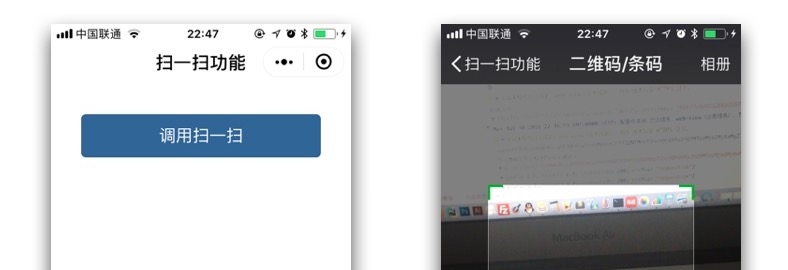

# 小程序web-view组件内嵌网页调用微信JS-SDK

小程序web-view内置H5可以像公众号H5一样使用JS-SDK，但会有一定的限制，另外对于没有公众号H5调用JS-SDK经验的同学，可能会以为wx.config使用的参数是小程序的信息，下面以调用扫一扫为例子，介绍具体细节



小程序内嵌网页调用JSSDK与公众号网页里面调用基本一致，之前公众号h5可以直接嵌入到小程序里面使用，要注意的地方是：
- 内嵌网页调用JS-SDK需要使用公众号的appid及appsecret，与小程序的appid没有关系
- 小程序内嵌网页只支持部分JSSDK，详情参见： [小程序web-view组件](https://mp.weixin.qq.com/debug/wxadoc/dev/component/web-view.html)
- 公众号需要将调用接口的域名加入JS接口安全域名，对应的ip加入ip白名单


这里以调用微信的扫一扫为例子，来体验整个流程，前端html：
```html
<!-- 前端HTML -->
<!DOCTYPE html>
<html lang="en">
<head>
    <meta charset="UTF-8">
    <meta http-equiv="X-UA-Compatible" content="IE=edge">
    <meta name="viewport" content="width=device-width, initial-scale=1">
    <title>扫一扫功能</title>

    <!-- weui样式 -->
    <link rel="stylesheet" href="https://res.wx.qq.com/open/libs/weui/1.1.2/weui.min.css">

    <!-- 微信JS-SDK需要引入的js文件 -->
    <script type="text/javascript" src="https://res.wx.qq.com/open/js/jweixin-1.3.2.js"></script>
</head>
<body>
    <div style="margin:10%">
        <button class="weui-btn" onclick="startScanning()" style="background:#336699">
            调用扫一扫
        </button>
    </div>
    <script src="https://cdn.bootcss.com/jquery/3.3.0/jquery.min.js"></script>
    <script src="/public/js/common.js"></script>
    <script>
        // 是否在小程序内部打开的网页
        function isOpenInWechat() {
            return (window.__wxjs_environment === 'miniprogram');
        }

        // 非小程序内部打开，提示错误
        if (!isOpenInWechat()) {
            alert('请在小程序里打开页面');
        }

        // 获取signature及对应的时间戳，随机字符串
        var obj = getSignature();

        // 权限验证
        wx.config({
            debug: true, // 开启调试模式,调用的所有api的返回值会在客户端alert出来，若要查看传入的参数，可以在pc端打开，参数信息会通过log打出，仅在pc端时才会打印。
            appId: 'wx90aaf3035f813f5a', // 必填，公众号的唯一标识，此处填写企业号corpid
            timestamp: obj.timestamp, // 必填，生成签名的时间戳
            nonceStr: obj.noncestr, // 必填，生成签名的随机串
            signature: obj.signature,// 必填，签名，见附录1
            jsApiList: ['chooseImage','scanQRCode'] // 必填，需要使用的JS接口列表
        });

        // 请求后台接口，得到signature等
        function getSignature() {
            var res = null;
            // 自己封装的ajax函数，同步执行ajax，发送请求，后台去操作
            ajax_request('GET', '/initialize', 'getSignature', {}, function(result){
                res = result;
            },'sync');
            return res;
        }

        // scan
        function startScanning() {
            // 调用微信接口
            wx.scanQRCode({
                needResult: 0, // 默认为0，扫描结果由微信处理，1则直接返回扫描结果，
                scanType: ["qrCode","barCode"], // 可以指定扫二维码还是一维码，默认二者都有
                success: function (res) {
                    var result = res.resultStr; // 当needResult 为 1 时，扫码返回的结果
                }
            });
        }
    </script>
</body>
</html>
```
后台使用了nodejs+express，获取signature等信息
```js
// 后台node代码

// 发送get请求依赖
var https = require('https');
// SHA 加密
var crypto = require('crypto');

/**
 * signature 调用了initialize函数
 * 调用微信的接口获取access_token及jsapi_ticket，生成signature。这里只是演示，没有缓存数据
 * 注意调用接口有次数限制。获取access_token | 2000次/每天；获取jsapi_ticket | 1000000次/天
 * 正式环境下业务量大就需要将access_token和jsapi_ticket存入缓存，一般有效期为7200秒。
 */
function initialize(app, data, req, res) {
    // 获取access_token
    var url = 'https://api.weixin.qq.com/cgi-bin/token';
    var appid = 'wx90aaf3035f813f5a';
    var appsecret = '这里填公众号生成的appsecret';

    var preRes = res;
    url += "?grant_type=client_credential&appid="+appid+"&secret="+appsecret;

    https.get(url, function(res) {
        console.log("Got response: " + res.statusCode);

        res.on('data', function (d) {
            d = JSON.parse(d.toString());
            console.log(d);
            var access_token = d.access_token;
            var ticketUrl = "https://api.weixin.qq.com/cgi-bin/ticket/getticket?access_token=";
            ticketUrl += access_token + "&type=jsapi";

            // 获取ticket
            https.get(ticketUrl, function (res) {
                res.on('data', function (d) {
                    var d = JSON.parse(d.toString());
                    var jsapi_ticket = d.ticket;

                    var timestamp = new Date().getTime();

                    // 获取随机字符串
                    // toString()默认是10进账，如果想包含字母，禁止要大于10 toString(32)
                    // 0.66666666666xx => "0.66666666666xx" => "66666666666xx"
                    var noncestr = Math.random().toString().substr(2);

                    // 这里的url是调用接口时当前的url
                    var url = 'https://zuo11.com/start';
                    var targetStr = "jsapi_ticket=" + jsapi_ticket + "&noncestr="+noncestr+ "&timestamp="+timestamp + "&url="+url;
                    console.log(targetStr);

                    // SHA1加密
                    var sha1_result = crypto.createHash('sha1').update(targetStr).digest('hex');
                    console.log(sha1_result);

                    // 将获取到的signature一级对应的时间错，随机字符串返回给前端
                    preRes.json({
                        'signature': sha1_result,
                        'noncestr': noncestr,
                        'timestamp': timestamp
                    })
                });
            }).on('error', function(e) {
                console.log("Got error: " + e.message);
            });
        })
    }).on('error', function(e) {
        console.log("Got error: " + e.message);
    });

}
```

官方文档：[微信JS-SDK说明文档](https://mp.weixin.qq.com/wiki?t=resource/res_main&id=mp1421141115)


