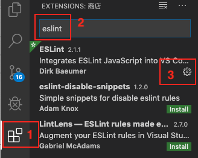
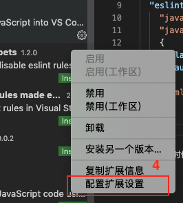
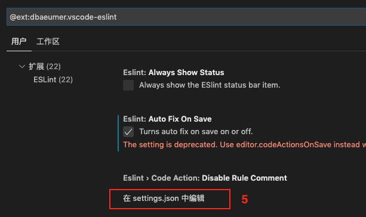

# 2020 vscode配置eslint保存后自动fix

vscode默认的autofix只能fix js格式文件(.js)，无法fix vue格式文件(.js)，怎么设置ctrl+s保存后自动fix呢？

需要修改eslint的配置文件

## 在扩展里搜索eslint找到设置入口
点击第三方扩展，搜索eslint，如果没安装先安装，点击管理按钮。如下图：



点击配置扩展扩展设置



点击在settings.json里编辑



## ESLint插件新版本保存自动fix配置变更
最近换了个办公电脑，重装了vscode，发现eslint的配置和以前不一样了，新版本废弃了原先的一些配置，配置更简洁了，最新配置vscode自动fix
```js
{
  "editor.codeActionsOnSave": {
    "source.fixAll": true
  }
}
```

The old `eslint.autoFixOnSave` setting is now deprecated and can safely be removed

**ESLint插件检测、自动修复机制，依赖当前目录下的package.json对应的eslint配置**，vue项目、node项目、react项目、ts支持都对应不同的npm依赖包，比较难以理解

**另外如果项目目录层级太深，可能会导致插件不生效，尽量保持在vscode中打开的目录下就有package.json，而不是套多个层级**

**当我们从远程仓库拉取vue项目代码后，在没有npm install的情况下，vscode的eslint插件不会起任何作用，需要npm install 安装必要的插件后，重启vscode，才会生效**


## 旧eslint插件版本配置
`eslint.autoFixOnSave`未被废弃时，保存后自动fix配置
```json
{
  "edit.formatOnSave": false,   // 取消自带fix，使用eslint自动保存fix
  "eslint.autoFixOnSave": true, // 每次保存的时候将代码按eslint格式进行修复
  "eslint.validate": [
    "javascript",
    "javascriptreact",
    {
      "language": "vue",
      "autoFix": true
    },
    "html"
  ]
}
```

## 自动fix偶尔失效的问题
有时候ctrl+s保存后自动fix失效了，可能是工具的bug，关闭vscode重新打开可能就好了。