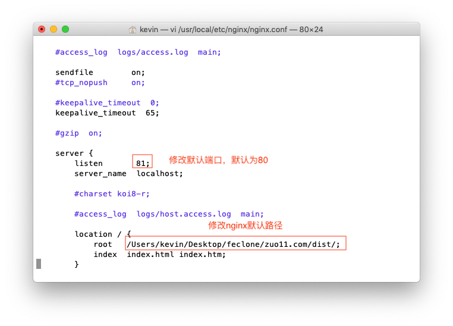
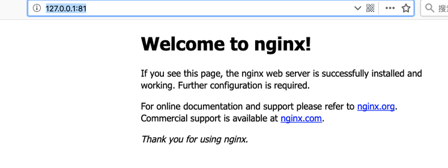

# macOS安装nginx

## 使用命令安装
mac下直接使brew install用命令安装，注意：mac自带的xcode不要随意卸载，不然会出各种奇怪的问题: 包括svn安装问题、nginx安装问题等
```bash
brew install nginx
```
安装完成后的log如下：
```bash
# brew install nginx 安装后部分log
==> nginx
Docroot is: /usr/local/var/www

The default port has been set in /usr/local/etc/nginx/nginx.conf to 8080 so that
nginx can run without sudo.

nginx will load all files in /usr/local/etc/nginx/servers/.

To have launchd start nginx now and restart at login:
  brew services start nginx
Or, if you do not want or need a background service you can just run: nginx
brew install nginx
```
需要保存下2个重要的信息
- Docroot: /usr/local/var/www
- 默认配置文件路径 /usr/local/etc/nginx/nginx.conf

## 开启nginx
直接 sudo nginx 即可，nginx默认占用使用80端口
```bash
kevindeMacBook-Air:~ kevin$ sudo nginx # 一般这里都会成功
Password:
nginx: [emerg] bind() to 0.0.0.0:8080 failed (48: Address already in use)
nginx: [emerg] bind() to 0.0.0.0:8080 failed (48: Address already in use)

# 我这里运行nginx，出现端口占用的情况，
# 是由于我之前调试过php，开启了apache服务占用了80端口
# 我这里将端口修改为81
kevindeMacBook-Air:~ kevin$ vi /usr/local/etc/nginx/nginx.conf # 打开配置文件修改端口
```
## 配置文件修改
配置文件修改时，如下图所示：




## 运行效果
修改好端口保存后，再sudo nginx，运行nginx，http://127.0.0.1:81/ 可正常访问，如下图

