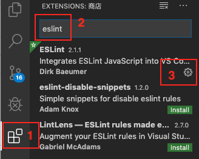

# vscode 配置eslint保存后自动fix

vscode默认的autofix只能fix js格式文件(.js)，无法fix vue格式文件(.js)，怎么设置ctrl+s保存后自动fix呢？

需要修改eslint的配置文件

## 在扩展里搜索eslint找到设置入口
点击第三方扩展，搜索eslint，如果没安装先安装，点击管理按钮。如下图：



点击配置扩展扩展设置


点击在settings.json里编辑


## 在配置文件里加入下面的配置代码

```json
{
  "edit.formatOnSave": false,   // 取消自带fix，使用eslint自动保存fix
  "eslint.autoFixOnSave": true, // 每次保存的时候将代码按eslint格式进行修复
  "eslint.validate": [
    "javascript",
    "javascriptreact",
    {
      "language": "vue",
      "autoFix": true
    },
    "html"
  ]
}
```

## 自动fix偶尔失效的问题
有时候ctrl+s保存后自动fix失效了，可能是工具的bug，关闭vscode重新打开可能就好了。