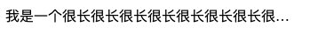
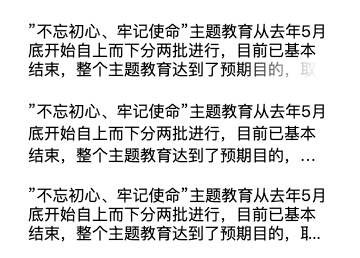

# 单行文本截断与多行文本截断

文本溢出处理，在HTML5权威指南这本书里是没有讲到这个知识点。一般使用 text-overflow: ellipsis

## 单行文本截断
对于单行文本，一般使用text-overflow: ellipsis即可。注意：使用这个样式的前提是需要先给定容器宽度、overflow:hidden等属性，来看一个实例:



```html
<head>
  <meta chaset="utf-8">
  <title>单行文本截断测试</title>
  <style>
    .test {
      width: 20em;          /* 指定宽度 */
      white-space: nowrap;  /* 不换行，如果是span就可以不用这个 */
      overflow: hidden;     /* 溢出内容隐藏 */
      text-overflow: ellipsis; /* 文本溢出时显示省略号 */
    }
  </style>
<head>
<body>
  <div class="test">
    我是一个很长很长很长很长很长很长很长很长很长很长很长很长很长很长很长的文本
  </div>
</body>
```

## 多行文本截断
多行文本截断有很多方法，这里主要介绍三种方法，先来看看效果：



### 1.使用伪元素绝对布局用线性渐变背景遮挡
使用伪元素选择器，绝对布局，将线性渐变的一个背景覆盖到文本内容的右下角
```css
.method-a {
  line-height: 1.2rem;
  max-height: 3.6rem;
  overflow: hidden;
  position: relative;
}
.method-a::after {
  position: absolute;
  bottom: 0;
  right: 0;
  width: 30%;
  max-width: 100px;
  content: '';
  height: 1.2rem;
  background: linear-gradient(to right, rgba(255,255,255,0), rgba(255,255,255,1) 90%);
}
```

### 2.使用line-clamp属性
兼容性方面不怎么好，不支持IE
```css 
.method-b {
  overflow: hidden;
  display: -webkit-box;
  -webkit-line-clamp: 3;
  -webkit-box-orient: vertical;
}
```

### 3.使用伪元素绝对布局用...遮挡
可能会挡住文字内容
```css
.method-c {
  line-height: 1.2rem;
  max-height: 3.6rem;
  overflow: hidden;
  position: relative;
}
.method-c::after {
  position: absolute;
  bottom: 0;
  right: 0;
  width: 20px;
  content: '...';
  height: 1.2rem;
  background:white;
}
```

### 完整demo

```html
<!DOCTYPE html>
<html lang="en">
<head>
  <meta charset="UTF-8">
  <meta name="viewport" content="width=device-width, initial-scale=1.0">
  <meta http-equiv="X-UA-Compatible" content="ie=edge">
  <title>Document</title>
  <style>
    .module {
      width: 300px;
      margin: 20px;
    }
    .module p {
      margin: 0;
    }
    .method-inline {
      width: 100%;
      white-space: nowrap;
      display: inline-block;
      overflow: hidden;
      text-overflow: ellipsis;
    }
    .method-a {
      line-height: 1.2rem;
      max-height: 3.6rem;
      overflow: hidden;
      position: relative;
    }
    .method-a::after {
      position: absolute;
      bottom: 0;
      right: 0;
      width: 30%;
      max-width: 100px;
      content: '';
      height: 1.2rem;
      background: linear-gradient(to right, rgba(255,255,255,0), rgba(255,255,255,1) 90%);
    }
    .method-b {
      overflow: hidden;
      display: -webkit-box;
      -webkit-line-clamp: 3;
      -webkit-box-orient: vertical;
    }

    .method-c {
      line-height: 1.2rem;
      max-height: 3.6rem;
      overflow: hidden;
      position: relative;
    }
    .method-c::after {
      position: absolute;
      bottom: 0;
      right: 0;
      width: 20px;
      content: '...';
      height: 1.2rem;
      background:white;
    }
  </style>
</head>
<body>
  <div class="module">
    <span class='method-inline'>单行隐藏：”不忘初心、牢记使命”主题教育从去年5月底开始自上而下分两批进行，目前已基本结束，整个主题教育达到了预期目的，取得了重大成果：各级党组织</span>
  </div>
  <div class="module">
    <p>”不忘初心、牢记使命”主题教育从去年5月底开始自上而下分两批进行，目前已基本结束，整个主题教育达到了预期目的，取得了重大成果：各级党组织和广大党员、干部深入学习实践习近平新时代中国特色社会主义思想</p>
  </div>
  <div class="module method-a">
    <p>”不忘初心、牢记使命”主题教育从去年5月底开始自上而下分两批进行，目前已基本结束，整个主题教育达到了预期目的，取得了重大成果：各级党组织和广大党员、干部深入学习实践习近平新时代中国特色社会主义思想</p>
  </div>
  <div class="module method-b">
    <p>”不忘初心、牢记使命”主题教育从去年5月底开始自上而下分两批进行，目前已基本结束，整个主题教育达到了预期目的，取得了重大成果：各级党组织和广大党员、干部深入学习实践习近平新时代中国特色社会主义思想</p>
  </div>
  <div class="module method-c">
    <p>”不忘初心、牢记使命”主题教育从去年5月底开始自上而下分两批进行，目前已基本结束，整个主题教育达到了预期目的，取得了重大成果：各级党组织和广大党员、干部深入学习实践习近平新时代中国特色社会主义思想</p>
  </div>
</body>
</html>
```

参考: [Line Clampin' (Truncating Multiple Line Text) | CSS-Tricks](https://css-tricks.com/line-clampin/)